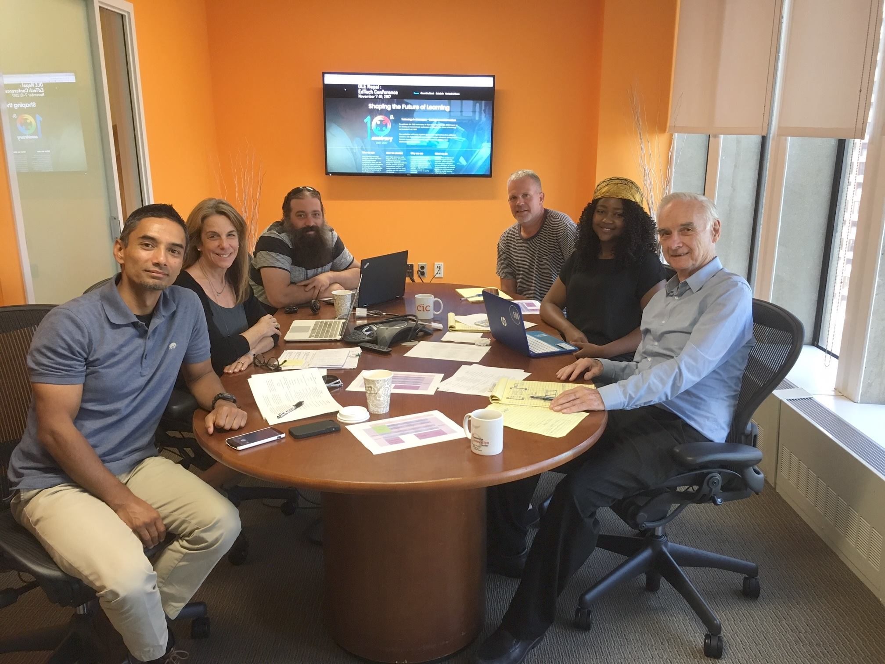

# Welcome & Congratulations!
### You just took your first step towards becoming a Virtual Intern!

###### The OLE International Team. [Left to Right] Rabi, April Stone, Stefan Unterhauser, Rory Phimister, Denisia Mangue, Richard R. Rowe, Boyah J. Farah and Leonard Maximus Ireneous Mensah not pictured.

---

## This **MDwiki** serves as an information repository for treehouses, a project of the Open Learning Exchange.

#### **Virtual systems engineering interns** will be helping develop OLE’s treehouses system. Treehouses allows us to share our different learning platforms via the Rasperry Pi series of single-board computer devices.

---

### The **treehouses** project is divided into several parts to meet the needs of different users, including those participating in our Virtual Intern program.

> More information about the internship can be found in our [FAQ](https://treehouses.io/#!./pages/vi/faq.md#General_Internship_Questions). 

#### Here are the leaders you should reach out to if you need help:

> **Dogi**, **Ryan**, **Vassilis**, **Roshan**, **Sam**, **Samuel** and **Arran**

---

The [Open Learning Exchange](http://www.ole.org/) is a social benefit and for-purpose organization based in Cambridge, Massachusetts. Our mission is to provide universal quality education using open source materials and technology to overcome educational barriers.

> OLE believe **everyone** has the right to a quality basic education.

**Find Us On:** [Linkedin](https://www.linkedin.com/company/open-learning-exchange) | [Twitter](https://twitter.com/oleorg) | [Facebook](https://www.facebook.com/openlearningexchange/)
