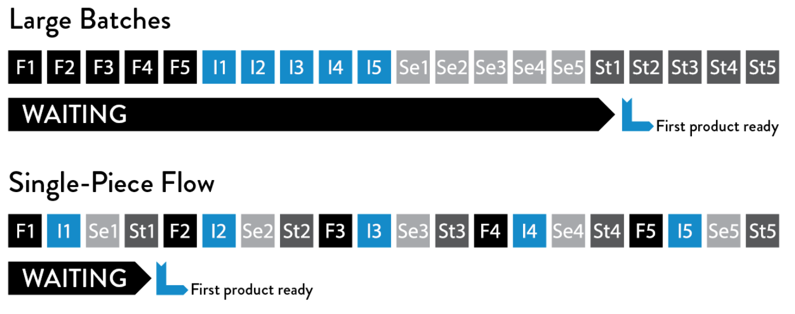

May 5, 2018 • [empeje](https://github.com/empeje)

<iframe src="//www.slideshare.net/slideshow/embed_code/key/3BrvezTU3yPVuR" width="595" height="485" frameborder="0" marginwidth="0" marginheight="0" scrolling="no" style="border:1px solid #CCC; border-width:1px; margin-bottom:5px; max-width: 100%;" allowfullscreen> </iframe> 

[DevOps Practice in Nonprofit - Abdurrachman Mappuji](https://www.slideshare.net/DevOpsDaysJKT/devops-practice-in-nonprofit-abdurrachman-mappuji) from [DevOpsDaysJKT](https://www.slideshare.net/DevOpsDaysJKT)

Last April we speak at DevOpsDay Jakarta 2018 where we talk about our progress in packaging Learning Management System (LMS) in Raspberry Pi and how we leverage DevOps principle while developing the solution rapidly.

> If you can't explain it simply, you don't understand it well enough. - Albert Einstein

My first software conference is PyCon Indonesia 2017 where I talk about load testing and performance engineering of application with a simple little tool called Locust. It was gaining some interest from the audience so I got very excited and wanted to talk more about my experience. You know, for an introvert coder like me, having some public speaking exercise is always both exciting and not that exciting. Very exciting because I can learn how to communicate better, and not that exciting because I am shy.

So, when there was an opportunity to talk at DevOpsDay Jakarta, I thought about my contribution here at Open Learning Exchange and decided to talk about our DevOps practice, hoping it would inspire other people and organizations.

Actually, the time was not very good, I also do talk one day before DevOpsDay in MoodleMootPH, so, in the middle of my busy day, I need to prepare two presentations which both are will be presented almost at the same time.

***

In this talk, we talked about how we implement the three-way of DevOps and how we deliver small batch size of work continuously and fast cycle manner.

When I joined the organization as an intern, I didn't know what DevOps is. All I knew was [dogi](https://github.com/dogi), our CTO, is a DevOps professional. It turned out I played with the so-called DevOps early in my career both at this organization as a contributor and at my full-time job.

So what is DevOps? Well, like any other jargons, DevOps means many things to many different people. Some people call it a process, some people call it a principle, some people call it culture and practice, some people making money from talking about it, even some people call them DevOps organization by calling their system engineers as DevOps engineer.

So far I've found no strict definition of DevOps, but there is one important insight about it. It comes from [Gene Kim](https://twitter.com/RealGeneKim), the author of The Phoenix Project and DevOps Handbook. The loose definition or let alone insight from him is DevOps is a way leveraging advancement of manufacturing and applying the principle of lean manufacturing in software development, wherein the modern era of software development it is more and more applicable. Frankly speaking, it is about how we implementing small batch of delivery to the user and the business.

*Simulation of “envelope game” (fold, insert, seal, and stamp the envelope)
(Source: Stefan Luyten, “Single Piece Flow: Why mass production isn’t the most efficient way of doing ‘stuff’,” Medium.com, August 8, 2014, https://medium.com/@stefanluyten/single-piece-flow-5d2c2bec845b#.9o7sn74ns.)*

Small batches is one of the key idea. Imagine about a simple envelope game (fold, insert, seal, and stamp). When you do it in small batch, for example one, you can deliver one finished envelope every 4 steps. Yeah, you can get the first finished envelope in the first four steps, but when you deliver it in large batches say 5 batches, we will have the first delivered envelope in the 16th step. Significant right? Yeah, since the pressure for the development of software are more tense than was before, it is very important to deliver stuffs incrementally and validate idea as soon as possible.

However, we didn't dive deeper in this posts. Want to learn more about DevOps? Follow our projects in [github.com/treehouses](https://github.com/treehouses/) and follow our members. The slide shown at the top of the page also contains our full presentation in the DevOpsDay Jakarta 2018.
