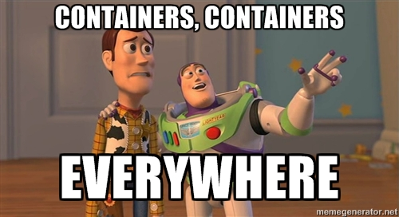
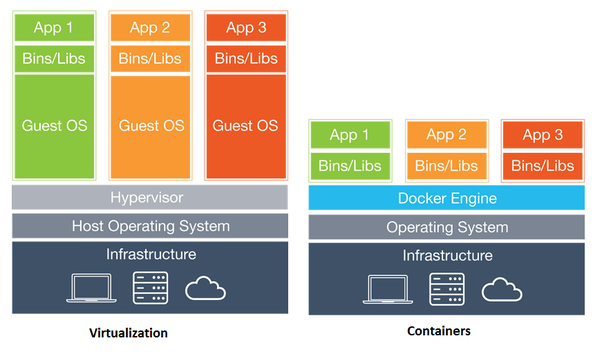
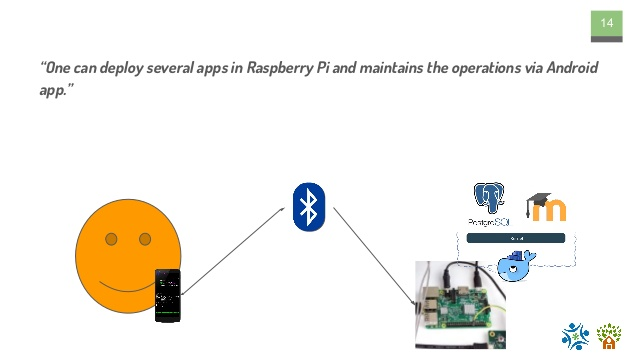

May 5, 2018 • [empeje](https://github.com/empeje)

Last April we speak at MoodleMoot Philippines 2018 where we talk about our progress in packaging Learning Management System (LMS) especially Moodle and introducing [treehouses/remote](https://github.com/treehouses/remote/issues) to the audience.

The story is a little bit funny. One of the organizers of the MoodleMoot Philippines was sending me a message and inviting me to connect on LinkedIn. She reads that I have a little bit experience with Moodle and ask me if I interested attending the conference. I don't know why, but I automatically answered by not only attending if possible I want to speak there talk about our advancement in deploying Moodle LMS in small devices like Raspberry Pi. Then the rest is history. Yeah, there was a time where I invited to talk directly in Manila, but because I don't have a budget for that I talk about my constraint and then they offer me an options to talk remotely and turned out not only me that talking in this conference remotely, there are also some other presenter even from outside Asia.

The story was started from a small project to setup a simple LMS in Madagascar, and at that time our primary LMS, which is BeLL-Apps is in maintenance mode and our new LMS Planet is still under development. We then decide to use Moodle to bootstrap the project and deploy it in Madagascar. The problem back then is we want to have the stuff running both in amd64 (server) and also arm devices which is Raspberry Pi (specifically RPi 3).

***

Okay, lets dive deeper into the content of my talk.

### The problem

Deploy Moodle on Raspberry Pi is easy, it is even easier if you deploy it on `amd64`. We can just deploy it directly on the machine by installing MySQL or PostgreSQL and the Moodle with some web server via Nginx or Apache, but we choose another path.

>We want to build a platform where people can deploy various educational apps in single board computer

Since the beginning we want to build a platform where people can deploy various educational apps in single board computer. One of them is is Moodle, but we also want to deploy another application like our own LMS called [open-learning-exchange/planet](https://github.com/open-learning-exchange/planet/).

In essence the requirements are

* Easy to setup and operate the software
* Run on small machine (Raspberry Pi mostly)
* Able to deploy multiple applications

### Tools #1: Docker

So we choose Docker.

If you never heard about Docker, it is a container engine, an implementation of container technology. For the past 4 years, it is reinventing how we deploy software and make container technology become mainstream.

What is special with Docker? If you come from the time where you can spawn another instance of software by installing some Virtual Machine engine like Virtual Box or VMWare, it is something similar but quite different. Well, my first time meeting with the virtual machine was using it for doing some cheat on my favorite online game. Just several years ago I know that people using the virtual machine for managing server and deploying an application on the internet.

Well, the problem is still about deployment. Docker and container technology, in general, want to reduce time installing the application and giving us more time to test and deploy our application, instead of spending time in the repetitive installation process. Remember the time where people said "it is works on my machine"?

In old days, with a virtual machine, we virtualize our machine with a hypervisor and install a guest operating system on top of that then we install our app on the guest operating system. The problem with the virtual machine is we have a big overhead with the virtualization and it cost us a big portion of our computer resources. In the other hand, a container is the light version of the VM (however quite different). We change two layers (hypervisor & guest OS) with a docker engine, and we can deploy the application and its `bin/libs` directly.

The Docker has two main tools. The first is the Docker CLI where we can pull, create, push, or run a Docker image and container. The other one is `docker-compose` where we can compose Docker container and link a container with the other. Pretty interesting, right? We'll not talk deeper about `docker` cli and `docker-compose`.

### Tools #2: Specialized Raspberry Pi OS Image

To solve the problem we also develop our own Raspberry Pi OS image based on Raspbian OS where we add several tools from Docker until some homebrew command line tools like [pirataship](https://github.com/ole-vi/pirateship) and [treehouses/cli](https://github.com/treehouses/cli). By the way, you can get the OS image in [treehouses/builder](https://github.com/treehouses/builder).

### Tools #3: Bluetooth Remote

The ultimate tool is the Bluetooth remote where we can remote controlling the Raspberry Pi for operational purpose. The problem we have is since we deploy the application mostly in remote area where computer expertise is minimum, we need to lower the barrier for people to operate our stuff. So we develop [treehouses/remote](https://github.com/treehouses/remote/). We have this by installing a bluetooth server in the Raspberry Pi which already included in our specialized Raspberry Pi OS Image, the [treehouses/builder](https://github.com/treehouses/builder), then after that we can connect to that server via the [treehouses/remote](https://github.com/treehouses/remote/). Here are some illustration.

### Recap

In this approach we can solve the problem of creating platform for people to install multiple application in single board computer with helps of Docker for the application packaging, the [treehouses/builder](https://github.com/treehouses/builder) for the base OS and [treehouses/remote](https://github.com/treehouses/remote/) for operating the Raspberry Pi.

For complete talk, you can play the video in the beginning of the page.

### We are looking for contributors and interns

By the way, we are always looking for self-driven contributor who wants to develop their skill and at the same time makes the world better. We are looking for 

* Software Engineering Intern/Volunteer
* System Engineering Intern/Volunteer, and
* Mobile Engineering Intern/Volunteer

Excited? Visit [first steps](https://treehouses.io/#!pages/vi/firststeps.md) even if you are not aspire to be a virtual intern.
