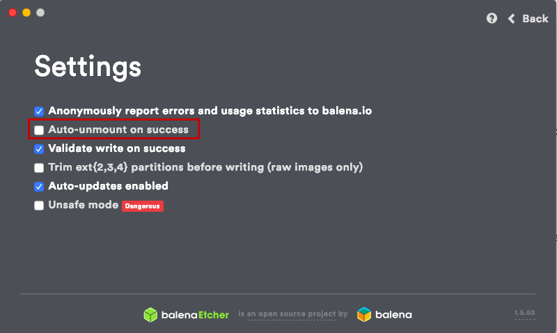
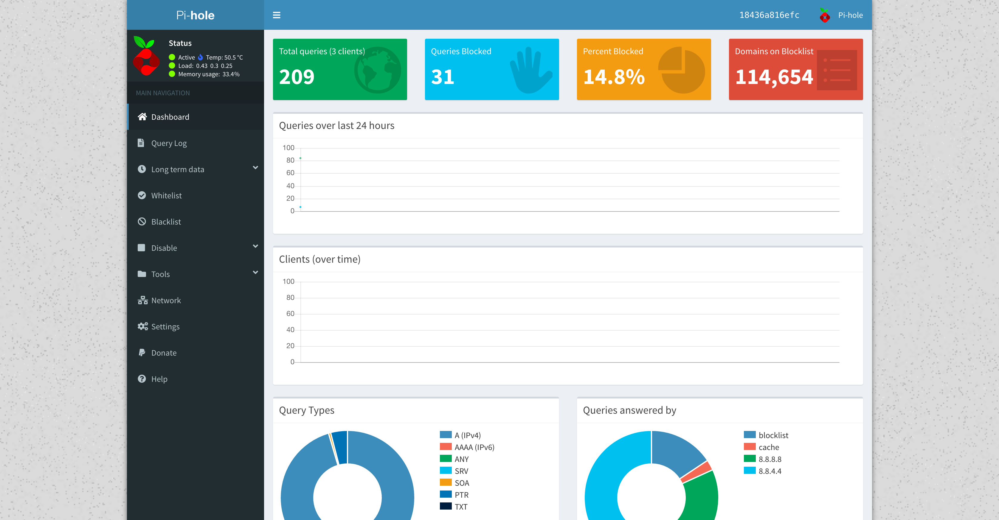

# Setting up Pihole on boot drive for Raspberry Pi

Jul 17, 2019 • [liew211](https://www.github.com/Liew211)  

---

As a member of OLE's Raspberry Pi team, I have recently been tasked with running Pihole concurrently with Planet.  Unfortunately, the two programs occupy the same ports, so I have been working on this one step at a time, the first of which is to set up Pihole and run it on its own, while Planet is disabled.  The easiest way to disable Planet is to remove the Planet set up in the `autorunonce` file, in the boot drive, essentially creating a *"clean slate"*.  


## Step 1 - Prepare Treehouses image

Download the latest treehouses image from http://download.treehouses.io, then use [balenaEtcher](https://etcher.io) to flash the image onto your SD card.  Be sure to change balenaEtcher's settings to prevent it from automatically unmounting the SD card once it's done flashing.



In your file explorer, navigate to the `boot` drive, and open the `autorunonce` file in a text editor of your choice.  Delete everthing, and paste this in:

```bash
#!/bin/bash

treehouses rename treehouses
treehouses expandfs
treehouses button bluetooth

treehouses bridge 'wifiname' 'treehouses' 'wifipassword'

reboot
```
Replace `wifiname` and `wifipassword` with your wifi name and password.  Save the file, and safely eject the SD card.  


## Step 2 - Start up your Raspberry Pi

Plug the microSD into your Raspberry Pi, and power it on.  The red LED should turn on, indicating that the Raspberry Pi is connected to power.

Once the green LED next to it on your Raspberry Pi stabilizes into a solid green, find its local IP address by typing `ping treehouses.local` or `ping treehouses.home` in your terminal or command prompt.  You should see something like this:
```
PING treehouses.local (192.168.1.119): 56 data bytes
64 bytes from 192.168.1.119: icmp_seq=0 ttl=64 time=69.424 ms
64 bytes from 192.168.1.119: icmp_seq=1 ttl=64 time=4.640 ms
64 bytes from 192.168.1.119: icmp_seq=2 ttl=64 time=2.945 ms
64 bytes from 192.168.1.119: icmp_seq=3 ttl=64 time=3.372 ms
```
As you can see here its local IP address is `192.168.1.119`.  If this doesn't work, you'll need to [use another method](https://www.raspberrypi.org/documentation/remote-access/ip-address.md) to find the local IP address. 


## Step 3 - ssh into your Raspberry Pi

Type `ssh root@[local IP address]` to enter the root of your Pi.  You will need to create a `pihole` folder for your Pihole project; to do this, run the following commands:
```
cd /srv
mkdir pihole
cd pihole
```
In here, you will create the `docker-compose` file for pihole, which is basically the instructions for running Pihole.  Run `vim pihole.yml`, press `Esc`, and run `:set paste`.  Copy and paste the following:

```yaml
version: "3"

# https://github.com/pi-hole/docker-pi-hole/blob/master/README.md

services:
  pihole:
    container_name: pihole
    image: pihole/pihole:4.3.1-4_armhf
    # For DHCP it is recommended to remove these ports and instead add: network_mode: "host"
    ports:
      - "53:53/tcp"
      - "53:53/udp"
      - "67:67/udp"
      - "8053:80/tcp"
      - "443:443/tcp"
    environment:
      TZ: 'America/New_York'
      WEBPASSWORD: ''
    # Volumes store your data between container upgrades
    volumes:
       - './etc-pihole/:/etc/pihole/'
       - './etc-dnsmasq.d/:/etc/dnsmasq.d/'
    # run `touch ./var-log/pihole.log` first unless you like errors
    # - './var-log/pihole.log:/var/log/pihole.log'
    dns:
      - 127.0.0.1
      - 1.1.1.1
    # Recommended but not required (DHCP needs NET_ADMIN)
    #   https://github.com/pi-hole/docker-pi-hole#note-on-capabilities
    cap_add:
      - NET_ADMIN
    restart: unless-stopped
```

**NOTE** - On GitBash and Powershell, the paste command is `Shift` + `Insert`

Press `Esc`, and run `:wq` to save and exit.  


## Step 4 - Start up Pihole

Due to a port 53 conflict, you will have to run `service dnsmasq stop` to terminate the existing process on that port.  You can now start up the Pihole container with 
```
docker-compose -f pihole.yml -p pihole up -d
```
On a web browser, go to `[local IP address]:8053/admin`.  You should see something like this:  



## Step 5 - Wrap Up

This entire set up can also be done in one step, all through the autorunonce file.   

To use this, you will need to use balenaEtcher to flash a new image onto an SD card (you can either overwrite the previous SD card, or use a new one), then find and open the `autorunonce` file as you did earlier.  Replace the contents of your `autorunonce` file with [this](https://www.github.com/treehouses/builder/blob/master/examples/pihole_autorunonce):
```sh
#!/bin/bash

treehouses rename treehouses
treehouses expandfs
treehouses button bluetooth

treehouses bridge 'wifiname' 'treehouses' 'wifipassword'

mkdir -p /srv/pihole

sync;sync;sync

{
  echo "version: \"3\""
  echo
  echo "# More info at https://github.com/pi-hole/docker-pi-hole/ and https://docs.pi-hole.net/"
  echo "services:"
  echo "  pihole:"
  echo "    container_name: pihole"
  echo "    image: pihole/pihole:4.3.1-4_armhf"
  echo "    ports:"
  echo "      - \"53:53/tcp\""
  echo "      - \"53:53/udp\""
  echo "      - \"67:67/udp\""
  echo "      - \"8053:80/tcp\""
  echo "      - \"443:443/tcp\""
  echo "    environment:"
  echo "      TZ: 'America/New_York'"
  echo "      WEBPASSWORD: ''"
  echo "    # Volumes store your data between container upgrades"
  echo "    volumes:"
  echo "      - './etc-pihole/:/etc/pihole/'"
  echo "      - './etc-dnsmasq.d/:/etc/dnsmasq.d/'"
  echo "    dns:"
  echo "      - 127.0.0.1"
  echo "      - 1.1.1.1"
  echo "    # Recommended but not required (DHCP needs NET_ADMIN)"
  echo "    #   https://github.com/pi-hole/docker-pi-hole#note-on-capabilities"
  echo "    cap_add:"
  echo "      - NET_ADMIN"
  echo "    restart: unless-stopped"
} > /srv/pihole/pihole.yml

{
  echo "#!/bin/sh"
  echo
  echo "sleep 1"
  echo
  echo "service dnsmasq stop"
  echo "docker-compose -f /srv/pihole/pihole.yml -p pihole up -d"
} > /boot/autorun

sync;sync;sync

case "$(treehouses detectrpi)" in
  RPIZW|RPI3A+)
    treehouses bootoption console
esac

reboot
```
Remember to add your Wifi name and password on line 7.  
This new `autorunonce` file takes all of the set up we did manually, and runs it when booting for the first time.  
- Line 9 creates the Pihole folder
- Lines 13-42 creates the `docker-compose` file for Pihole
- Lines 44-51 creates an `autorun` file that runs every time you start up your Raspberry Pi, which frees up port 53, and starts up Pihole.  

Eject the SD card, and boot up your Raspberry Pi with it.  Once the green light stabilizes to a "heartbeat" pattern (this signifies that the `autorun` file has executed), run `ping treehouses.local` in your terminal or command prompt to find the local IP address, and open `[local IP address]:8053/admin` in a web browser to access Pihole.  

Finally, to start using Pihole's DNS service, go to your computer's network settings and change your DNS server to the `[local IP address]` of your Raspberry Pi.

Congrats!  You have successfully set up your Pihole!

---  

This has been my progress from my past few sessions of working with Pihole.  Feel free to experiment some more, and stay tuned for the next steps.  Thanks for reading!
