# Initial Steps to Get Started with Treehouses
Welcome to treehouses. This is our system allowing us to share our different learning platforms via the Rasperry Pi series of single-board computer devices. Here is a quick start for interacting your Raspberry Pi with Treehouses Remote.
## Step 1: Image Download and Burn
Assuming you have an Android device and/or using an Android simulator; here is the way to go about it:
Download the latest version of treehouses image [here](http://download.treehouses.io/) and burn it with [etcher](https://www.balena.io/etcher/). Once burned put your microsd card into your raspberry pi 
## Step 2: Treehouses Remote App
With your android device download [treehouses remote](https://play.google.com/store/apps/details?id=io.treehouses.remote). 
## Step 3: Bluetooth Pairing
After installing it, get into your bluetooth settings and pair your system with your Raspberry Pi (optional).

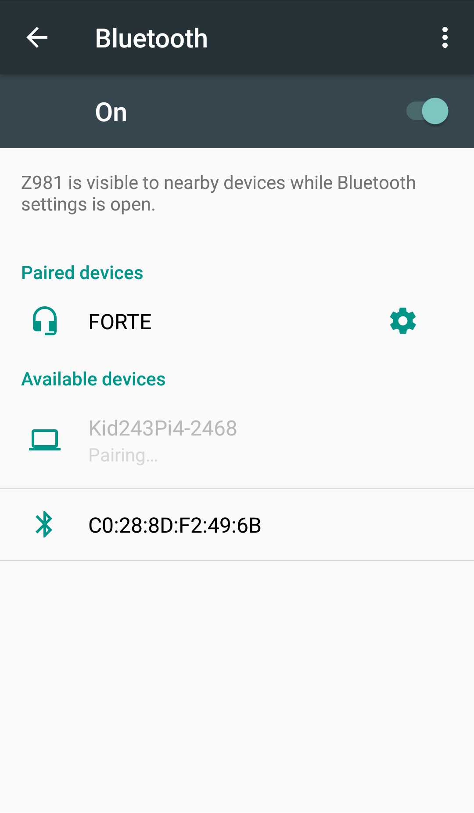 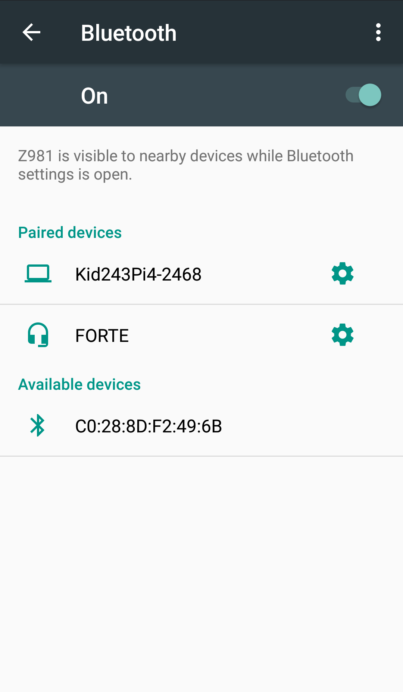

## Step 4: RPI Connection to App
Once you're paired with your Raspberry Pi, open treehouses remote and connect to your Raspberry Ri.

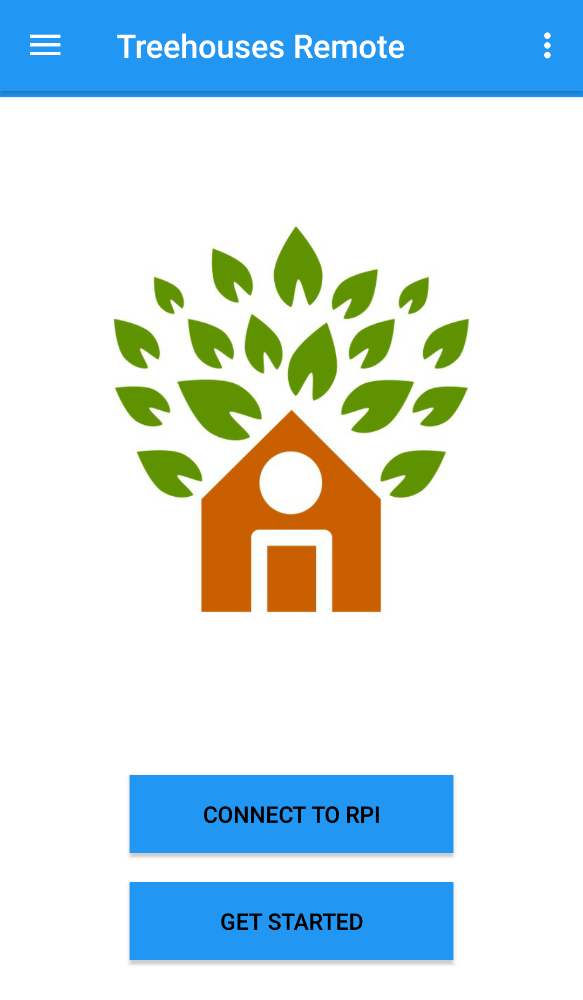 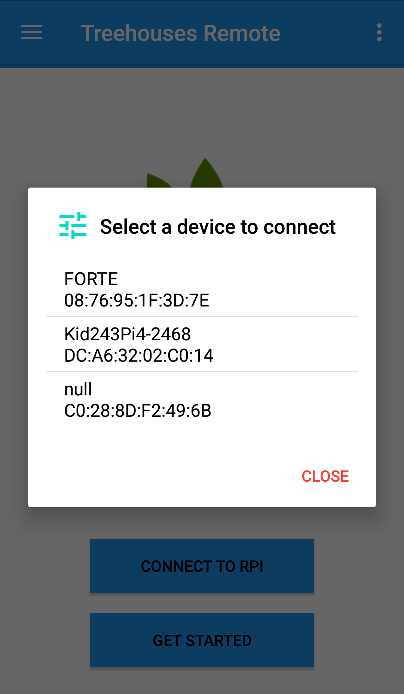

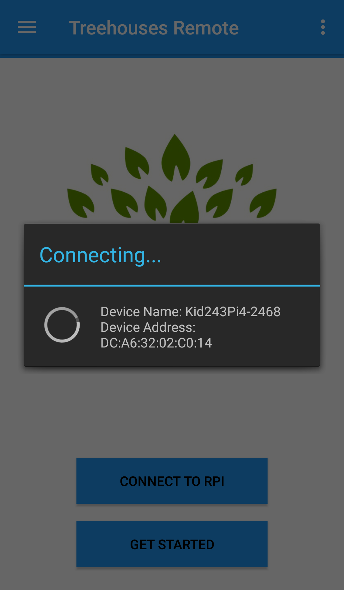 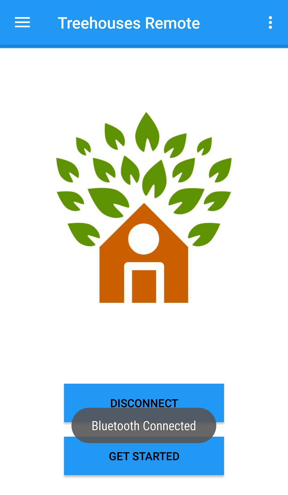

## Step 5: WiFi and Bridge Set Up
At the terminal we'll get into setting up a bridge and setting up a WiFi

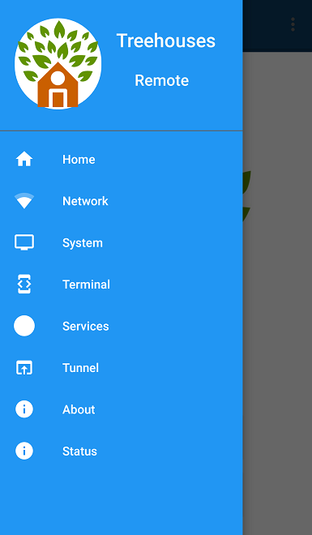 

### Setting Up WiFi
In your terminal enter `treehouses wifi <your local WiFi name> [your password]`

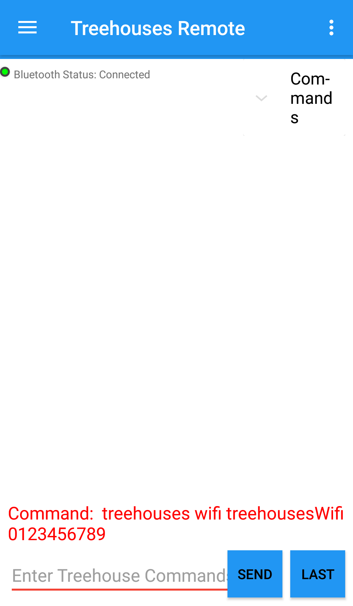 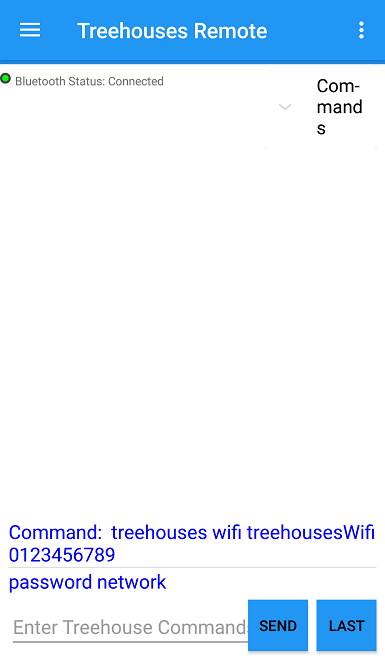
_treehousesWifi_ would be your wifi name _0123456789_ woud be your password

To verify if your raspberry pi is connected to the internet, just type `treehouses internet` into your terminal. If it returns true, it means your Raspberry Pi is connected. If it returns false, it means your Raspberry Pi is not connected to the internet. In that latter case, you should check the spelling of your WiFi name and corresponding password.

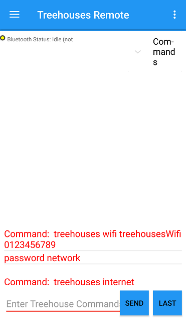 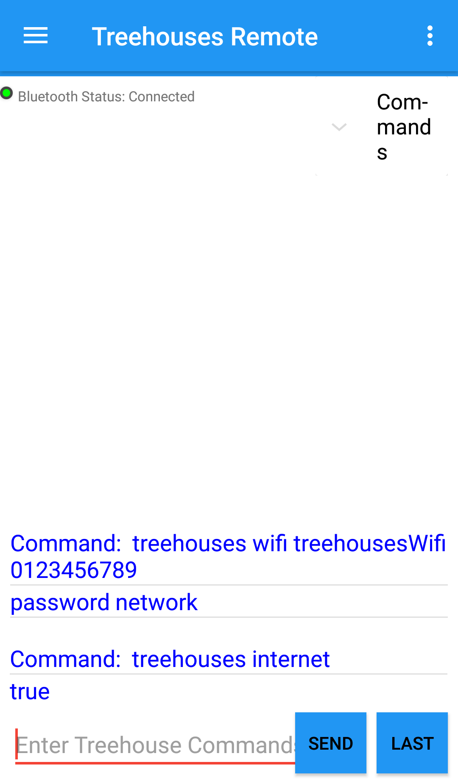

### Setting up a bridge
In your terminal, enter `treehouses bridge <your local wifi name> <the new name for your hotspot> [your wifi password] [(optional) your password for your new hotspot]`

After entering the command you will be asked to reboot. Just enter the command `reboot`. This will disconnect your device. Wait a few moment for the device to boot up and connect like you did in Step 4.

 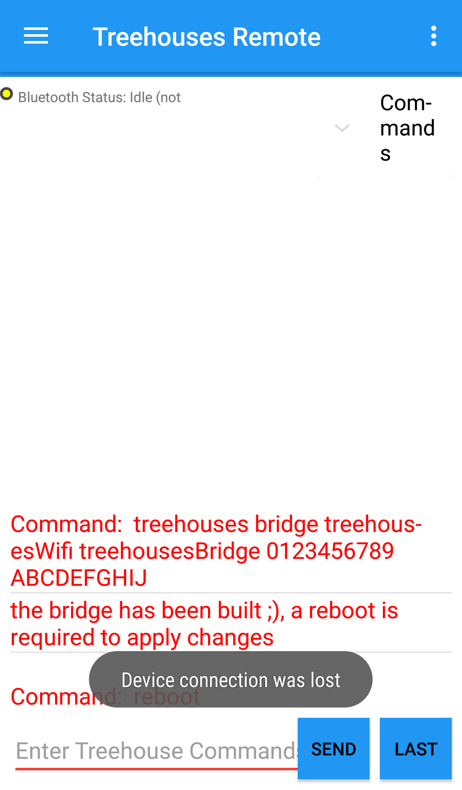
_treehousesWifi_ would be your local wifi name; _treehousesBridge_ would be your hotspot name; _0123456789_ woud be your wifi password; optionally _ABCDEFGHIJ_ woud be your hotspot password

Note: To be certain of the network mode in which your raspberry pi is connected you can use treehouses networkmode and it should return whether your Raspberry Pi is connected via AP internet, WiFi or bridge

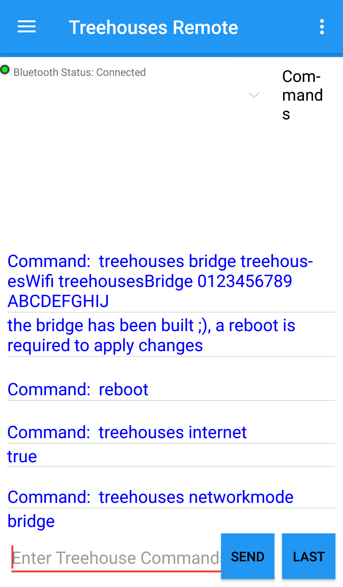

## Step 6: Tor Configuration
Once you are connected to the internet, let's configure your tor access.
### Verify if tor is already configured
In the terminal, type treehouses tor to verify if you get a onion address. Normally it shouldn't and it would return this:

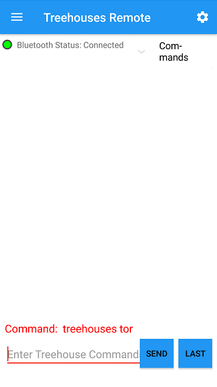 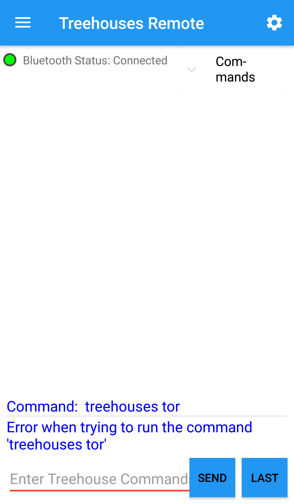

### Configure tor tunnels
 * Type `treehouses tor add 22`
 * Type `treehouses tor list` in order to verify if tor tunnel has been configured
 * Type `treehouses tor add 80`
 * Type `treehouses tor add 2200`
 * Type `treehouses tor start` to configure tor for your Raspberry Pi 
 * Type `treehouses tor list` in order to verify all tunnels have been configured

After configuring tor you can use `treehouses tor` to display your onion address

 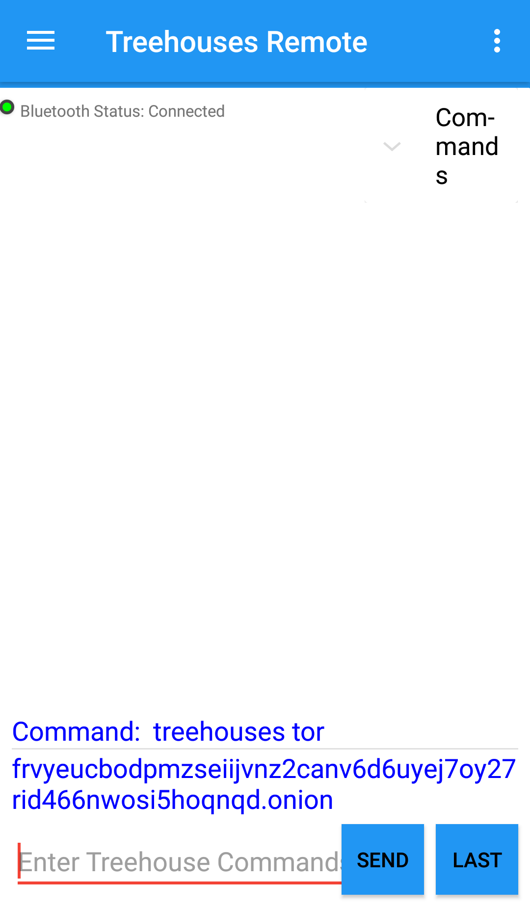

Once you see the display of your onion address that concludes your 6th step.
## Step 7: Onion Address
In order to verify that the previous step is working, we publish the onion address on the [treehouses gitter chat](https://gitter.im/open-learning-exchange/treehouses)
Here is the command to accomplish the step:
`treehouses tor notice now`

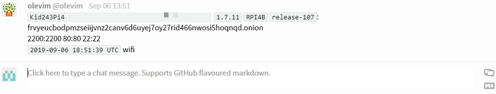

**Congrats you have successfully completed this blog session !!!**
