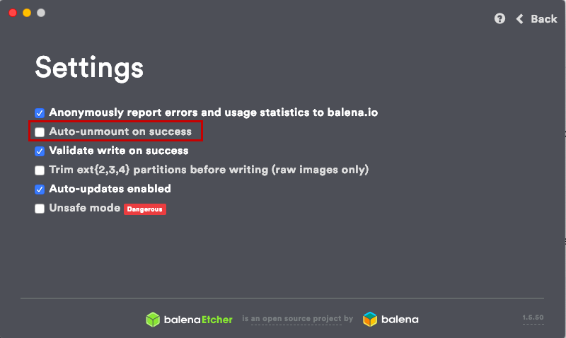
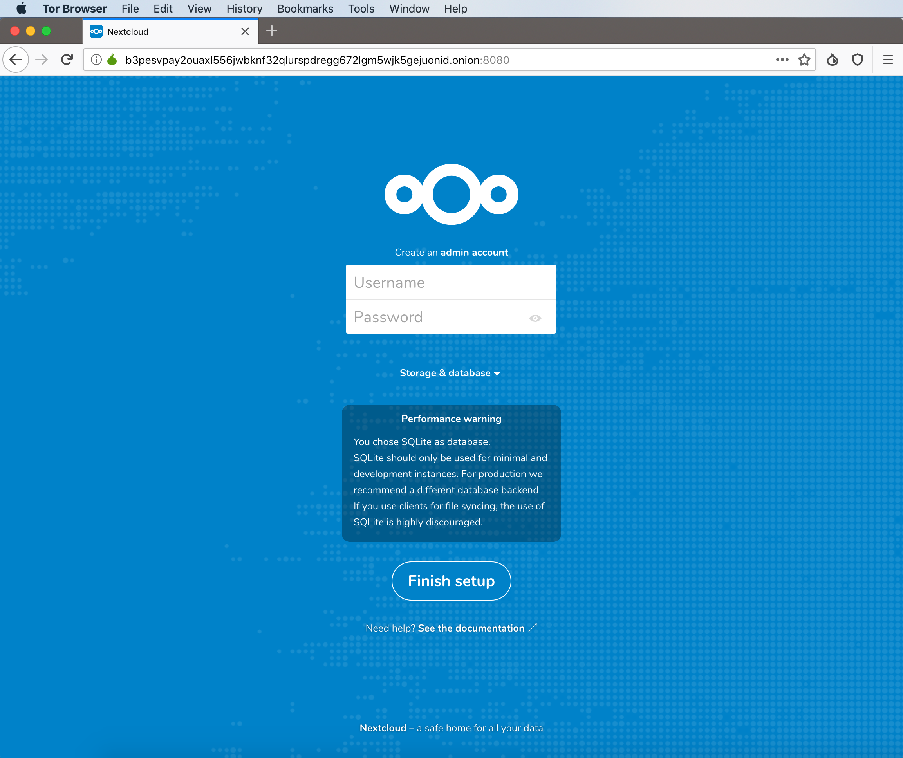
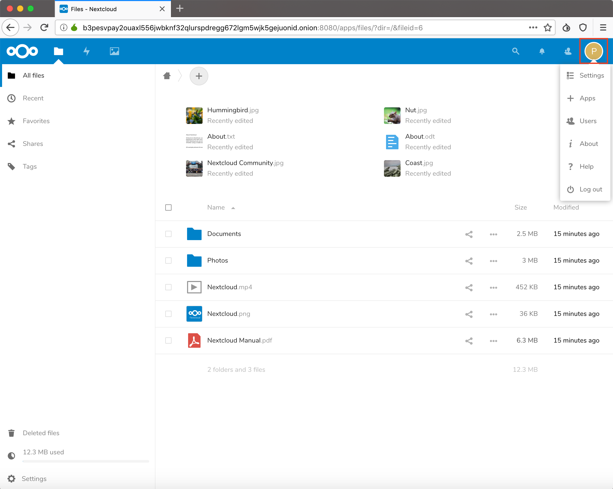

# Running Nextcloud on Raspberry Pi with Tor

Jul 17, 2018 • [liew211](https://www.github.com/Liew211)  

---

I have recently learned about using Tor to allow a Raspberry Pi to be accessed remotely, and have implemented this with [Nextcloud](https://nextcloud.com/).  Nextcloud is a file-storage service similar to Dropbox, or Google Drive, but hosted privately from your own Raspberry Pi.  By using Tor to open up the port occupied by Nextcloud, you will be able to access it without needing to be on the same Wifi network, which enhances Nextcloud's collaborative features, such as file-sharing and messaging.


## Step 1 - Prepare Treehouses image

Download the latest treehouses image from http://download.treehouses.io, then use [balenaEtcher](https://etcher.io) to flash the image onto your SD card.  Be sure to change balenaEtcher's settings to prevent it from automatically unmounting the SD card once it's done flashing.  



In your file explorer, navigate to the `boot` drive, and open the `autorunonce` file in a text editor of your choice.  Delete everthing, and paste this in:
	
```bash
#!/bin/bash

treehouses rename treehouses
treehouses expandfs
treehouses button bluetooth


treehouses bridge 'wifiname' 'treehouses' 'wifipassword'

reboot
```
Replace `wifiname` and `wifipassword` with your wifi name and password.  Save the file, and safely eject the SD card.  


## Step 2 - Set up your computer. 

### macOS

You should already have [Homebrew](https://brew.sh) installed.  You can check if it's already installed by running `brew -v` in your terminal.  If you haven't yet installed it, run the following:
```
/usr/bin/ruby -e "$(curl -fsSL https://raw.githubusercontent.com/Homebrew/install/master/install)"
brew install wget
```

Then, install Tor and Tor Browser:
```
brew install tor
brew cask install tor-browser
```

### Windows & Linux

Install [Tor](https://www.torproject.org/download/)

## Step 3 - Start up Nextcloud

Plug the microSD into your Raspberry Pi, and power it on.  The red LED should turn on, indicating that the Raspberry Pi is connected to power.  Once the green LED next to it on your Raspberry Pi stabilizes into a solid green, you should see "treehouses" appear in available Wifi networks.  Connect to it, and make sure that you have an internet connection by opening up another web page.  

Find the Raspberry Pi's IP address in your network settings (it will probably be `192.168.2.1`).  Open up your terminal or command prompt, and run `ssh root@[IP address]` to enter the root of your Pi.  Run 
```
docker run -d -p 8080:80 --name nextcloud --restart=unless-stopped nextcloud
```
to pull the Docker image for Nextcloud, and start up the container - this will take a few minutes.  To check if the container is running, run `docker ps`:
```bash
root@treehouses:~# docker ps
CONTAINER ID        IMAGE               COMMAND                  CREATED             STATUS              PORTS                  NAMES
b9484a8d681e        nextcloud           "/entrypoint.sh apac…"   12 minutes ago      Up 12 minutes       0.0.0.0:8080->80/tcp   nextcloud
```
Now that the container has been created, you can stop and start it with `docker stop nextcloud` and `docker start nextcloud`.  To view all running and stopped containers, run `docker ps -a`.


## Step 4 - Start up Tor

As we have run Nextcloud on port 8080, that's the port that we will have to open up with Tor.  While still in the root of treehouses, run `treehouses tor add 80 8080`, then run `treehouses tor` to find the tor address.  You should see something like this:
```bash
root@treehouses:~# treehouses tor add 80 8080
Success: the port has been added
root@treehouses:~# treehouses tor
b3pesvpay2ouaxl556jwbknf32qlurspdregg672lgm5wjk5gejuonid.onion
```
In the Tor browser on your computer, navigate to the .onion address.  For instance, I would navigate to `b3pesvpay2ouaxl556jwbknf32qlurspdregg672lgm5wjk5gejuonid.onion` in my Tor browser.  If the Nextcloud container is up and running, you should see the Nextcloud set up page:  




## Step 5 - Wrap up    



After you have created an admin account and logged in, you can play around with the settings, add users, install apps to augment your Nextcloud experience, and more.  As long as your Raspberry Pi is connected to internet, and the Docker container is running, you will be able to access Nextcloud through the same Tor address (if you forget it, you can always ssh into your Pi and run `treehouses tor`).

Thank you for reading, and happy hacking!
