# Debian for Windows 

#### What we'll be doing
As of March 2018 Debian is available for Windows users through the Windows store as an app for the Windows Subsystem for Linux (WSL).

The app gives you a Debian stable command line environment running on the Windows kernel. Most of the packages in Debian stable should "just work", meaning you get a full UNIX system inside of Windows, which is critical for fully taking advatage of the capabilities of the Paspberry Pi's used in the Systems team.

There are currently two versions of WSL, version 1 and version 2

WSL 1 has been in use in Windows 10 for a while and allowes you to use different Linux distros directly from your Windows 10 machine. 
WSL 2 includes the capabilities of WSL 1 and provides increased file system performance and full system call compatibility, for this reson OLE system's engeneering team members require WSL2.

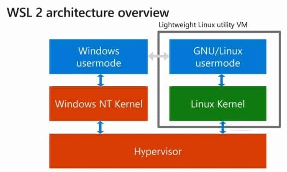

## Pre-Requisits to setting up the Windows Subsystem for Linux 2 

### Checking if your computer supports Hyper-V Virtualization
For your device to run a WSL we need to check if it has virtualisation enabled. 

Most recent CPUs have this feature enabled already, but if you are unsure whether this is enabled on your device follow these steps:
1. Open Task Manager (CRTL + ALT + DELETE)
2. Go to Performance Tab 
3. Find whether virtualization is enabled or not

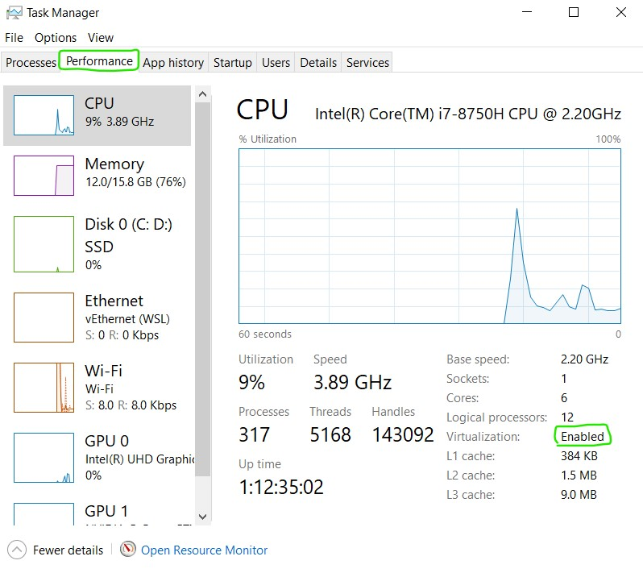

If you're device has vertualization enables you're good to go! 

Otherwise please follow the following steps to [enable virtualization on Windows](https://www.howtogeek.com/213795/how-to-enable-intel-vt-x-in-your-computers-bios-or-uefi-firmware/)

### Joining Windows 10 Insider Preview edition

The second requirement for running WSL 2 is to be part of Windows 10 Insider Preview Build 18917 or higher

We will first check what current version of windows you are running by following these following steps:
  1. Press Win + R
  2. Type in "winver"
  3. Hit enter 
  
  The follwoing will appear :
  
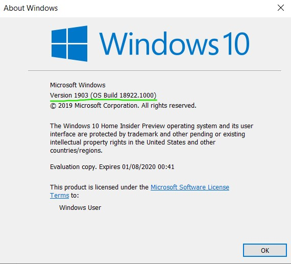
 
  
  If you are already an Windows 10 Insider Preview Build 18917 or higher you're all set, otherwise carry on to the `Getting Windows insider edition ` section

  #### Getting Windows Insider edition
Once you've completed this steps, your device will be enrolled in the Windows Insider Program, and it will start receiving preview builds as soon as they become available depending on the cadence you have selected.

 `Optional: A good step to take before making changes to your computer is to create a backup that you can go back to if things go wrong or at the least to backup your important files. 
  Upgrading to the windows insider is quite safe, but being on the safer side never hurts.`
  
**To join the program follow these steps:**
1. Open Settings.
2. Click on Update & security.
3. Click on Windows Insider program. 
4. Click the Get started button.

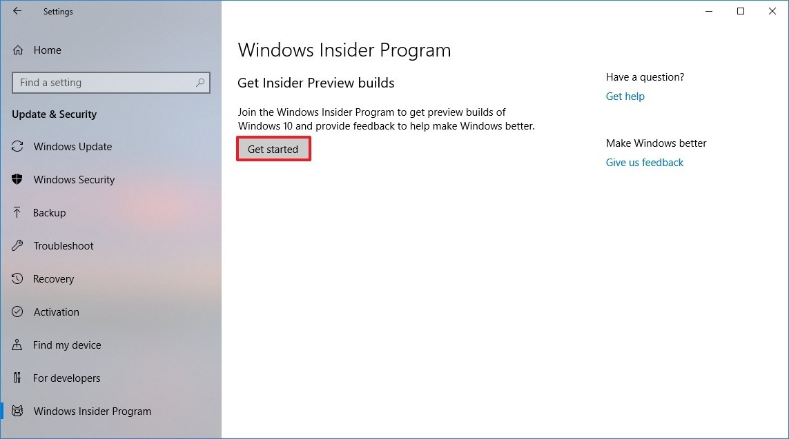

5. Click the Link an account option.

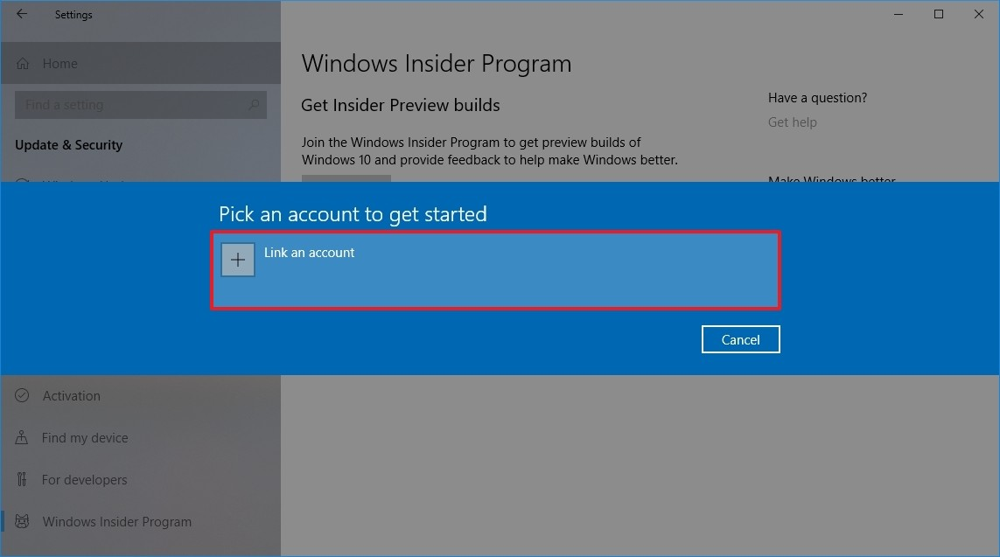

6. Select your Microsoft account, and click the Continue button.

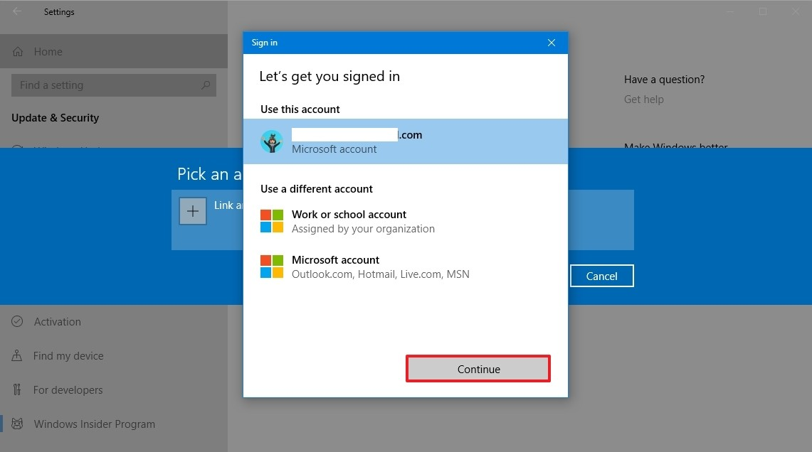

7. On the "What kind of content would you like to receive?" page, use the drop-down menu, and select one of the following:

`Just fixes, apps, and drivers: Enrolls your device in the Release preview ring without getting preview builds. However, pre-releases will be available in this ring as soon as the new version is considered complete.`

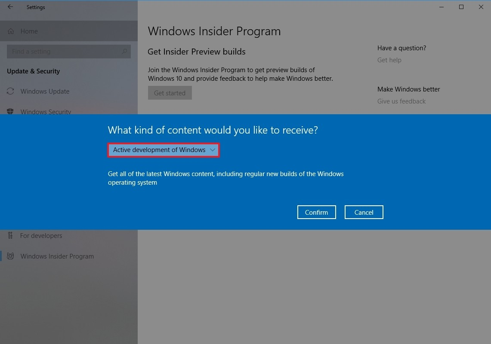

8. Click the Confirm button.

9. On the "What pace do you want to receive preview builds?" page, use the drop-down menu, and select:

Slow: Gets preview builds with the latest features and changes with minimal risks of coming across bugs and significant problems.

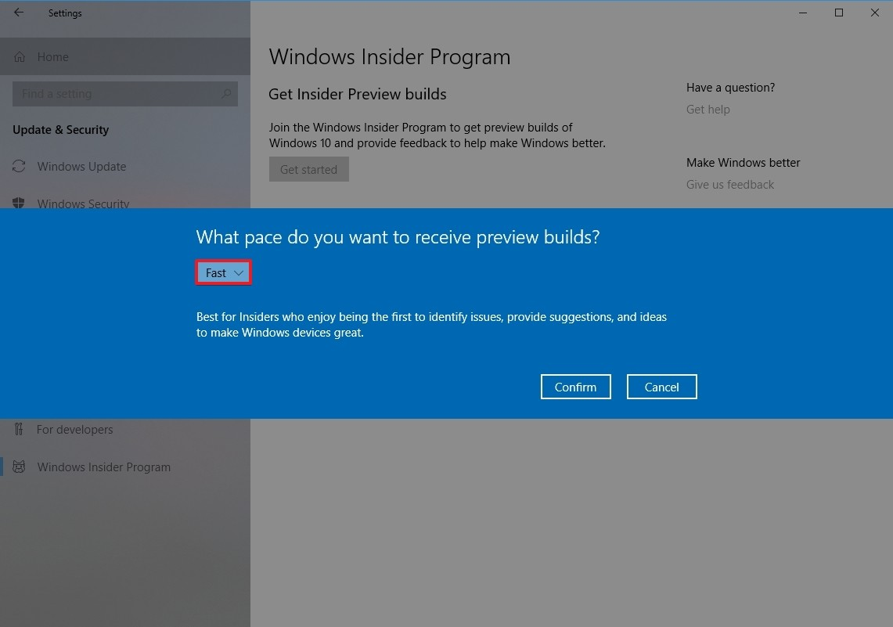

10. Click the Confirm button.

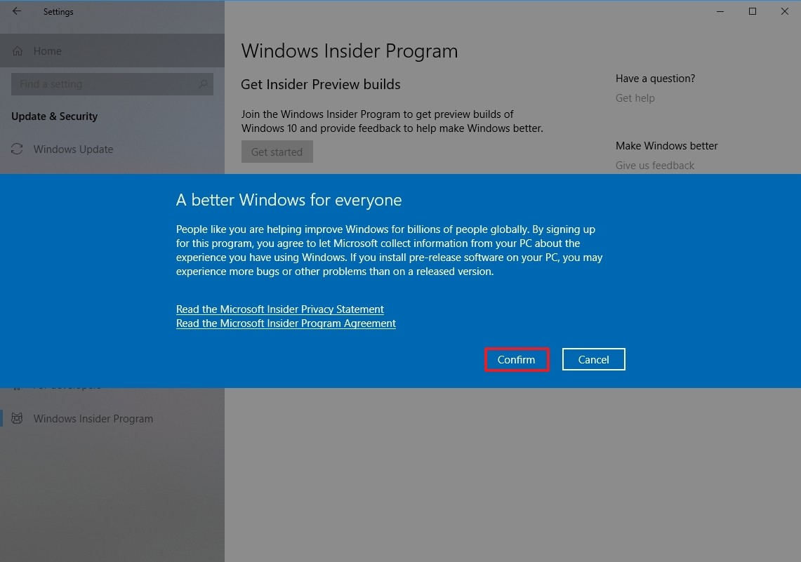

11. Click the Confirm button again to agree to the terms.

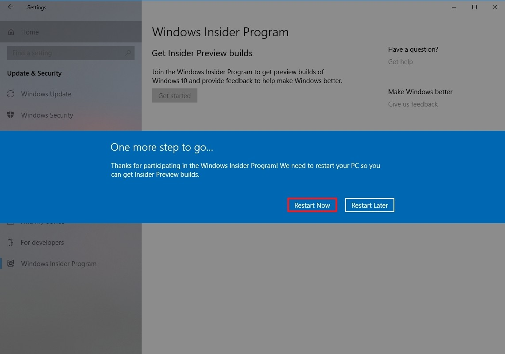

12. Click the Restart Now button.

------------------------------------------------
## Install Debian
Before installing any Linux distros for WSL, you must ensure that the "Windows Subsystem for Linux" optional feature is enabled:

1. Open PowerShell as Administrator and run:
  Enable-WindowsOptionalFeature -Online -FeatureName Microsoft-Windows-Subsystem-Linux
 
2. Restart your computer when prompted.

3. Open the Microsoft Store and search '"Linux"' 

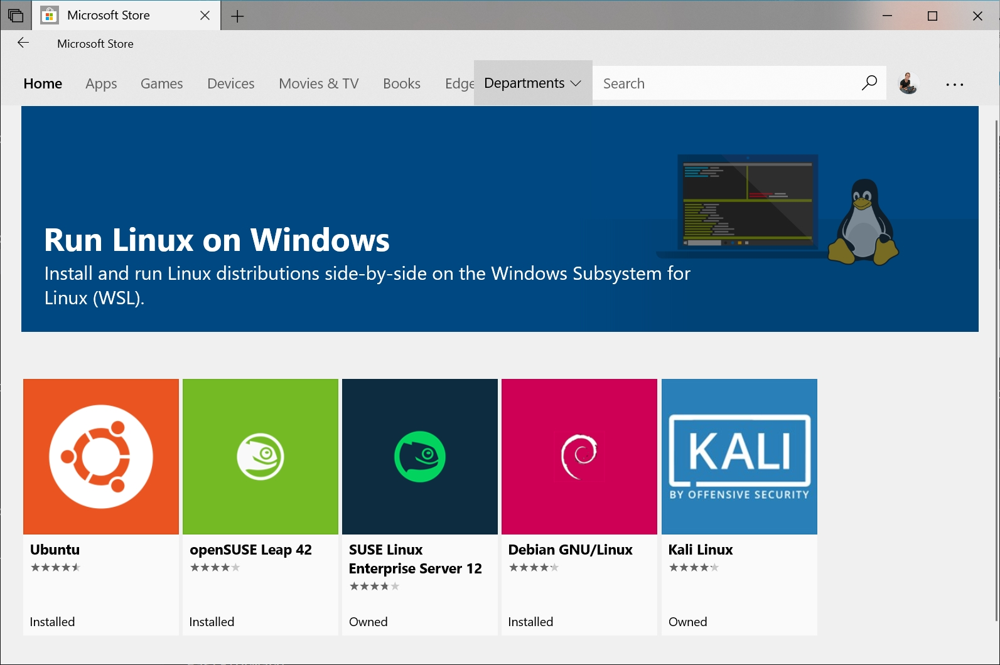
  

4. Click on 'Debian'

5. From the distro's page, select "Get"

6. Allow Debian to install 

7. Launch Debian

8. `Optional: Add a shortcut to Debian from your desktop or taskbar`

The first Debian runs, a Console window will open, and you'll be asked to wait for a minute or two for the installation to complete.

During this final stage of installation, the distro's files are de-compressed and stored on your PC, ready for use. This may take around a minute or more depending on the performance of your PC's storage devices. This initial installation phase is only required when a distro (Debian) is clean-installed - all future launches should take less than a second.

9. Once installation is complete, you will be prompted to create a new user account (and its password).

`Store this password securly somewhere`

We have now got you set up with Windows Insider Edition and have Debian working, so we're finally ready to get WSL 2 up and going!

------------------------------------------
### Installation of WSL 2

##### Enable the 'Virtual Machine Platform' optional component

1. Open PowerShell as an Administrator and run:

`Enable-WindowsOptionalFeature -Online -FeatureName VirtualMachinePlatform`

2. After these changes are enabled you will need to restart your computer.

##### Set a distro to be backed by WSL 2 using the command line

1. In PowerShell run:

`wsl --set-version Debian 2`

2. Make WSL 2 your default architecture with the command:

`wsl --set-default-version 2`

This will make any new distro that you install be initialized as a WSL 2 distro.

3. Finish with verifying what versions of WSL your distro are using use the following command:

`wsl --list --verbose or wsl -l -v`

The distro that you've chosen above should now display a '2' under the 'version' column. Now that you're finished feel free to start using your WSL 2 distro!

-----------------------------------------

### Last step: Update & upgrade Debian's packages
Windows does not automatically update or upgrade Debian: This is a task that the Linux users prefer to control themselves.

Let's update  your package catalog, open your Debian command terminal and type:
`sudo apt update && sudo apt upgrade`

You will be asked a series of Y/N questions, for these hit enter or type `y` then enter 

Congratulations! You now have a WSL 2 version of Debian running on your operating system! 

