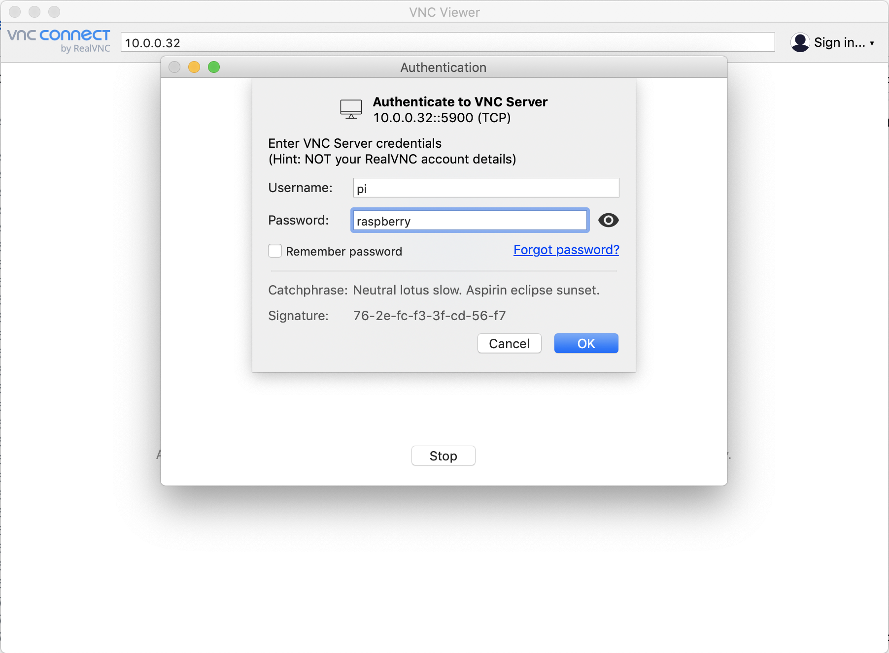

# Raspberry Pi Headless Setup

Aug 16, 2019 • [irisb1701](https://github.com/irisb1701)

---

Don’t have an extra keyboard or monitor?? Here’s how to do a headless Raspberry Pi setup with a [treehouses](http://download.treehouses.io/) image, which is our modified version of Debian.

## Hardware requirements:
1.  Raspberry Pi 4 B, 3 B/B+, or Zero W
1.  Power cord
	- 3A USB-C for Pi 4 B, 2.5A microUSB for Pi 3 B/B+, or 1.2A microUSB for Pi Zero W
1.  3 Class 10 or U1 microSD cards
	- minimum 16GB, but we recommend 32GB or greater
1.  A microSD card reader
	- Check your computer if you have a slot for a card reader, otherwise use a USB reader
1.  Ethernet cable or wifi dongle
1.  Laptop or computer with mimimum of 8 GB of free hard-drive space and 8 GB of RAM


## Step 0 - Prepare image

Download the [latest treehouses image](http://download.treehouses.io/) to your computer, and flash it onto your microSD card using [balenaEtcher](https://etcher.io).


## Step 1: Get your RPi Up and Running

Unmount your SD card and place it inside the RPi.

Connect it to your router using the Ethernet cable, and power it on.  The red LED should turn on, indicating that the Raspberry Pi is connected to power.

## Step 2: Accessing Treehouses 

Once the green LED next to it on your Raspberry Pi stabilizes into a solid green, find its local IP address by typing `ping treehouses.local`,`ping treehouses.home` or `ping treehouses.lan` in your terminal or command prompt.  You'll need the local IP address to configure the  You should see something like this:
```
PING treehouses.local (192.168.1.119): 56 data bytes
64 bytes from 192.168.1.119: icmp_seq=0 ttl=64 time=69.424 ms
64 bytes from 192.168.1.119: icmp_seq=1 ttl=64 time=4.640 ms
64 bytes from 192.168.1.119: icmp_seq=2 ttl=64 time=2.945 ms
64 bytes from 192.168.1.119: icmp_seq=3 ttl=64 time=3.372 ms
```
Once you start seeing this output, you can use `Ctrl`+`C` to terminate the process.  As you can see here the local IP address of your Pi is `192.168.1.119`.  If this doesn't work, you'll need to [use another method](https://www.raspberrypi.org/documentation/remote-access/ip-address.md) to find the local IP address.

SSH into the Pi by using (substitute `IP_address` with the IP address you just found):
~~~
ssh pi@IP_address
~~~
You will now see a message that reads
```bash
Authenticity of host can't be established, are you sure you want to continue? (yes/no)
```
Enter `yes`, and you will be prompted for a password which is "raspberry" by default (you can change it later).

## Step 3: Set Up RealVNC

Download [RealVNC Viewer](https://www.realvnc.com/en/connect/download/viewer/) on your computer.

Meanwhile, enable VNC on your Pi by running the following in your terminal while SSHed in:
~~~
sudo -s
treehouses vnc on
reboot
~~~


## Step 4:  View your treehouses desktop

Open up the RealVNC Viewer, and enter the local IP address of the Raspberry Pi in the search bar.  You may be prompted to log in: username `pi`, password `raspberry`.



Your Pi desktop should appear:


Congrats!  You have now set up your headless Raspberry Pi, and can access the terminal through SSH, as well as the desktop through VNC.
