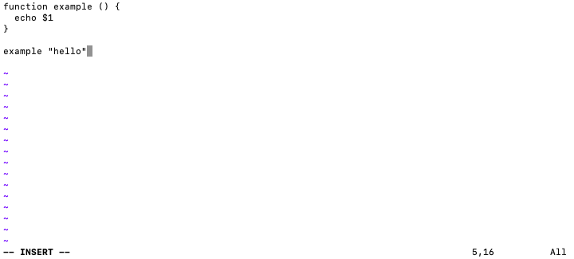
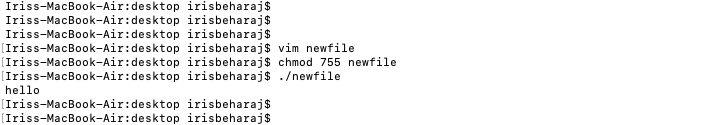
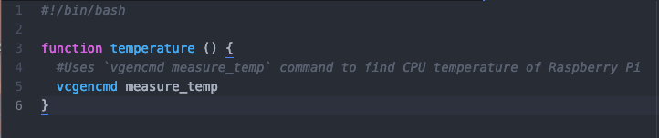
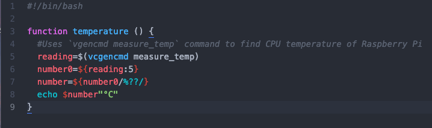
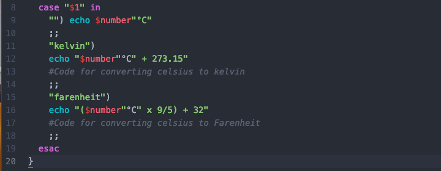
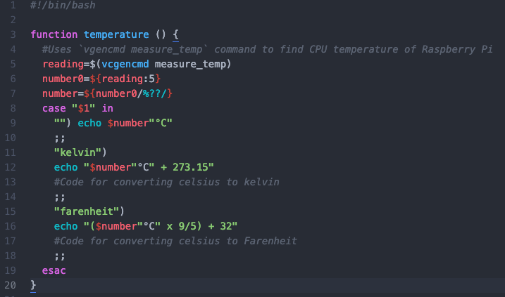
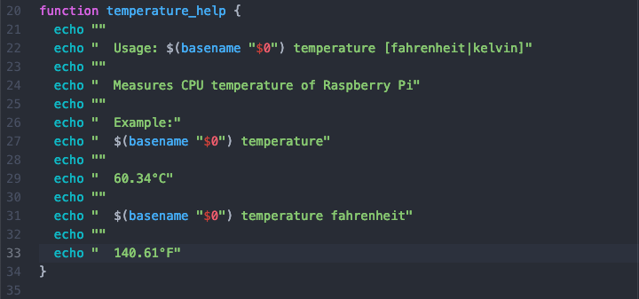

# Adding a New Feature

31, August 2019 • [irisb1701](https://github.com/irisb1701)

---

As a system's engineer you may need to work with the [treehouses cli](https://github.com/treehouses/cli) (command line interface). 

Here are step by step instructions on how to create a new feature for treehouses.

## Determining a New Feature:

Example situation:
As you're testing the new image for treehouses you notice your raspberry pi is getting hot. You know anything past 85°C may damage your pi so you'd like to monitor its core temperature.

If you run the raspberry pi command `vcgencmd measure_temp`, it will return its core temperature in celsius.

Looking at the treehouses cli commands, you notice there aren't any commands involving detecting temperature and decide it would be a useful addition.

Now that you have an idea for a new command, you will create a new issue and when approved, can create a new branch and begin working on it.

## Step 0 - Vim

Vim is an easy way to test your code. Here are instructions on how to use it.

1. Download Vim [here](https://www.vim.org/download.php) for windows and follow their instructions for set-up or
    * type `brew install vim` in your terminal for Mac
    * `sudo apt-get install vim` in your terminal for Ubuntu
1. Create a new file and give it a name`vim mycoolnewfile.sh`
1. The new file will automatically open, now press i on your keyboard to edit it
1. Include `#!/bin/bash` at the top
1. Copy the below script, press Esc, type `:wq`, and press Enter to save it and exit
1. 
1. Now enter the command `chmod 755 mycoolnewfile.sh` so you can run it
1. Enter `./mycoolnewfile.sh`
1. You should now see what the function returns. This is how you can easily test your functions
1. 

## Step 1: Creating your new Command
Your function can be as simple as just calling the `vcgencmd measure_temp` command, however this command will return something like "temp=60.00'C".
You may want to modify it.

1. Your first line will define a function which we will call temperature
1. Inside the function we will call `vcgencmd measure_temp` by simply writing in the command
1. 
1. This can be the end of the function, however we want to modify what is returned
    * First lets put the `vcgencmd measure_temp` command in a variable and call it "reading" so we can refer to it: `reading=$(vcgencmd measure_temp)`
    * Lets make a new variable called number0 referencing our variable `reading` to remove "temp=": `number0=${reading:5}`
    * Now let's make a third variable called number which refers to our variable number0 to remove `'C`: `number=${number0/%??/}`
    * Now if we `echo $number` we will get the pure number returned, no `temp=` or `'C`, just `60.00`.
    * We're going to finish the function by adding `°C` to our number by using `echo $number"°C"`
    * This returns our desired output which will look like this: `60.00°C` instead of like this: `temp=60.00'C` 
    * 

## Step 2: Subcommands
Additionally you may want to add subcommands to return different temperature scales such as Fahrenheit or Kelvin.
For example `treehouses temperature` will return the temperature in a default setting, but `treehouses temperature fahrenheit` will return it in Fahrenheit. The command `fahrenheit` is your subcommand.

Shown below is how to create subcommands using cases

For convenience, the function above does not actually convert celsius to fahrenheit or kelvin, just displays a short message. However two new subcommands have just been added.
Now instead of your command being just `treehouses temperature` it can now also be `treehouses temperature fahrenheit` or `treehouses temperature kelvin`

## Step 3:  The 4 Files That Must Be Added/Modified in the cli Repo

You will now add/modify these 5 files to your branch of the cli repo. Remember to only make changes to your own branch and make sure you are on it before pushing these changes.

1. **README.md**: First you will include your command in the `README.md` file in the cli Repo
    * Place the new command either at the end of the list or near commands it is similar to
    * Copy the structure of the previous commands and include a description
    * In brackets `[]` place any optional subcommands divided by a pipe `|`
    * In angled brackets `<>` place mandatory subcommands
        * A mandatory subcommand for example would be <on|off>, for some commands one or the other must be selected
        * An optional subcommand would be, like in this case, choosing to see the temperature in Fahrenheit or Kelvin which you don't necessarily have to do to run the command
    * Your entry should look like this: `echo "  temperature [fahrenheit|kelvin]     displays raspberry pi's CPU temperature"`

2. **help.sh**: Now go into cli/modules and modify the `help.sh` file in the exact same way you modified the `README.md` file

3. **Modules**: Now you will add your `temperature.sh` file into the modules folder. This is the file that has the source code for your new feature.
    * Inside the file you will make sure you have a second function called function `temperature_help`
    * Each command has a help function that when called will display a description of the command and show examples of its usage.
    * Using a different command's help function as a template you can easily create one for your own command
    * Your final `temperature.sh` file should look like this:
    
    

4. **_treehouses**: Lastly you will open up `_treehouses` in the cli repo and add your commands to the heredoc (between the `EOF`s) in `_treehouses_complete()`

  Now go ahead and push all the changes you've made to your branch on Github.

## Step 4: Testing Your Command

  1. Now get your Pi running.
  1. Once you are connected to treehouses in your terminal, git clone the cli repo using `git clone https://github.com/treehouses/cli.git`
  1. Make cli your current directory using `cd cli`
  1. Now go to your branch using `git checkout <whatever you named your branch>`
  
 _**IMPORTANT NOTE:**_ When creating a branch, make sure it uses the feature you are adding or updating to be the prefix. For example, here we are creating the  `temperature` module with subcommands `fahrenheit` and `kelvin`. So a good name for this branch could be: `temperature-conversions`
 
  1. Enter `git branch` for safe measure to see that you really are on your branch
  1. Now you can test out your new command and subcommands: `treehouses temperature`, `treehouses temperature fahrenheit`, and `treehouses temperature kelvin`
  1. You may have to use `./cli.sh` instead of `treehouses` until your branch is approved: `./cli.sh temperature`
  1. If your command didn't work the way you intended it to, you can always fix your files
  1. Cd into cli/modules using `cd modules` and open your desired file using vim: for example `vim temperature.sh`
  1. You can now modify your file by pressing `i` and exiting by pressing esc then typing `:wq`
  1. Test your file again using `./cli.sh temperature` until it works how you intended it to
  1. Once everything is working perfectly, go ahead and create a pull request

  Congrats! You just created your first feature!
