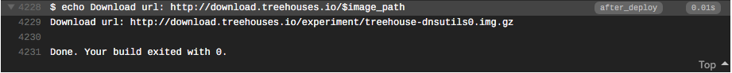

# Creating a Script for Builder

21, September 2019 • [irisb1701](https://github.com/irisb1701)

---

The Builder repository contains the files that go into each new treehouses image.
When you modify a file here, once it's merged it will be part of the next update.

Below are detailed instructions on how to make an addition to Builder

Example situation:

You just downloaded the new update for treehouses and start it up.
You realize a lot of the software/items you had downloaded for testing purposes in the old image must be re-downloaded all over again.
You notice `terraform`, for example, takes a while to download and is something you keep needing to re-install.
Why not have `terraform` already installed in the image?

You can do that by adding a script to builder.

## Step 0: Find the Right Download Link

1. Go to `terraform`'s [download](https://www.terraform.io/downloads.html) page
1. Scroll down and find the option for Linux (treehouses is based off of Raspbian, a Linux distribution)
1. Skip over 32-bit and 64-bit, and right click on "arm", the correct selection for RPi's
1. Select "copy link address", which should look like this: `https://releases.hashicorp.com/terraform/0.12.9/terraform_0.12.9_linux_arm.zip`

## Step 1: Write the Script for Installation
Just as you would install `terraform` on your own system, you will write a script with a list of the commands you would use and they will be executed on the treehouses system

Your script should include the following:

1. First you will use the `wget` command to retrieve the download: `wget https://releases.hashicorp.com/terraform/0.12.9/terraform_0.12.9_linux_arm.zip`
1. Next unzip your file using `unzip terraform_0.12.9_linux_arm.zip`
1. Now you will create a directory to place the `terraform` file in: `mkdir -p mnt/img_root/usr/local/bin/`
1. And move the downloaded and unzipped file inside using `mv terraform mnt/img_root/usr/local/bin/.`
1. Before saving your script complete step 2
1. 

## Step 2: Include the File in the Correct Folder

1. Locate the builder Repo in treehouses
1. Open `scripts.d` and scroll to the bottom
1. You will see the last entry is `31_install_ssh_configs.sh` so you will include your file after this one by calling it `32_terraform.sh`
1. Now go ahead and save and name your script `32_terraform.sh`
1. As usual you will create a new branch, we'll call it `terraform`, and then make sure you are on this branch using `git checkout terraform`
1. Include your script in the `scripts.d` folder and push your changes to your branch.
1. 

**NOTE:** If you are working on a Windows machine, refer to https://stackoverflow.com/a/57584620 to make sure the file permissions for your newly added files are set correctly. This will help prevent builder from skipping over your script when creating your new image.

## Step 3: Checking for Errors
Because it takes a long time to 'bake' a new image for treehouses, we can't just create a new image every time we want to test our new code for errors. To do this, we use a different method:

1. Create a pull request for your changes, after doing this you will have triggered a Travis build
1. Go to your pull request and scroll down to the checks
1. Where it says `continuous-integration/travis-ci/pr Pending` select details
1. 
1. A travis build will be run to test and see if any errors will be encountered if a new image were to be created
1. To see what this would look like, you can check out https://travis-ci.org/treehouses/builder/builds/581941970#L3084, here you can see the build that was run when `terraform` was actually added to treehouses
1. On line 3084 you will see that `terraform` has been added successfully (You can also search by using Cmd or Ctrl + F `run-parts: executing scripts.d/32_terraform.sh`

## Step 4: Creating a Prototype
In this step we will create a prototype by making a tag. You can find tags on Github when you are on a repo and open the branches window, tags can be seen right next to it. The tag serves as a bookmark placed right after the last commit. They are important because they are a required step for creating new images

1. If all goes well with your Travis build, it's now safe to create a prototype
1. Open your terminal and run the following commands:
1. `git checkout terraform`
1. `git pull` Always make sure when completing this step that your branch is completely up to date
1. `git tag` To view the current tags, optional
1. `git tag release-terraform0` Here you will create and name your tag
  - `release-` is required for the build to run.
  - Following `release-` is our branch name
  - and then build number (0 for now, but if we end up running more builds this number will go up with the new tags we create)
1. `git push --tag` Then push your tag to the remote branch, through our webhook this triggers a travis release

Creating a tag creates a second deploy -the real one this time. Unlike the travis build in step 3 which gets triggered by pull requests or commits and serves only to check if the build will run into errors, a tag triggers a new release and this time a new image and treehouses version will get created (This is how dogi creates the new treehouses images that you often download and test)

Once you've deployed your travis build, you can view it and all the builds by following the link here https://travis-ci.org/treehouses/builder/branches. The details of your build can be seen by clicking the large green checkmark to the right of your branch. This will take you to a page like the one linked here https://travis-ci.org/treehouses/builder/builds/589707976#L4293. The new image download link can be found in the second to last line of code in the job log. Clicking on the line that begins `$ echo Download url:` will cause the download url to your specific branch to appear. Navigating to the URL for your branch will automatically begin the download. 

It will take some time to appear, however you can download your new image as well at this link http://download.treehouses.io/experiment/. You've now just created a new treehouses image. 

## Step 5: Testing your code

1. Now you can finally run your RPi, ssh into treehouses and try to use `terraform`, or any new addition you made as you normally would on your own system
1. If all works well, then you have successfully added a new script to builder
 

## Congratulations!
