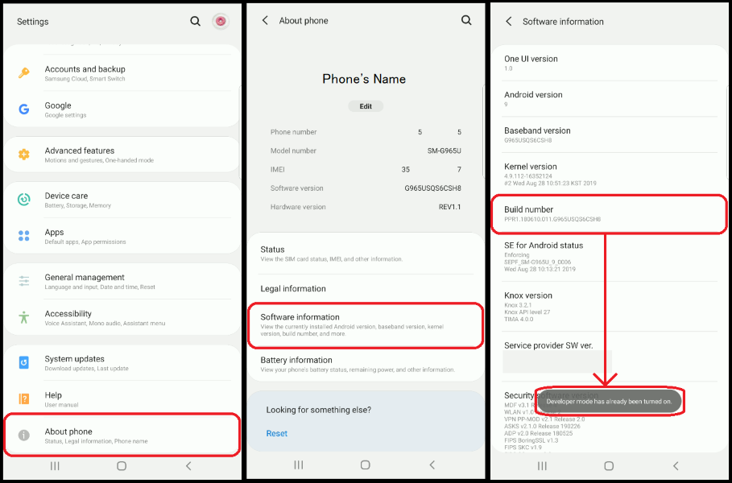
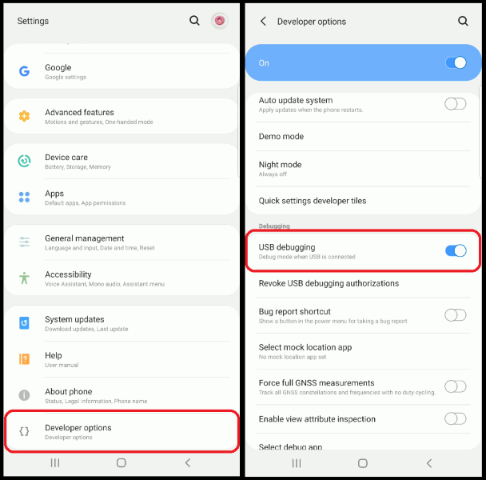

# Android Screen Sharing

September 25, 2019 • [CalebProvost](https://github.com/CalebProvost)

Updated on August 19, 2020 • [anthonyhvo12](https://github.com/anthonyhvo12) • Based off of [Genymobile’s documentation](https://github.com/Genymobile/scrcpy)

---

## About This Method
There are many ways to connect and share a device's screen. This blog will use the open source application `scrcpy` for its ability to use the device through the screen sharing and its user support. There will be two main steps in getting `scrcpy` to work; getting the application onto your computer, and setting up USB Debugging on your Android device. The latter of the two requires the Android device to be at least Android 5.0.

## Install scrcpy
Follow the instructions at [Genymobile's official documentation](https://github.com/Genymobile/scrcpy#Get-the-app) (available on Linux, Windows, and macOS).

## USB Debugging
#### Enable Developer Mode
1. Open your Android device's settings and select "About Phone" or "About Device".
1. Locate "Build Number" within the settings referencing system software (sub settings are different per device).
1. Press the "Build Number" 7 times where it should state developer mode unlocked.

#### Enable USB Debugging
1. Now that you have developer mode unlocked, go to newly aquired developer settings (within the main settings page).
1. Scroll down to "USB Debugging" and enable the option.

## Use scrcpy!
1. Connect your Android device to your PC.
1. A pop-up will ask for confirmation to allow connection with your PC, accept it.
1. Next, start scrcpy in the method designed for your OS:
    * Windows: Open the directory you saved from the .zip file and execute `scrcpy-noconsole.exe`.
    * Mac: Open terminal and enter `scrcpy`.
    * Linux: Open terminal and enter `scrcpy`.
