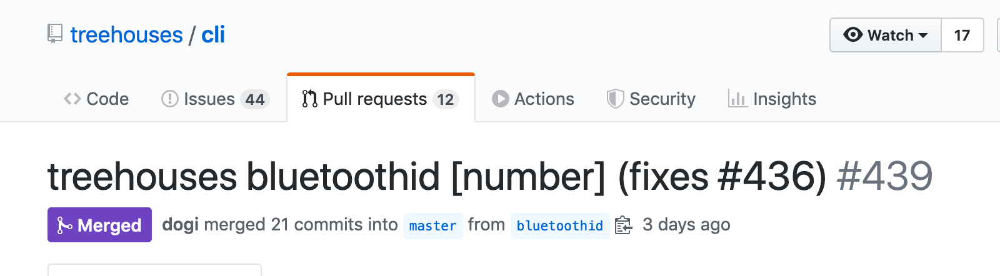
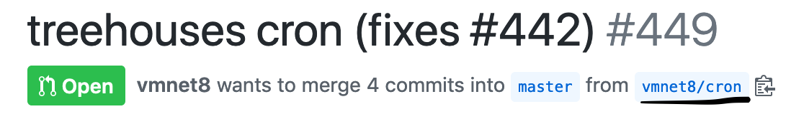
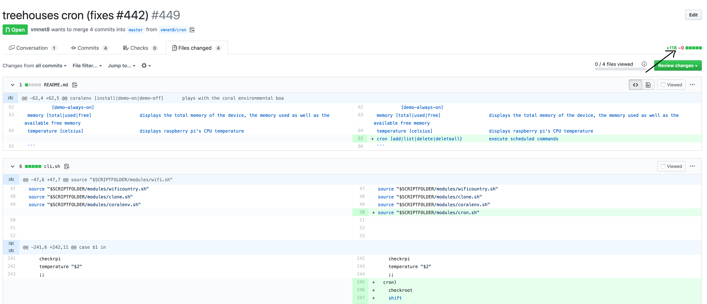
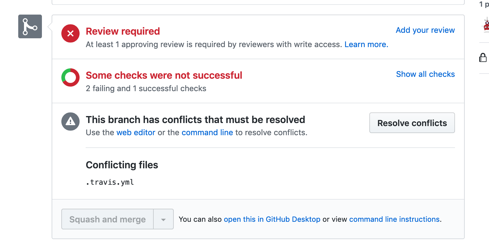
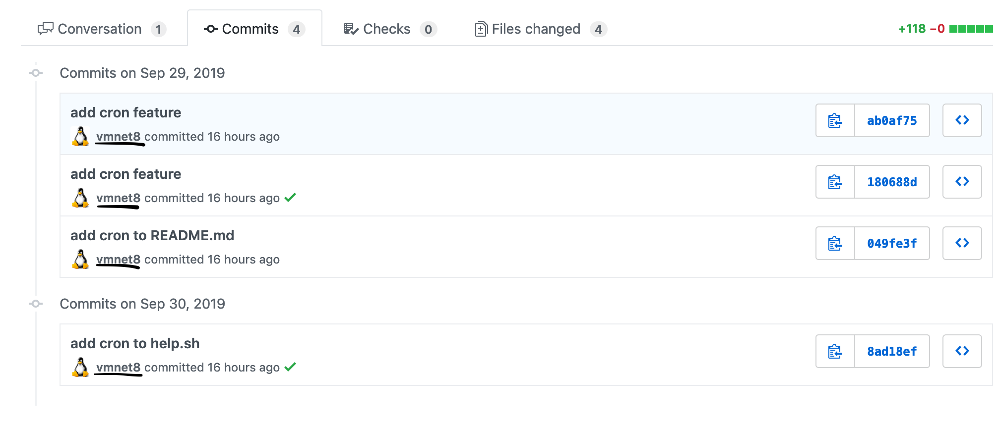
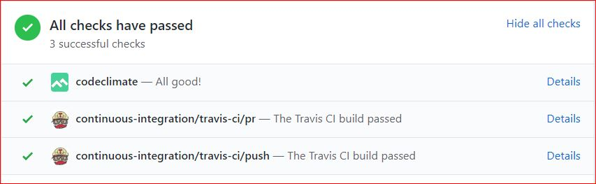
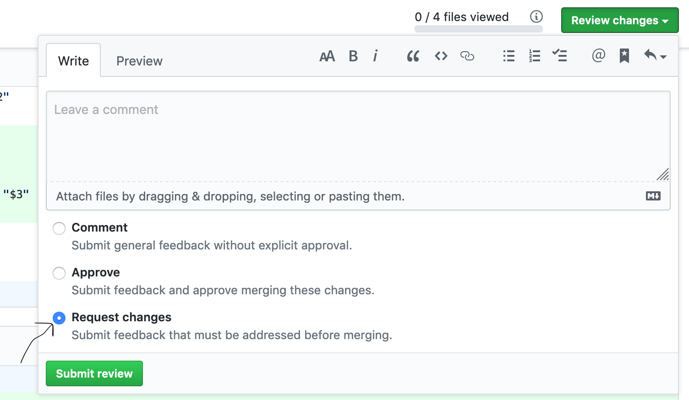
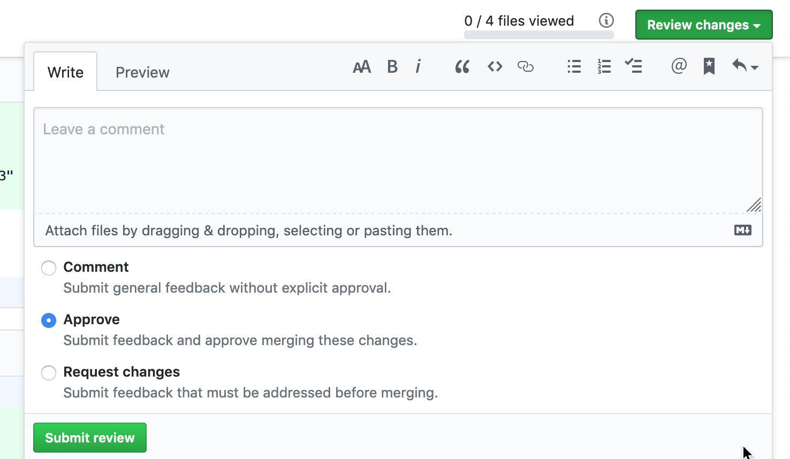

# Reviewing PRs on the CLI repository

30, September 2019 • [Xavierh93](https://github.com/xavierh93) | [vmnet8](https://github.com/vmnet8)

---

As a system's engineer you may need to work with the [treehouses cli](https://github.com/treehouses/cli) (command line interface). 

Here are step by step instructions on how to review Pull Resquests (PR) for the Treehouses/CLI repository.

## Step 1: Check the pull request title and description

Make sure the issue number that the pull request is fixing is in the pull request title. An example is shown below.




## Step 2: Verify that there is a branch for the pull request

 The pull request should have its own branch for the issue fix. You can find which branch the pull request is on right beneath the title of the pull request in the blue box.



## Step 3: There are no unnecessary file/line changes in the pull request

Click on the files changed tab beneath the branch in the previous step. On this page you can see all the changes that have been made in this pull request including all the files that were changed and every line that was added or removed from each file. Green lines indicate lines that were added while red lines indicate which lines were removed. Directly above the green "Review Changes" box is a green number that indicates how many lines were added followed by a red number that indicates how many lines were removed in total in the pull request.



_**NOTE:**_ You can change from a unfied view to a split view by clicking the gear icon located beneath the *Files Changed* tab.

## Step 4: There are no merge conflicts

If you scroll down on the main conversation page, beneath the *Review Required* there will be a Box that lets you know if there are any merge conflicts and if there is, a list of the conflicting files.




## Step 5: The pull request fixes the issue

Before you can submit your review of the pull request you must verify that it is actually fixing the issue it refers to in the title. If it is a new feature that is being added you will have to test the feature on your raspberry pi. In order to do this you will need to ssh into your raspberry pi and switch to the branch that the feature is added on via `git checkout <branchname>`.

## Step 6: The commits are associated with a Github Account

Click on the *Commits* tab. This will  display all the commits for this pull request. You will need to verify that all commits were made by the same Github account.



## Step 7: Test the cli code
The next step is testing the code to make sure it works as expected. For example, we will test the command `bluetoothid` below.  
The first thing you can check is that all checks have passed on the Github PR page. If all the checks have passed it means the code passed the travis and codeclimate test.If it shows pending or failed, the developer who pushed the PR will have to fix it before you can continue to test the code.

 

**Testing the code**

1. Log into your Raspberry Pi via SSH as root.

2. If you dont already have the cli repository cloned to your Raspberry Pi you will need to do so now. Clone the repo  by typing
  `git clone https://github.com/treehouses/cli.git`
  You can also clone the repository via the SSH option.

3. Switch to the branch  
  Change into the cli directory by `cd cli`.
  `git checkout bluetoothid`
  Check that you are in the correct branch by typing:
  `git branch`
  `git pull`
  
4. Differences between `treehouses` and `./cli.sh`
 Type the command `treehouses version`. Then type `./cli.sh version`. In most cases they are different numbers meaning they are different versions of treehouses. You may need to update your treehouses by typing `treehouses upgrade`.

5. Find where the `treehouses` file is locate and find out what type of file treehouses.
```
root@treehouses:~ $ which treehouses
/usr/bin/treehouses
root@treehouses:~ $ ls -al `which treehouses`
lrwxrwxrwx 1 root root 42 Sep 27 06:41 /usr/bin/treehouses -> ../lib/node_modules/@treehouses/cli/cli.sh
```
As you can see the `treehouses` file is a symbolic link for a `cli.sh` file located in the `/usr/lib/node_modules/@treehouses/cli` directory. 

6. Execute the cli command:
View the help page of the command to see it's usage:

```
root@treehouses:~ $ ./cli.sh help bluetooth

Usage: treehouses bluetooth <on|off|pause|mac|id|button>

Switches between hotspot / regular bluetooth mode, or displays the bluetooth mac address

Example:
  treehouses bluetooth
      off

  treehouses bluetooth on
      This will start the bluetooth server, which lets the user control the raspberry pi using the mobile app.

  treehouses bluetooth off
      This will stop the bluetooth server, and bring everything back to regular mode.
      This will also remove the bluetooth device id.

  treehouses bluetooth pause
      Performs the same as 'treehouses bluetooth off'
      The only difference is that this command will not remove the bluetooth device id.

  treehouses bluetooth  mac
      This will display the bluetooth MAC address

  treehouses bluetooth id
      This will display the network name along with the bluetooth id number

  treehouses bluetooth button
      When the GPIO pin 18 is on the bluetooth will be turned off
      Otherwise the bluetooth mode will be changed to hotspot

  treehouses bluetooth id number
      This will display the bluetooth id number
```

Run the command:

```
root@treehouses:/root/cli# ./cli.sh bluetooth id
xavierelon-8941
```

As you can see the `bluetooth id` command works!
     
## Step 8: (Optional) Request Changes

If you find any issue that needs to be addressed with another commit, you can use the `Request Changes` option when creating your review. Make sure to leave a comment about what needs to be addressed in the change. 



## Step 9: Submit Review

If everything in the pull requests checks out submit your review and leave a comment for feedback. Make sure you click the `Approve` radio box when submitting.


