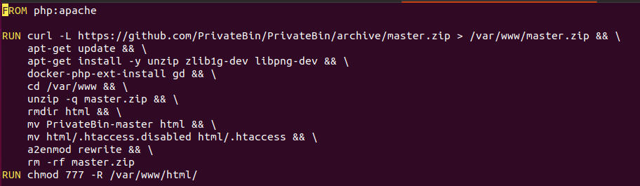
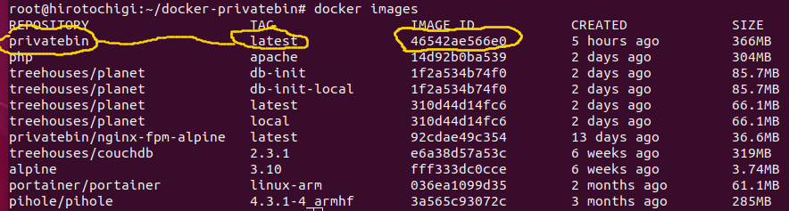
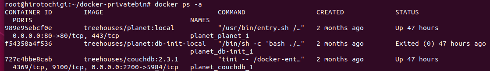
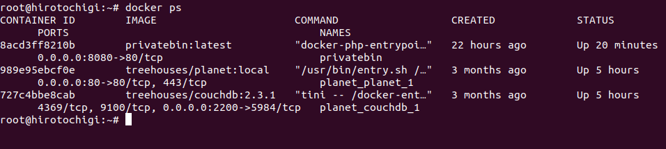
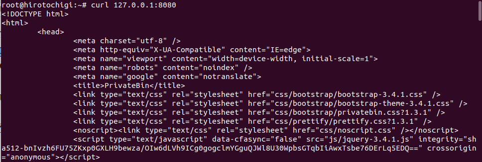
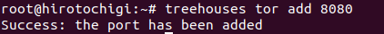
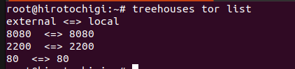
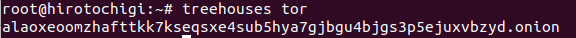
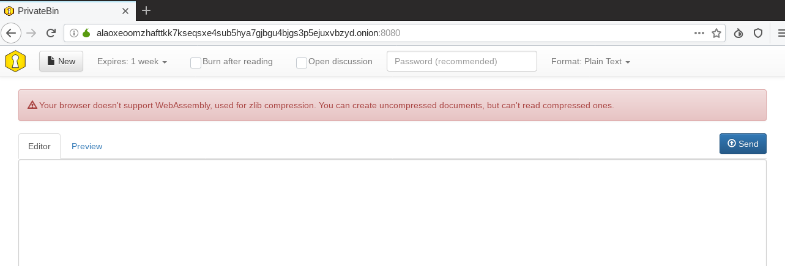

# Install Privatebin on Raspberry Pi by treehouses image

Oct 09, 2019 • [hiroTochigi](https://www.github.com/hiroTochigi)  

---

This tutorial lets you install Privatebin on your Raspberry Pi via a Treehouses image. The Treehouses image already has Tor Hidden Service and Docker so you can easily configure Privatebin on your Raspberry Pi through your Onion Server with Docker. You can use Privatebin through your Tor Browser with your Onion address. Also, you can learn a simple example of a way to use Docker and a configuration of the installed software on your Onion address.

### Prerequisite 
* Raspberry Pi with treehouses
* Tor Browser
* ssh connection to your Raspberry Pi

## Step 1 - Download Codes by Git

Download a Docker file of Privatebin for Raspberry Pi and the latest Privatebin code

```
git clone https://github.com/uGeek/docker-privatebin
cd docker-privatebin
git clone https://github.com/PrivateBin/PrivateBin
```

The first command downloads a Dockerfile of Privatebin for Raspberry Pi. After that, download the latest Privatebin code in docker-privatebin directory.

## Step 2 - Tweak Dockerfile for Tor Browser

Let’s look at Dockerfile.
Type

```
vim Dockerfile
```

You get the below text



This Dockerfile builds an image of Privatebin based on Apache server. However, it has a problem; In October/2019, the Privatebin of this Dockerfile does not support Tor Browser. Fortunately, the latest code supports Tor Browser. Therefore, you need to use the latest Privatebin code which you git-cloned.

### Add ADD Command
Add one line between `FROM` command and `RUN` command

```
ADD PrivateBin /var/www/PrivateBin
```

This code downloads a `master.zip` file from the Privatebin archive repository and stores in `/var/www/master.zip` in Docker image. However, the `master.zip` code is not the latest code. You do not want to use this image, so delete the line.

### Delete Three Lines
Delete the three lines


1. `curl -L https://github.com/PrivateBin/PrivateBin/archive/master.zip  > /var/www/master.zip && \`
1. `unzip -q master.zip && \`
1. `rm -rf master.zip`


```
curl -L https://github.com/PrivateBin/PrivateBin/archive/master.zip > /var/www/master.zip && \
```

This code downloads a `master.zip` file from Privatebin archive repository and stores in `/var/www` directory as the same name: `master.zip`. However, the master.zip code is not the latest code. You do not want to use this image, so delete the line. 


```
unzip -q master.zip && \
rm -rf master.zip
```


These two codes handle the zip file. The first code decompresses the master.zip. The second code deletes the master.zip. However, you git-cloned the uncompressed Privatebin, so not only are these codes not used anymore, but they also produce errors. 


### Modify Three Lines
Change three lines


1. `apt-get install -y unzip zlib1g-dev libpng-dev && \`   →    `apt-get install -y zlib1g-dev libpng-dev && \`
1. `mv PrivateBin-master html && \`   →    `mv PrivateBin html && \`
1. `a2enmod rewrite && \`   →    `a2enmod rewrite`


The first modification is optional. You do not need to use upzip in this Dockerfile. The second and third modifications are crucial. The second command changes the first directory name to html. If the name of the first directory is not PrivateBin, you get an error. The third command must be the last command in the first RUN command block. `&& \` tells Docker engine that there is a next command. If there is `&& \` but no command proceeds, you get an error.

After that you should have the below Dockerfile.


```
FROM php:apache

ADD PrivateBin /var/www/privatebin

RUN apt-get update && \
    apt-get install -y zlib1g-dev libpng-dev && \
    docker-php-ext-install gd && \
    cd /var/www && \
    rmdir html && \
    mv privatebin html && \
    mv html/.htaccess.disabled html/.htaccess && \
    a2enmod rewrite

RUN chmod 777 -R /var/www/html
```

## Step 3 - Make Docker Image

Type the below command

```
docker build -t privatebin .
```

The command docker `build .` builds Docker image from Dockerfile if there is a Dockerfile in the current directory. In order to identify the image you just built easily, you should name your image. The flag `-t privatebin` means that you are naming your images as privatebin.
 
You can see it from the below command.

```
docker images
```

You should get the similar result



You can identify the image by name: REPOSITORY:TAG or IMAGE ID
The privatebin image is identified by `privatebin:latest` or `46542ae566e0` 

## Step 4 - Make and Run Docker Container from the Built Image

### Check the Used Port Number

Before making the container, you need to decide what port number you use. You cannot use the same port number twice, so you need to know the used port numbers. 
Type the below command

```
docker ps -a
```

You should get the similar result.



You can see **_0.0.0.0:80->80/tcp_** and **_0.0.0.0:2200->5984/tcp_**. **_80_** and **_2200_** are already used so you cannot use them. If you use the used port number, you get an error. 

Note: You should not use port numbers from **_0_** – **_1023_**, too. They are called well-known ports and they are already reserved by other systems. Even though you could make a container, you might not be able to use it.

### Make Container with Port Mapping

Type the below command

```
docker run --name privatebin -p 8080:80 -d privatebin:latest
```

This command make a container from privatebin:latest image. 
Then, type `docker ps`  

You get



`docker run` makes a container from an image and lets the container running. In this case, the image is `privatebin:latest`. Also, put the name: privatebin on the container (`--name privatebin`), and flag `-d` indicates that the container runs background. 
`-p 8080:80` indicates the port **_8080_** of the host machine (localhost) connects to the port **_80_** of the container. If you accesses to `localhost:8080` by `curl`, you will get HTML content. 

```
curl localhost:8080
```

You will get the similar result like the below.



If you can see `<title>PrivateBin</title>`, your container works correctly.

## Step 5 - Access Privatebin from Tor Browser
treehouses already has Tor Hidden Service. Tor Hidden Service lets your device have an unique Onion address which is available within Tor network. You can easily register your Privatebin container by treehouses CLI function: `treehouses tor`.  After configuring your container to Tor Hidden Service, you can use your Privatebin service through Tor Browser.   

###  Connect your container port and your Onion Address port
treehouses has tor function to manage Tor configuration.
Type the below command

```
treehouses tor add 8080
```

You should get a similar message.



It means that you succeed adding port number **_8080_**.
Let’s be more clear about it. Type the below command.

```
treehouses tor list
```

You will get the similar result.



An external port number is used to communicate with a local port number over your Onion Address. The above example tells that the external port **_2200_** connects to the local port **_2200_**, and the external port **_80_** connects to the local port **_80_**. 
The external port **_8080_** connects to the local port **_8080_**. The local port **_8080_** attached to your Privatebin container because you can access to Privatebin over **_127.0.0.1:8080_**.

### Discover Your Onion Address

The `treehouses tor` functions let you know your Onion address.
Type the below commandi.

```
treehouses tor
```

Then, you will get the similar results.



The second line: `alaoxeoomzhafttkk7kseqsxe4sub5hya7gjbgu4bjgs3p5ejuxvbzyd.onion` is Onion address (This address is already invalid).



Congratulation!! You can use your own Privatebin.

