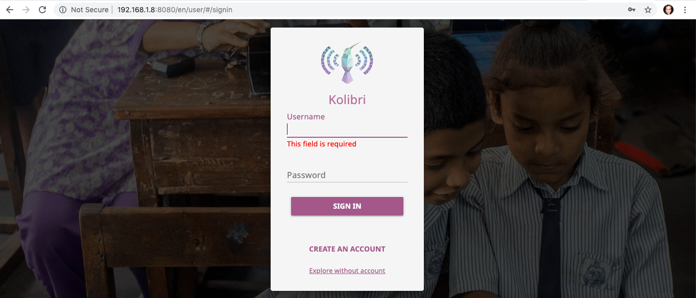
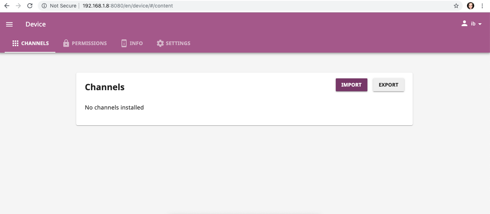
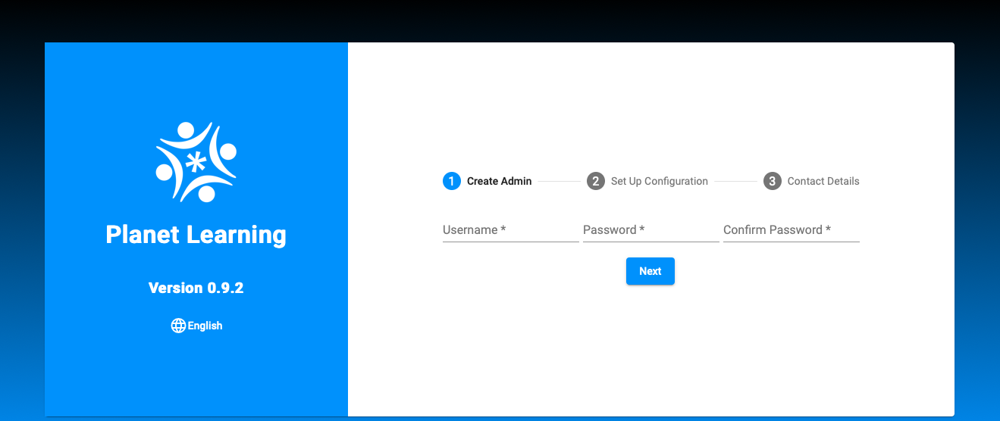
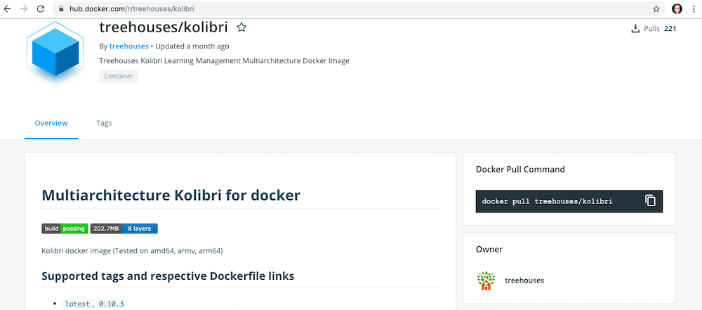

# Access Kolibri on treehouses using docker

14, October 2019 • [irisb1701](https://github.com/irisb1701)

---

Kolibri is a platform used by our "competitor" organization called Learning Equality similar to what Planet is for Open Learning Exchange.

Below are instructions on how to run Kolibri on treehouses:

1. Plug your RPi in and ssh into treehouses
1. If you don't already have docker installed, follow [these instructions](https://docs.docker.com/v17.09/engine/installation/) on their official page to install it on mac/windows
1. Now, go to the [treehouses github](https://github.com/treehouses)
1. Scroll down until you find the `kolibri` repository
1. Once in the repo, scroll down to where the readme.md file is displayed
1. Copy the link provided: `docker run -v /data/save/location:/root/.kolibri -p 8080:8080 treehouses/kolibri`
1. Replace `/data/save/location` with `/srv/kolibri`
1. Run the above command in your terminal
1. Give it some time to process
1. Enter your RPi IP address in browser followed by :8080, Example: `192.168.1.8:8080`
1. You should now see the Kolibri interface
   
1. You can create an account and browse around, you will see it is not very different from planet learning.
1. You can import learning materials the same way you would in the planet
   
1. You can pull up planet on your browser as well by entering just the ip address of your RPi in another browser
   
1. Now you have successfully ran kolibri on treehouses and can compare and contrast it with planet

If you want to make sure you are using the latest version of kolibri you can check like this:

1. Go to hub.docker.com
1. Search for treehouses/kolibri (2nd result)
1. Select it, then select tags
1. 
1. View the last updated version and cross check by googling kolibri's current version
