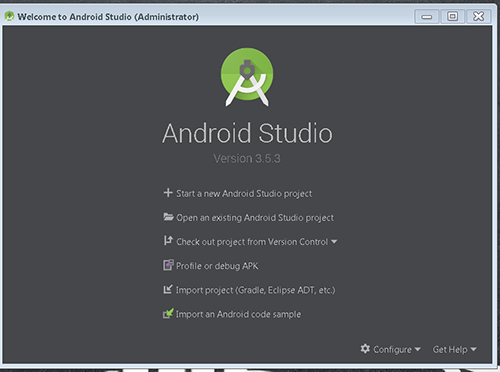

# How To Setup Android Studio 

10, January 2020 • [LordJashin32](https://github.com/LordJashin32)

---

This blog is about how to setup [Android Studio](https://en.wikipedia.org/wiki/Android_Studio) for the [treehouses remote](https://github.com/treehouses/remote) repository.
These projects rely on the [Java](https://en.wikipedia.org/wiki/Java_%28programming_language%29) programming language and Android Studio is an Integrated Development Environment (IDE) for Android Apps. 

---

## Download Android Studio

1. Android Studio is available for Linux, Mac, and Windows platforms. Go ahead and download the installer. 
[Download Link](https://developer.android.com/studio).

2. Install Android Studio by running the installer. Make sure you select
Android Virtual Device in the components section of the install becuase you 
will need this to run an emulator to test your APKs you build.

---

## Download treehouses Remote 

1. Go ahead and clone the [treehouses remote](https://github.com/treehouses/remote) repository to a folder somewhere on your computer.

---

## Importing the project

1. Open Android Studio.
 

 
2. Click Import Project (Gradle, Eclipse ADT, etc.)
3. Navigate to your local clone. Select your Main directory that contains
your AndroidManifest.xml file. E.g. `remote\app\src\main`
 

 
4. Click Ok
5. Click Import project from external model
6. Select the 2nd option (Gradle) (With the elephant icon)
7. Click Next.
 

 
8. Click the 3 dots button (...) next to Gradle Project: to pull up
a file/folder browser. Select the folder containing your Gradle directory. E.g. `C:\Users\nmnmhjmj\Desktop\remote`
Which just so happens to be the folder for your repository.
 

 
9. Click Finish!

---

## Running the project

1. Now you should see the project do a build and if everything is working correctly all green checkmarks.
 

 
2. You will need to setup a build configuration to run your project (Shift + F10 to run).
 

 
3. You will need to setup a emulator device for the project to run the apk on using AVD manager.
 

 
4. Finally you should be able to hit the big green play button (Run) and get the following.
 

---

## Run into problems?

 * Google your errors and post them in [Gitter](https://treehouses.io/#!pages/chat.md) if you need help. 
 * You might need to reinstall Android Studio to fix your problem.
