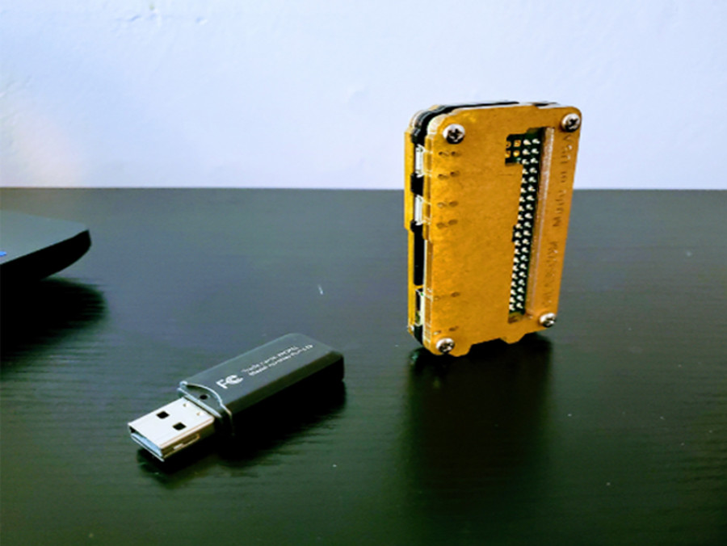

# Treehouses node deploy

Feb 17, 2020 • [An Pham](https://github.com/phamduchongan93)

---


## Compatible devices
1.  Raspberry Pi 4 B, 3 B/B+, or Zero W

## Prepare image

Download the [latest treehouses image](http://download.treehouses.io/) to your computer, and flash it onto your microSD card using [balenaEtcher](https://etcher.io).

## Mount the **/boot/** directory for editing 
Based on your current running system, we will locate the **/boot** directory. I am using Linux system, so I would type the following command to mount your boot partition.

- In Linux 
`lsblk -f`
Sample output:
```
sda                                                         
├─sda1 vfat     boot   69D5-9B27                            /media/anpham/boot
└─sda2 ext4     rootfs 24eaa08b-10f2-49e0-8283-359f7eb1a0b6 /media/anpham/rootfs
sr0                                                         
```
This tells me that boot directory is mounted at `/media/anpham/boot`. 

- In Windows system, you should have your **boot** directory auto mounted already.


The file we want to edit  is `autorunonce` file. Before editing this file, we need to find the current network info so that we can assign IP address for our Pi.

**Note: ** we look for `autorunonce`, not `autoranonce`. If you don't find the `autorunonce`, then create an empty file and name it as `autorunonce`

After opening the `autrunonce` file, go ahead and erase the content of the file since we will start from the scratch. 

## Assign IP address for Pi
First, we need to find your current subnet and ip of your network. 

- In Windows environment


- In Linux environment

```bash
anpham@dell-laptop:~$ ifconfig wlp2s0                                                                                                            
wlp2s0: flags=4163<UP,BROADCAST,RUNNING,MULTICAST>  mtu 1500                                                                                     
        inet 192.168.0.90  netmask 255.255.255.0  broadcast 192.168.0.255
        inet6 2601:197:a80:5274:e2c0:a959:c502:7ed2  prefixlen 64  scopeid 0x0<global>
        inet6 2601:197:a80:5274:814f:3c4c:e4cb:6a97  prefixlen 64  scopeid 0x0<global>
        inet6 fe80::8cb5:d2ec:db7d:19ad  prefixlen 64  scopeid 0x20<link>
        ether fc:77:74:80:02:23  txqueuelen 1000  (Ethernet)
        RX packets 648703  bytes 900707585 (900.7 MB)
        RX errors 0  dropped 0  overruns 0  frame 0
        TX packets 141760  bytes 22970617 (22.9 MB)
        TX errors 0  dropped 0 overruns 0  carrier 0  collisions 0
```

The important lines:

```
inet 192.168.0.90  netmask 255.255.255.0  broadcast 192.168.0.255
```

or 

```
IPv4 Address. . . . . . . . . . . : 192.168.0.90
Subnet Mask . . . . . . . . . . . : 255.255.255.0
```

This tells me that I'm in subnet 192.168.0.90/24, meaning the network ip come from 192.168.0.1 to 192.168.0.255. Except the 192.168.0.90 which belongs to my current host, I can assign the Raspberry Pi with any ip from 192.168.0.2 to 192.168.0.254.
An example of an 'autorunce' file would look like this:

```
#!/bin/bash
treehouses rename pinode1
# expands the filesystem
treehouses expandfs
treehouses bluetooth on
# set up the default ip
# treehouses staticwifi <ip> <mask> <gateway> <dns> <ESSID> [password]
treehouses staticwifi 192.168.0.10 255.255.255.0 192.168.0.1 8.8.8.8 NETGEAR11 bostonteaparty
# treehouses wifi NETGEAR11 blueteapot615
treehouses ssh on
reboot
```

Save the file and detach your SD card from your PC. Plug it in the Raspberry Pi and power your Raspberry Pi on. Pi zero which has slower processor will take around 15 mins or more, but the Raspberry Pi model 4 should take less than 3 mins. Also, during the booting process, your Raspberry Pi will reboot one time to reload the config.

**Note: ** You can use ping command to check if your Raspberry Pi is up and running.
- In Linus, `ping <pi_ip>`  e.g. `ping 192.168.0.11` 
- In window, open powershell and type `test-netconnection <pi address>` e.g.`test-netconnection 192.168.0.11`

## Test ssh communication
Try to ssh to your Pi
`ssh pi@<pi_address>`

Expected output:
```
You have mail.
Last login: Mon Feb 17 02:20:05 2020 from 192.168.0.90
                                                                                                                                                 
SSH is enabled and the default password for the 'pi' user has not been changed.                                                                  
This is a security risk - please login as the 'pi' user and type 'passwd' to set a new password.                                                 

pi@treehouses:~ $ 
```

## Verify new image's compatibility with Remote app
- Download **Treehouses Remote** app from android market and connect to your pi.

- Select your Pi model 


- Go to terminal and start to test **treehouses** command


- Go to services on side bar, and install docker apps.


- Go to tunnel located on sidebar to start tor service


## Conclusion
- This tutorial should help you to have a stable deployment and to establish communication with your Raspberry Pi over WLAN. However, occasionally, there are cases where you find yourself not having a reliable WLAN, forcing you to think of a PAN alternative. In other words, Bluetooth network will be your main drive. The remote app offers variety of features such as network troubleshooting, ssh tunneling, and docker apps deploy. Above all, treehouses systems offer tor network port tunneling. By accessing onion addresses, you should be able to have access to docker services via tor network. 
- Keep in mind that you can switch your installed SD card between Pi zero and Pi 4. 
- We provided the tool, the rest is for your creativity. Happy hacking!

