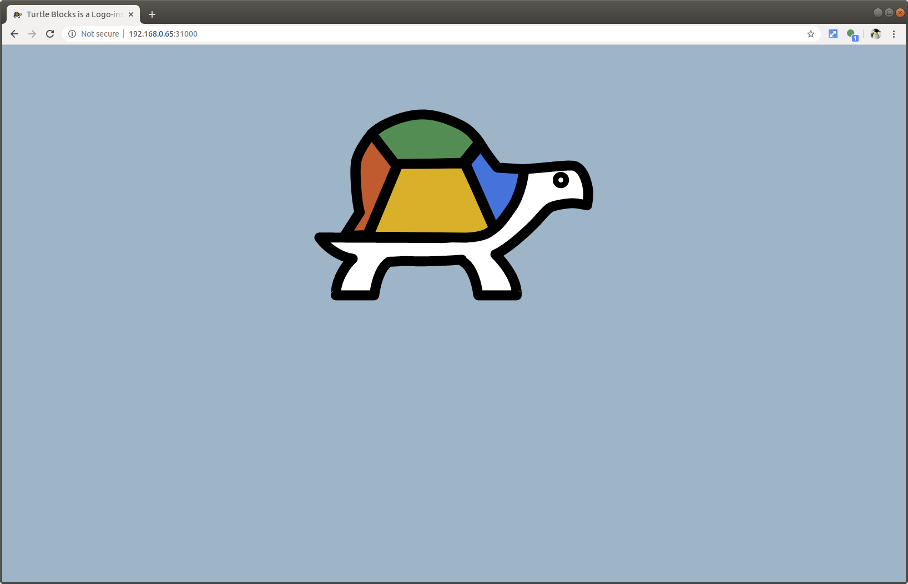
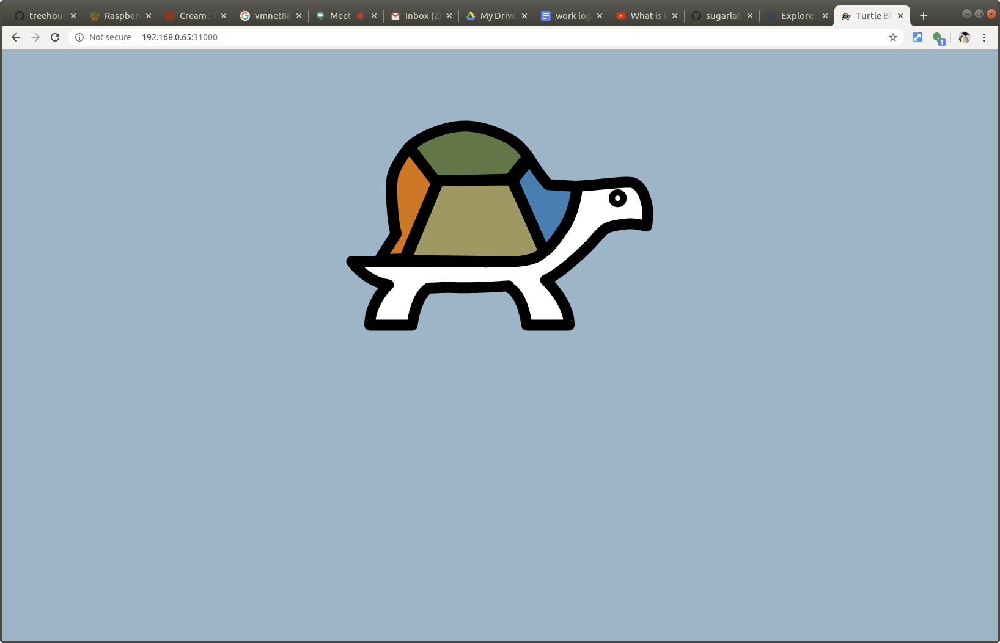
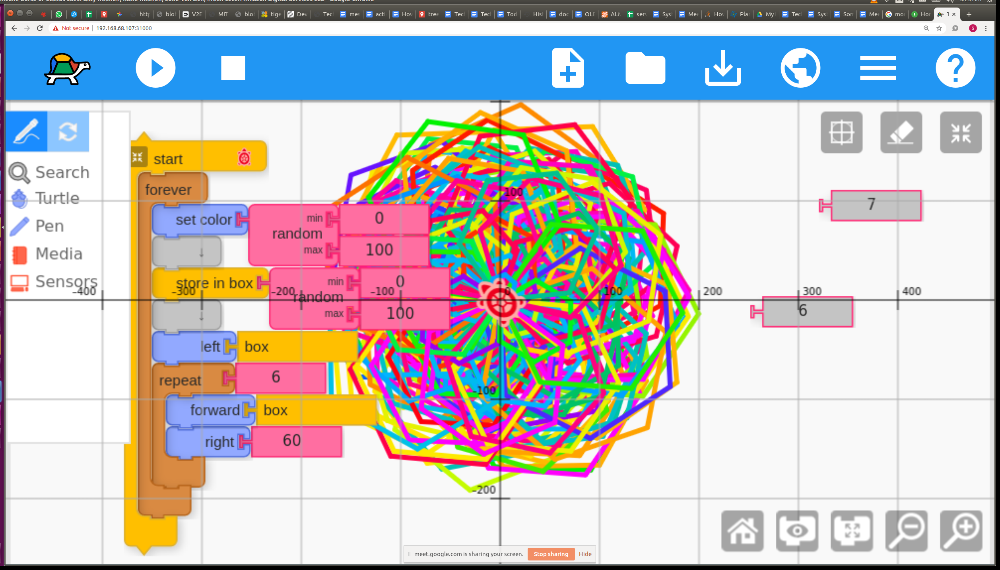

# Create Dockerfile and Build Docker image

April 09, 2020 • [vmnet8](https://github.com/vmnet8)

---

Turtle Blocks is an activity with a Logo-inspired graphical "turtle" that draws colorful art based on snap-together visual programming elements. I am going to build a turtleblockjs docker image and run it on Raspberry Pi.


## Step 1: Git clone your target github repo 

[sugarlabs](https://github.com/sugarlabs/turtleblocksjs) provides all codes I need to build turtleblocksjs docker image.
I make a directory named turtleblocksjs then work under this directory.

```
git clone https://github.com/sugarlabs/turtleblocksjs
```

## Step 2: Create Dockerfile 

Under the same directory, create a file name `Dockerfile`.

Note:  
1.  The file name has to be the exact `Dockerfile`, otherwise the docker build process will fail.
1.  The Dockerfile has to be under the same turtleblocksjs directory.


## Step 3: Write Dockerfile

```
FROM balenalib/raspberry-pi-alpine:3.9 

RUN apk --no-cache upgrade
RUN apk add --no-cache apache2 curl git
# Create directory for apache2 to store PID file
RUN mkdir -p /run/apache2

WORKDIR /var/www/localhost
RUN rm -rf htdocs
RUN git clone https://github.com/sugarlabs/turtleblocksjs.git
RUN mv -f turtleblocksjs htdocs

EXPOSE 80 443

CMD ["-D","FOREGROUND"]

# Start httpd when container runs
ENTRYPOINT ["/usr/sbin/httpd"]
```

## Step 4: Build Docker image using Dockerfile

```
pi@treehouses:~/git_repo/turtleblocksjs $ docker build -t treehouses/turtleblocksjs .
......
Successfully built 1d28ef1e0e22
```

check the docker image:
```
pi@treehouses:~/git_repo/turtleblocksjs $ docker images
REPOSITORY                      TAG                 IMAGE ID            CREATED             SIZE
treehouses/turtleblocksjs       latest              1d28ef1e0e22        2 minutes ago       214MB
```

## Step 5: Run docker image

I am going to use port 31000 to run turtleblocksjs image.

```
pi@treehouses:~/git_repo/turtleblocksjs $ docker run -d -p 31000:80 treehouses/turtleblocksjs
e9769bca5f47f3da603468ddc08738f94a42ec7bf9e31ebcf5b3082db52b090d
pi@treehouses:~/git_repo/turtleblocksjs $ docker ps -a
CONTAINER ID        IMAGE                             COMMAND                  CREATED             STATUS                      PORTS                            NAMES
e9769bca5f47        treehouses/turtleblocksjs         "/usr/sbin/httpd -D …"   5 seconds ago       Up 2 seconds                443/tcp, 0.0.0.0:31000->80/tcp   silly_bell
```

Go to web browser, I can see turtleblocksjs web interface.




You can use this tool to create very cool pictures, like this one! 


 


