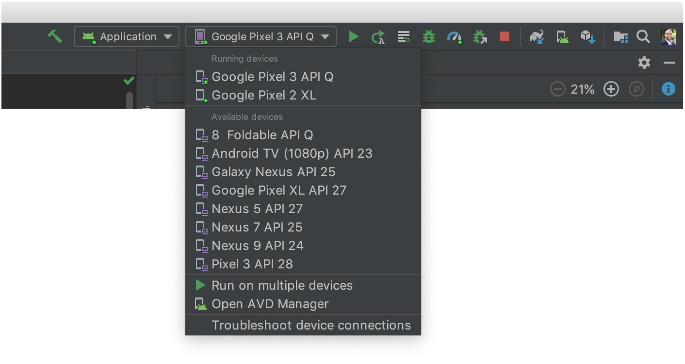
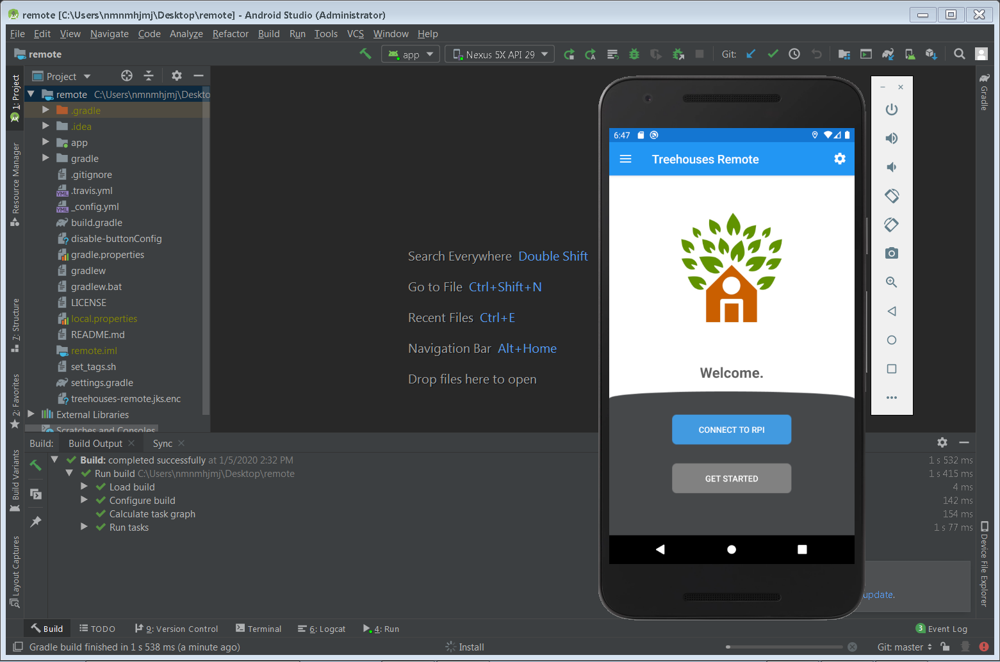

# How To Setup Github to work with Android Studio on a Windows Machine 

Created on 10, June 2020 • [ali18997](https://github.com/ali18997)

---

This blog is about how to setup [GitHub](https://github.com/) while working on [Android Studio](https://en.wikipedia.org/wiki/Android_Studio) for the [treehouses remote](https://github.com/treehouses/remote) repository using a Windows Machine.
To follow the steps here you should have Android Studio setup properly as per the [How To Setup Android Studio](./20200110-androidstudiosetup.md) blog post.

---

## Download GitHub Desktop App 

1. GitHub Desktop is available for the Windows platform. **Download** it [here](https://desktop.github.com/)

2. Install GitHub Desktop by running the installer and wait for it to finish installation

3. Click **Sign into Github.com** on the welcome screen and sign in with your GitHub account

---

## Setting up the treehouses remote repository  

1. Click **Repository** on the Menu bar and click **Repository settings** in the list.

2. Select **Remote** and enter **https://github.com/treehouses/remote.git** as the URL and click **Save**.

---

## Importing the project in Android Studio

1\. Open Android Studio
 

2\. Click **Import Project (Gradle, Eclipse ADT, etc.)**

3\. Navigate to where the GitHub Desktop stored the remote repository locally. By default its in the `GitHub\remote` directory inside your Documents folder. Select the remote folder with Android icon and click **OK**
 

 
---

## Making Changes and Pull Requests

1\. By Default you would be on the Master branch, so you should make a new branch to make your changes. Give it a name and click **New Branch**

2\. Click **Create branch**

3\. Your Android Studio project will automatically be switched to this new branch. Make the changes and when you come back they will automatically be detected by GitHub Desktop. Give your commit a description and click **Commit to "your branch name"**

4\. Click **Publish Branch**

5\. Click **Create Pull Request**

6\. It will open it on a browser where you can complete the Pull Request

---

### Set up your device as follows:
1. Connect your device to your development machine with a USB cable. If you developed on Windows, you might need to install the appropriate USB driver for your device
1. Perform the following steps to enable **USB debugging** in the **Developer options** window:
    1. Open the **Settings** app
    1. If your device uses Android v8.0 or higher, select **System**. Otherwise, proceed to the next step
    1. Scroll to the bottom and select **About phone**
    1. Scroll to the bottom and tap **Build number** seven times
    1. Return to the previous screen, scroll to the bottom, and tap **Developer options**
    1. In the **Developer options** window, scroll down to find and enable **USB debugging**
 
### Run the app on your device as follows:
1\. In Android Studio, select your app from the run/debug configurations drop-down menu in the toolbar

2\. In the toolbar, select the device that you want to run your app on from the target device drop-down menu

3\. Click **Run** \(the green play button\) or press `Shift + F10` \(Windows/Linux\) or `Control + R` \(Mac\)
 
### Run on an emulator

Run the app on an emulator as follows:

1. In Android Studio, create an Android Virtual Device (AVD) that the emulator can use to install and run your app
    1. To create an Android Virtual Device, open the AVD Manager by clicking **Tools > AVD Manager**
    1. Click **Create Virtual Device** at the bottom of the AVD Manager dialog
    1. Select a hardware profile and then click **Next**
    1. Select the system image for a particular API level, and then click **Next**
    1. Change any **AVD properties** as needed and then click **Finish**. You find more about creating an AVD [here](https://developer.android.com/studio/run/managing-avds#createavd) 
1. In the toolbar, select your app from the run/debug configurations drop-down menu
1. From the target device drop-down menu, select the AVD that you want to run your app on

4\. Click **Run** \(the green play button\) or press `Shift + F10` \(Windows/Linux\) or `Control + R` \(Mac\)   

5\. By now, you should see something like this:

---

## Run into problems?

 * Google your errors and post them in [Gitter](https://treehouses.io/#!pages/chat.md) if you need help
 * You might need to reinstall Android Studio to fix your problem

---

Portions of this page are reproduced from work created and shared by the Android Open Source Project and used according to terms described in the Creative Commons 2.5 Attribution License.
