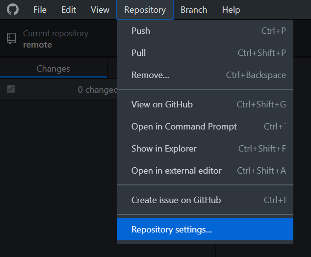
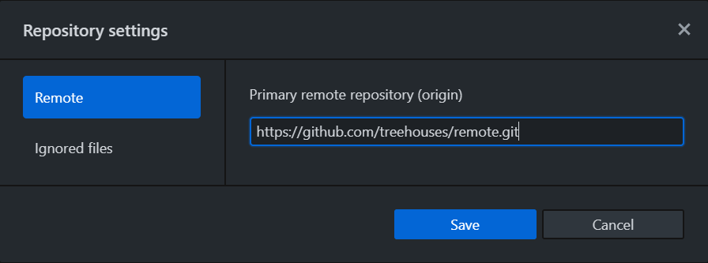
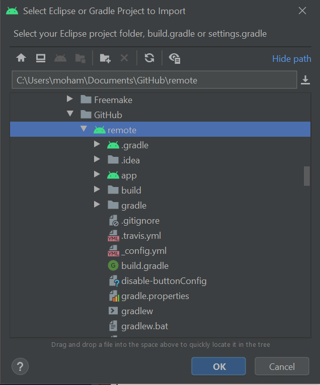
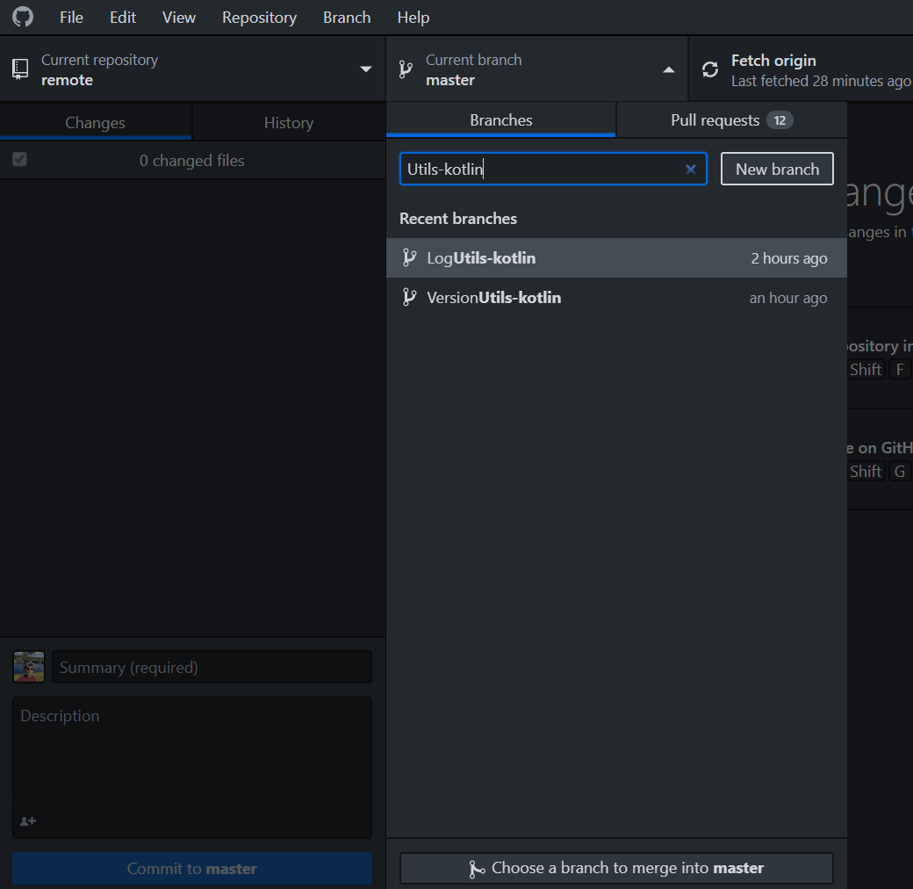
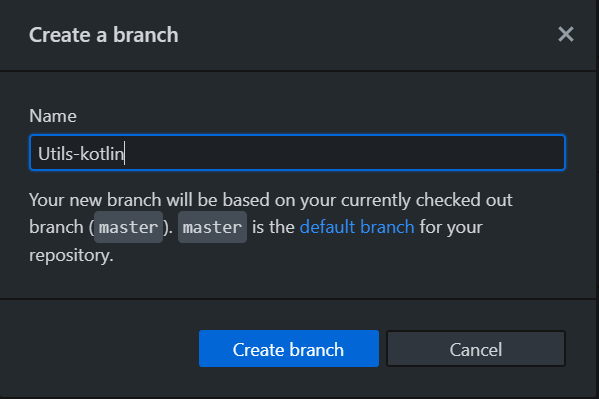
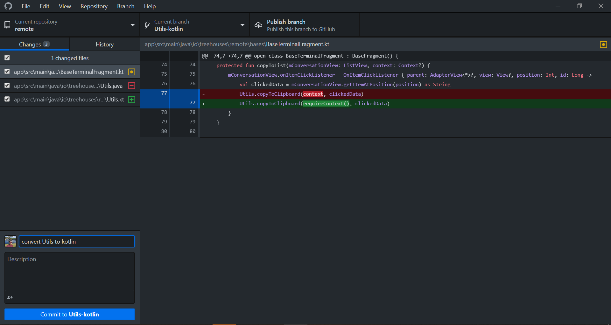
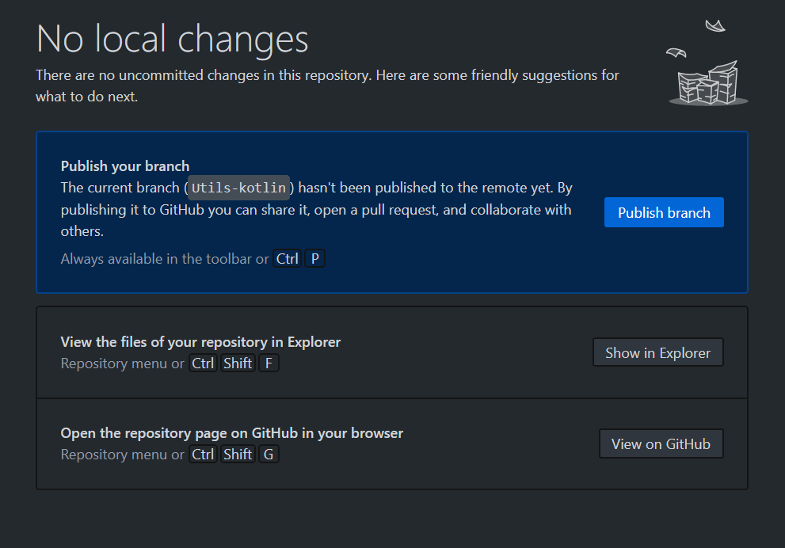
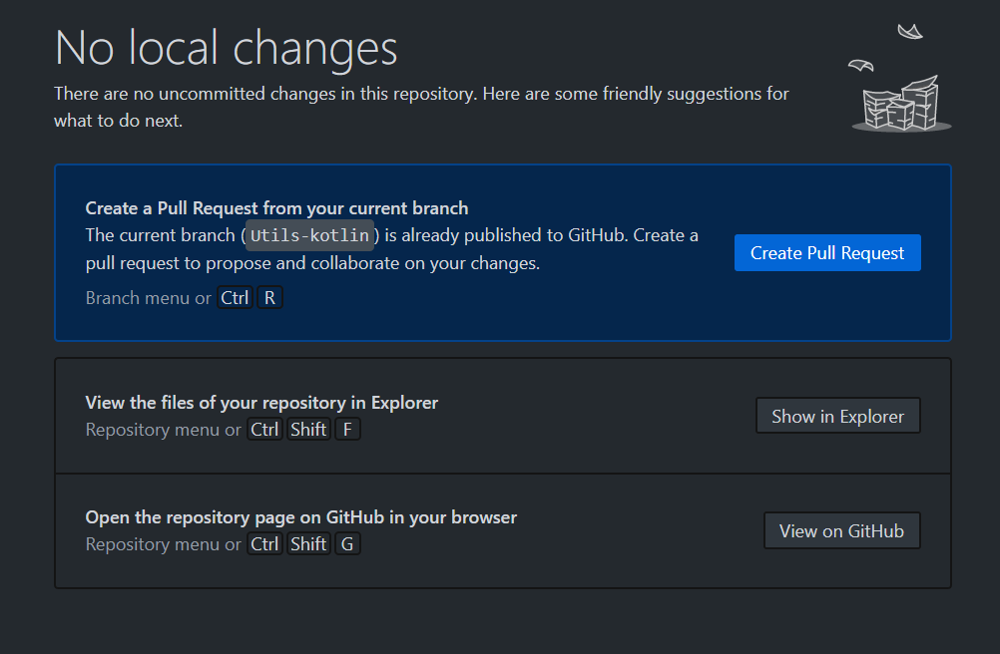
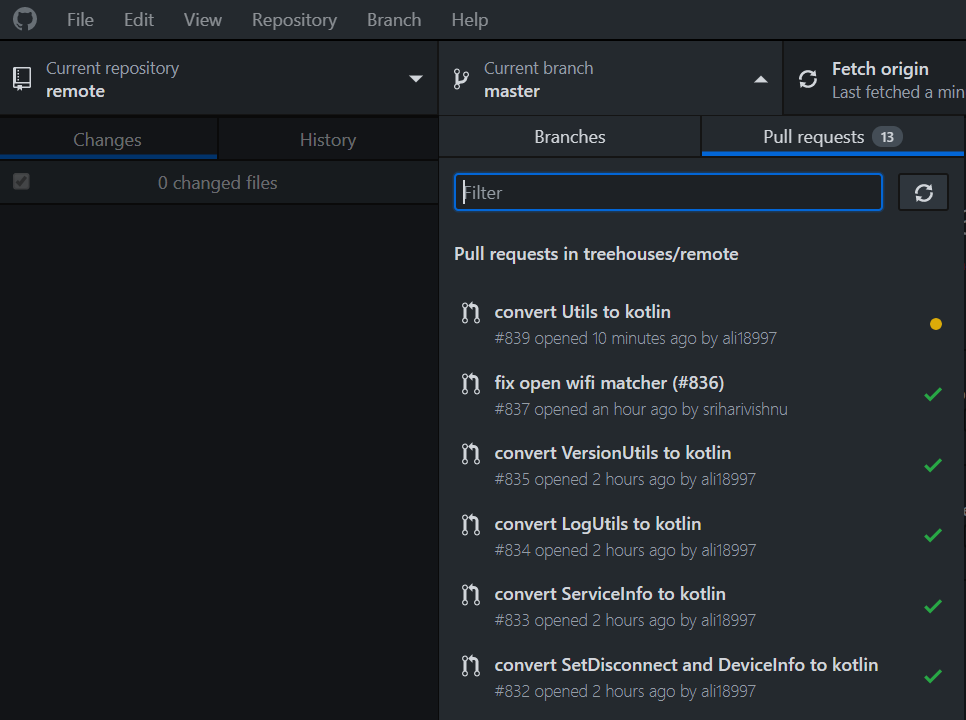

# How To Setup Github to work with Android Studio on a Windows Machine

Created on 10, June 2020 • [ali18997](https://github.com/ali18997)

---

This blog is about how to setup [GitHub](https://github.com/) while working on [Android Studio](https://en.wikipedia.org/wiki/Android_Studio) for the [treehouses remote](https://github.com/treehouses/remote) repository using a Windows Machine.
To follow the steps here you should have Android Studio setup properly as per the [How To Setup Android Studio](./20200110-androidstudiosetup.md) blog post.

---

## Download GitHub Desktop App

1. GitHub Desktop is available for the Windows platform. **Download** it [here](https://desktop.github.com/)

2. Install GitHub Desktop by running the installer and wait for it to finish installation

3. Click **Sign into Github.com** on the welcome screen and sign in with your GitHub account

---

## Setting up the treehouses remote repository

1. Click **Repository** on the Menu bar and click **Repository settings** in the list.

2. Select **Remote** and enter **https://github.com/treehouses/remote.git** as the URL and click **Save**.

---

## Importing the project in Android Studio

1\. Open Android Studio

2\. Click **Import Project (Gradle, Eclipse ADT, etc.)**

3\. Navigate to where the GitHub Desktop stored the remote repository locally. By default its in the `GitHub\remote` directory inside your Documents folder. Select the remote folder with Android icon and click **OK**

---

## Making Changes and Pull Requests

1\. By Default you would be on the Master branch, so you should make a new branch to make your changes. Give it a name and click **New Branch**

2\. Click **Create branch**

3\. Your Android Studio project will automatically be switched to this new branch. Make the changes and when you come back they will automatically be detected by GitHub Desktop. Give your commit a description and click **Commit to "your branch name"**

4\. Click **Publish Branch**

5\. Click **Create Pull Request**

6\. It will open it on a browser where you can complete the Pull Request

---

## Testing Pull Requests of Others:
1. Select the Pull Request you want to test in GitHub Desktop. Click on it and wait for it to fetch that branch. Once it is done, Android Studio will automatically be configured to work on that branch and you can build/run the code to test the pull request.

---
