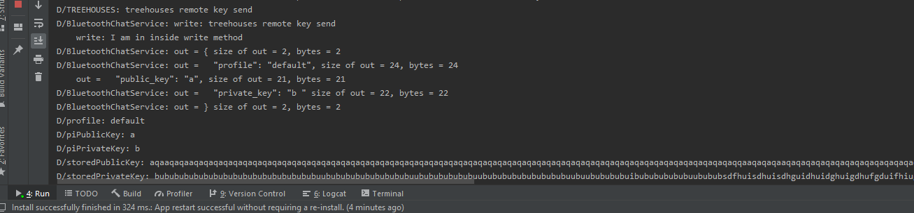

# Creating a Feature On the CLI and Remote

Created on 24, July 2020 • [law-lin](https://github.com/law-lin)

---

As you may already know, most features on the CLI is designed with the intent to be used on the remote app. This guide may help you create a new feature on both the CLI and remote app. This means you would have one PR in the cli repository and one PR in the remote repository.

I am writing this post under the assumption that you have experience with the CLI, remote, and developing Android apps in general.

The feature that I helped develop was `treehouses sshtunnel`/`remote` send/receive keys. I will be discussing how I approached this task. Hopefully you'll gain some insight on how you could create your own feature.

## Adding the CLI Feature

---

I'm not going to go too into detail about how to add a new feature to the CLI, as you've probably already created one if you've working on this. If you still need help, follow [this guide](20190831-newfeature.md).

Once you've gotten the CLI feature to work successfully, you can start to implement it in the remote.

In my experience, much of the heavy work in the script, such as saving the SSH keys to a new file and retreiving them, was already developed by another intern. I just added the necessary features to make it work with remote app like fixing the default profile and getting it to work without needing an active SSH tunnel.

The below snippet of code is what saves the SSH key to a new file, using `treehouses sshtunnel key receive <public | private> <key> [profile]`.

```
# I worked on this
if [[ $profile == "default" ]]; then
    profile=""
elif [ ! -z "$profile" ]; then
    profile="_${profile}"
fi

# Another intern worked on this
case "$3" in
    public | private)
        if [ "$3" = "public" ]; then
        tag=".pub"
        fi

        if [ -f /root/.ssh/id_rsa${profile}${tag} ]; then
        timestamp=$(date +%Y%m%d%H%M)
        mv "/root/.ssh/id_rsa${profile}${tag}" "/root/.ssh/id_rsa${profile}.${timestamp}${tag}"
        echo "Created backup of 'id_rsa${profile}${tag}' as 'id_rsa${profile}.${timestamp}${tag}'"
        fi

        echo -e "$key" > "/root/.ssh/id_rsa${profile}${tag}"
        echo "Saved $3 key to 'id_rsa${profile}${tag}'"
        ;;
    *)
        echo "Error: unknown command"
        echo "Usage: $BASENAME sshtunnel key receive <public | private> <\$key> [profile]"
        exit 1
        ;;
    esac
    ;;
```

For this part of the feature, I only worked on checking if the specified profile was "default", and if so, then set profile to an empty string, as an empty profile is saved directly to `id_rsa` (the default profile) rather than `id_rsa_${profile}` (a custom profile).

I only realized I needed these changes after developing the remote side of the feature, so note that your script isn't necessarily complete even though it works on the CLI!

## Starting the Remote Feature Development

---

**NOTE**: By this point your CLI feature should at least be functional - it doesn't have to be perfect nor does your PR have to be already merged.

### Upgrade your CLI

You will need to use `treehouses upgrade cli <branch-name>` to upgrade the CLI to a specific branch. This is necessary for testing features on the remote that depend on a specific branch in the CLI repository. When you create your PR, let others know to use this command and specify the branch name.

### Choosing the Fragment

Now it's time to start developing. If you need help setting Android Studio up, check [this guide](20200110-androidstudiosetup.md) out.

Depending on what feature you're adding, you have to think about where you want to place this feature.

If it's a systems-related feature, like a camera or SSH key related feature, then that would probably go into the Systems fragment.

If it's a network-related feature then the Network fragment makes sense.

If it's a feature that's larger scale and doesn't really fit into the existing fragments, you could even add a new fragment for the feature.

Below shows all the currently existing fragments for the app.


Not all of these fragments directly show up as "tabs" in the menu, but you can see some of them here:


In my case, the SSH tunnel key feature would belong in the SystemFragment/System tab and that's where I placed it. Of course, deciding where to place it is open to debate and you can seek the advice of other people for this if the answer isn't obvious.

### Bluetooth Chat Service

From here on, it's extremely useful to reference existing fragments/features and to see how they were implemented. There are differences in how each fragment implements a feature, so it's up to you to reverse engineer them to see what makes sense for your feature.

In your fragment, you should have something like
`val mChatService = listener.getChatService()`
which initializes the Bluetooth Chat Service (this can vary on how the chat service is initialized), the class that contains a thread for listening to incoming connections, a thread for connecting with a device, and a thread for performing data transmissions when connected. It's what ultimately connects the Pi with the remote app.

There's not much needed here except you to initialize the service. After that, you'll be using the message handler to read messages from the Pi.

### The Message Handler

You will have to use this getMessage() method in your code. This is the method that reads any output from the Pi. If you are working in an existing fragment, the getMessage() method should already be there and all you have to do is add to check the necessary expressions that your feature outputs.

```
// The Handler that gets information back from the BluetoothChatService
override fun getMessage(msg: Message) {
        when (msg.what) {
            Constants.MESSAGE_READ -> {
                val output = msg.obj as String
                if (output.matches(/*output from the Pi*/)) {
                    // do something
                }
            }
        }
    }
```

For example, `treehouses tor status` outputs either "inactive" or "active", so you can check if `output.matches("inactive")` and `output.matches("active")`. At this point in time, it's a good idea to go back to the CLI and make sure your script outputs certain strings that make sense and can be used well in this getMessage() method.

### Sending Messages To the Pi

Use `listener.sendMessage(/*treehouses command*/)` to send a command to the Pi.

Here's an example:

```
btnGetKeys.setOnClickListener {
    var profile = profileText.toString()
    listener.sendMessage("treehouses remote key send $profile")
    jsonSend(true)
}
```

When the user taps on the button specified by this listener, `treehouses remote key send <profile>` is sent to the Pi and the app will receive the message in the handler implemented before this step.

### Sending Log Output

You can use `Log.d(TAG, "<message>")` to send log output when the app is running. This is useful for debugging problems and identifying what is being sent/received over the Bluetooth Chat Service.

Click "Run" where shown below to see the logged output.


Here, you see the logged output. Note how `treehouses remote key send` is sent and the Bluetooth Chat Service reads the output. The profile, piPublicKey, piPrivateKey, storedPublicKey, and storedPrivateKey are the log messages I wrote to see what the SSH keys are.



After this, everything else is up to you to implement. Good luck!
