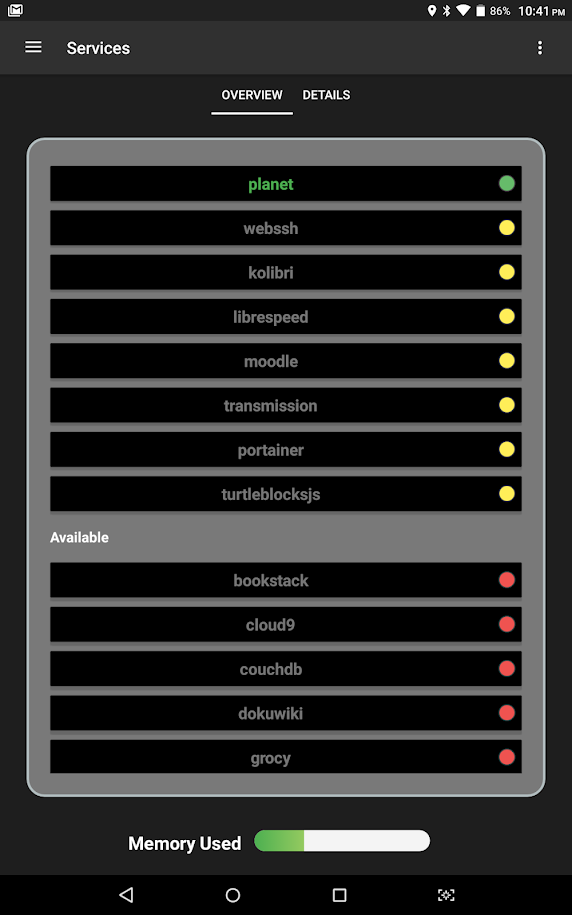
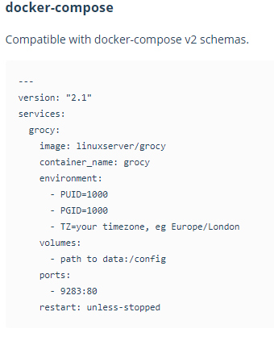
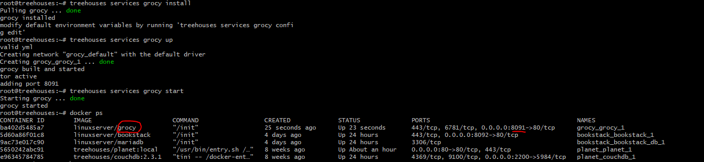
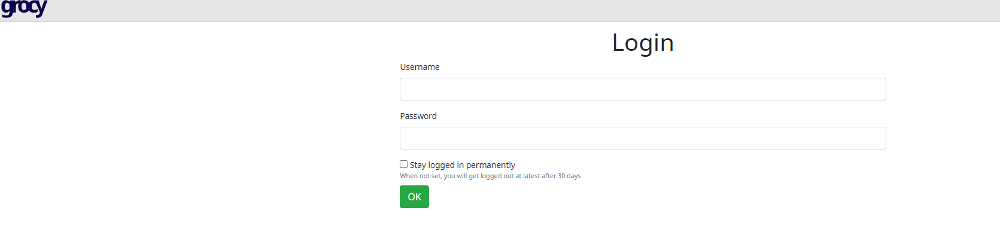
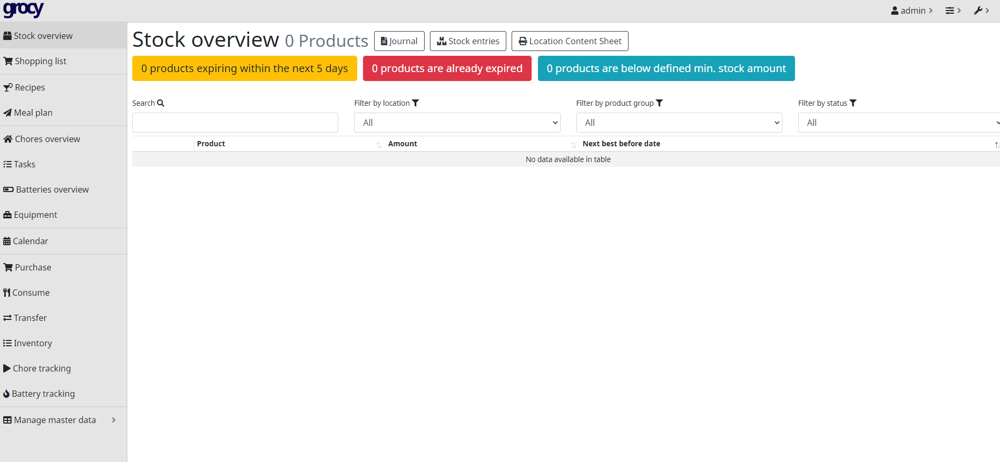

# Adding a New Docker Service

Created on 24, July 2020 • [law-lin](https://github.com/law-lin)

---

If you're working on the CLI, you might need to add a new Docker service. This guide should give you some direction on where to begin doing so. For a tutorial on how to get Docker up and running, check [this](../vi/dockertutorial.md) out.

You can browse [Docker Hub](https://hub.docker.com/search?q=&type=image) to find services to add to the CLI. If you don't know what to add, browse [LinuxServer's](https://hub.docker.com/u/linuxserver) repositories - most of them should support ARM 64 architecture (what treehouses image supports). You can also filter the services by ARM 64 architecture.

Once you find the service you wish to add, ensure that it supports ARM 64 and navigate to the section that instructs you how to set it up.

Most of all our services are listed in the remote app, as shown below:



After following this guide and getting your PR merged, the service you added will be here too!

## Writing the Script

---



This is a snippet taken from the grocy service's "Usage" section. Take note of any properties needed in the script to install the service properly, such as `image`.

If I wanted to implement this [grocy](https://hub.docker.com/r/linuxserver/grocy) service, then I would use the following script, which can serve as a useful template for adding your own services.

```
#!/bin/bash

function install {
  # create service directory
  mkdir -p /srv/grocy

  # create yml(s)
  cat << EOF > /srv/grocy/grocy.yml
version: "2.1"
services:
  grocy:
    image: linuxserver/grocy
    environment:
      - PUID=\${PUID}
      - PGID=\${PUID}
      - TZ=\${TZ}
      - PASSWORD=\${PASSWORD}
      - DB_TYPE=\${DB_TYPE}
      - DB_NAME=\${DB_NAME}
      - DB_HOSTNAME=\${DB_HOSTNAME}
      - DB_USERNAME=\${DB_USERNAME}
      - DB_PASSWORD=\${DB_PASSWORD}
    volumes:
      - "/srv/grocy.sh:/root/.grocy"
    ports:
      - 8091:80
    restart: unless-stopped
EOF

  # create .env with default values
  cat << EOF > /srv/grocy/.env
PUID=1000
PGID=1000
TZ=Europe/London
PASSWORD=PASSWORD
DB_TYPE=sqlite
DB_NAME=DB_NAME
DB_HOSTNAME=DB_HOSTNAME
DB_USERNAME=DB_USERNAME
DB_PASSWORD=DB_PASSWORD
EOF

  # add autorun
  cat << EOF > /srv/grocy/autorun
grocy_autorun=true
if [ "$grocy_autorun" = true ]; then
  treehouses services grocy up
fi
EOF
}

# environment var
function uses_env {
  echo true
}

# add supported arm(s)
function supported_arms {
  echo "v7l"
}

# add port(s)
function get_ports {
  echo "8091"
}

# add size (in MB)
function get_size {
  echo "55"
}

# add info
function get_info {
  echo "https://github.com/linuxserver/docker-grocy"
  echo
  echo "grocy is an enterprise resource planning system for your kitchen."
  echo "Cut down on food waste, manage your chores, keep track of your purchases,"
  echo "and what batteries need charging with this tool."
}

# add svg icon
function get_icon {
  cat <<EOF
# insert SVG icon here
EOF
}
```

**NOTE**: This is by no means a template that can be used for every service, but serves as a good starting point. You can also view the existing service installation scripts to get a good sense of what you need.

You would have to replace any necessary values with that of the service you are trying to add.

To create the SVG icon, you can use [SVGOMG](https://jakearchibald.github.io/svgomg/).

Some ports may already be occupied by other services. Use a port that doesn't conflict with another service.

Here's a list of all the current services and their corresponding ports (updated as of 7/24/2020):

| Service          | Port                                                     |
| ---------------- | -------------------------------------------------------- |
| Bookstack        | 8092:80                                                  |
| Cloud9           | 9999:8000                                                |
| CouchDB          | 5984:5984                                                |
| DokuWiki         | 8093:80                                                  |
| grocy            | 8091:80                                                  |
| Invoice Ninja    | 8090:80                                                  |
| Jellyfin         | 8096:8096, 8920:8920                                     |
| Kolibri          | 8080:8080                                                |
| LibreSpeed       | 8089:80                                                  |
| MariaDB          | 3306:3306                                                |
| Mastodon         | 3000:3000, 4000:4000                                     |
| Minetest         | 30000:30000/udp                                          |
| MongoDB          | 27017:27017, 27018:27018, 27019:27019, 28017:28017       |
| Moodle           | 8082:8082                                                |
| Musicblocks      | 8088:80                                                  |
| Netdata          | 19999:19999                                              |
| Nextcloud        | 8081:80                                                  |
| ntopng           | 8084:3000                                                |
| Pi-hole          | 53:53/tcp, 443:443/tcp, 53:53/udp, 67:67udp, 8053:80/udp |
| Piwigo           | 8094:80                                                  |
| Planet           | 80:80                                                    |
| Portainer        | 9000:9000                                                |
| PrivateBin       | 8083:80                                                  |
| Pylon            | 8095:3131                                                |
| ruTorrent        | 8097:80, 5000:5000, 51413:51413, 6881:6881/udp           |
| Seafile          | 8085:8000, 8086:8086                                     |
| Transmission     | 9091:9091, 51413:51413, 51413:51413/udp                  |
| Turtle Blocks JS | 8087:80                                                  |
| WebSSH           | 8888:8888                                                |

Please update this list with your new service!

Make sure to also update the `README.md`, `help.sh`, `services.sh`, and `package.json`. Please keep the order of services consistent among these files.

Add BATS tests for the new service as well.

## Testing If The Service Works

---

1. Run `./cli.sh services <service-name> install` to install the service
2. Run `./cli.sh services <service-name> up` to create the container
3. Run `./cli.sh services <service-name> start` to start the service
4. Run `docker ps` to list the containers currently running and see if it was successfuly started.
5. If you don't see the container there, try `docker ps -a` to show all containers. Note the container ID and use `docker logs <container-id> -f` to help debug the issue.

You should see something like this:



After the container is started, go to your browser and enter in the port that the service is being hosted on. In this example, I would navigate to `<RPi's IP address>:8091`.

Note that it may take time for the service to load and show up.

## Submitting the PR

---

Name the title of the PR `treehouses services <service-name> (fixes #<issue-number>)`.

You should show screenshots of what the service initially looks like in your browser.



If there is any login, attempt to login and screenshot the screen after logging in as well.



Once you have confirmed that the service works on your end, submit the PR and wait for others to review it!

Congratulations on adding a new Docker service to treehouses!
