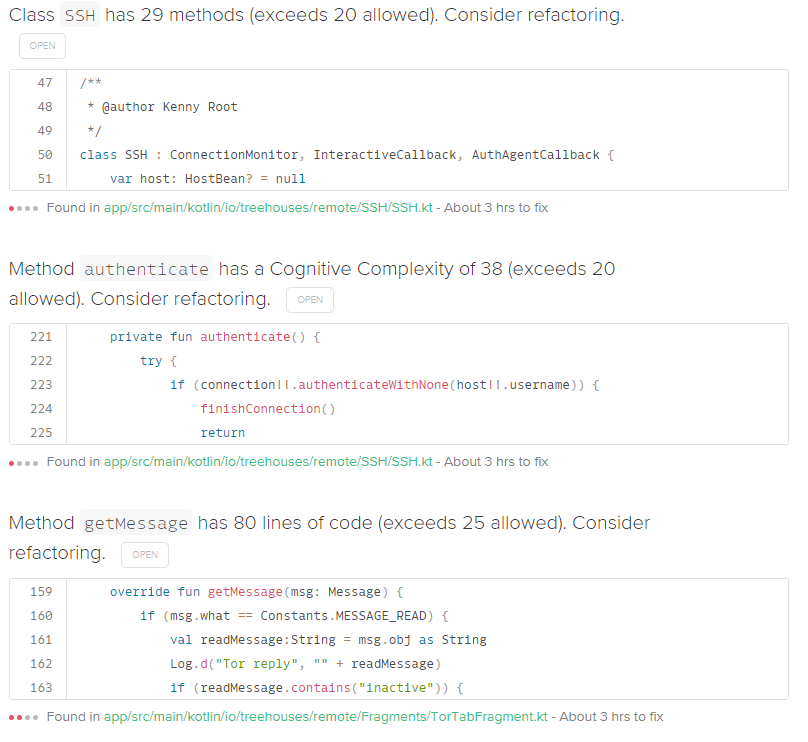
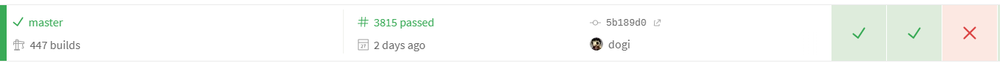

# The Intertwined Components Of Treehouses

Created on 24, July 2020 • [law-lin](https://github.com/law-lin)

---

Upon joining the treehouses team, you will probably start working on either the command line interface (CLI) or remote, depending on your experiences and what you wish to gain out of this internship. Having spent time with the CLI, builder, and remote, I'm writing this post to give you a sense of how all the different components work together in harmony to make treehouses what it is.

## CLI

---

The [CLI](https://github.com/treehouses/cli) is what we use to input commands into the Raspberry Pi to perform various services and functions. For example, if you wanted to display Christmas LED lights on the Pi, you could input `treehouses led christmas`. If you start working on this repository, your first task will probably be to implement a new LED light setting. You can find more about adding a new feature to the CLI [here](https://treehouses.io/#!./pages/blog/20190831-newfeature.md).

To give you some insight on what you could be working on in the CLI, here's some of the tasks I did:

- Created a script to read the power levels of the Pi
- Added a [Docker service](https://hub.docker.com/search?q=&type=image)
- Improved SSH tunnel/remote sending/receiving keys script
- Find bugs/issues in the existing code

The main goal in working on the CLI is to create meaningful features that can be utilized with our remote app.

## treehouses remote

---

[treehouses remote](https://github.com/treehouses/remote) is an Android app that communicates with a headless Raspberry Pi mobile server that is running treehouses image via Bluetooth. It was initially developed with Java but we migrated to Kotlin mid-2020. You can find it on the Play Store [here](https://play.google.com/store/apps/details?id=io.treehouses.remote&hl=en_US)

The remote app uses a Bluetooth chat service to send and receive messages to the Pi. For example, when you tap the LED Heavy Metal setting, the command `treehouses led heavymetal` is sent.

To give you some insight on what you could be working on in remote, here's some of the tasks I did:

- Develop "Send Feedback" feature that communicates with our [Parse](https://parseplatform.org/) database
- Create a tutorial
- Save and display SSH tunnel keys
- Refactor code (refer to [Code Climate](#code-climate))

### [Code Climate](https://codeclimate.com/github/treehouses/remote)

Code Climate is an app that is used to help ensure software quality in codebases. We use it to identify areas to refactor and reduce [technical debt](https://en.wikipedia.org/wiki/Technical_debt). Although we are using Code Climate for all our repositories, remote is the one you should pay particular attention to because more issues tend to arise there.

Here, you see that there are a total of 152 issues for the remote repository. An issue can be anything from having too many lines of code in a file, a method that has a high [Cognitive Complexity](https://www.sonarsource.com/docs/CognitiveComplexity.pdf) score, or duplicate/similar blocks of code in a file.

## Builder

---

The [builder](https://github.com/treehouses/builder) is used to create the bootable custom Raspbian treehouses image that is then burned to the microSD card. There are scripts to install pcakages, purge packages, and execute custom commands in this repository. If there needs to be a new package installed for a CLI feature, the builder is where you would create a script to install the package onto the image.

For example, I worked on a feature on the CLI that lets the user track the uptime of their Raspberry Pi, which required a package called [uptimed](https://github.com/rpodgorny/uptimed). I had initially included the package installation in the CLI - but don't do that. These types of packages should come pre-installed and should be set so that they're not always running, which can be all accomplished with a builder script.

### [Travis CI](https://travis-ci.org/github/treehouses/builder/branches)

Travis CI is a [continuous integration](https://en.wikipedia.org/wiki/Continuous_integration) service that we use to automatically test if our code is working or not. When working on the builder, you'll be inspecting Travis builds to confirm everything works and to debug if necessary. The screenshow below shows the `master` branch, with the most recent two builds succeeding but the third build failing.

Whenever you push a change to your PR, Travis will automatically deploy the current build and verify that it succeeds or not.
