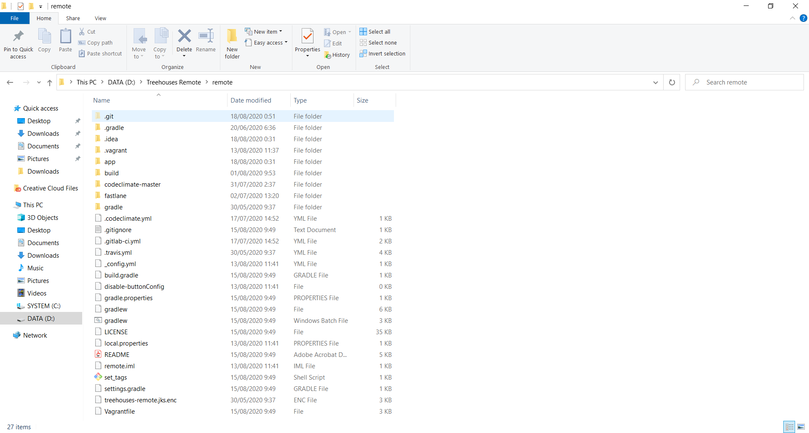
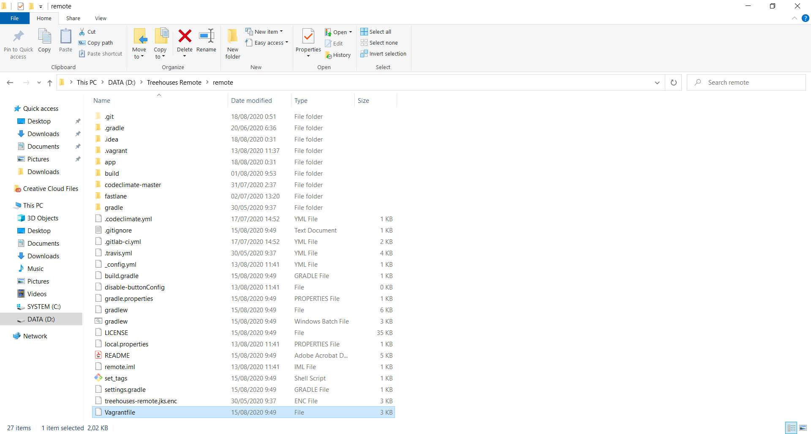
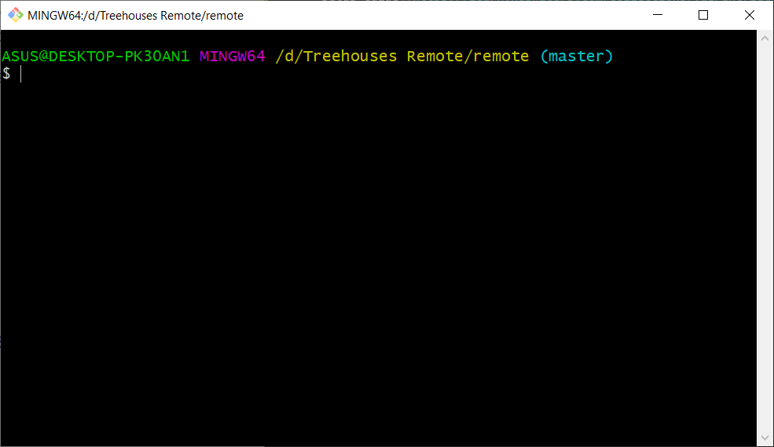
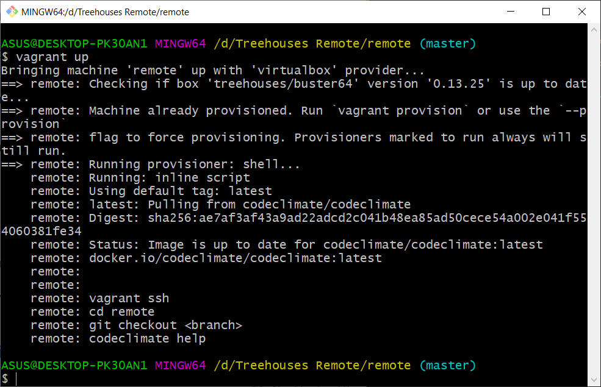
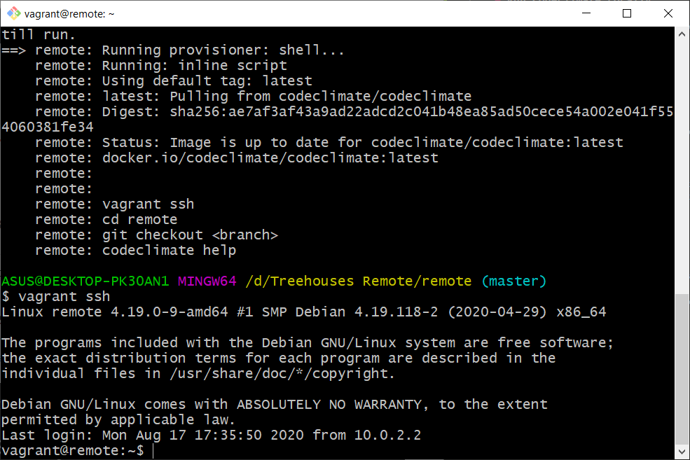
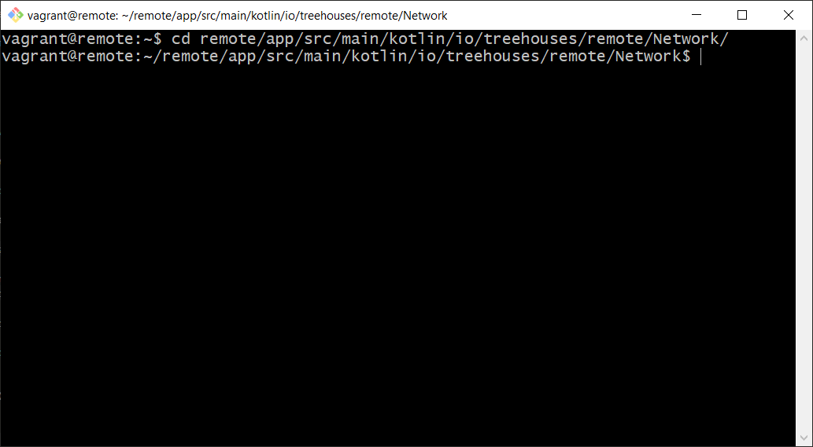
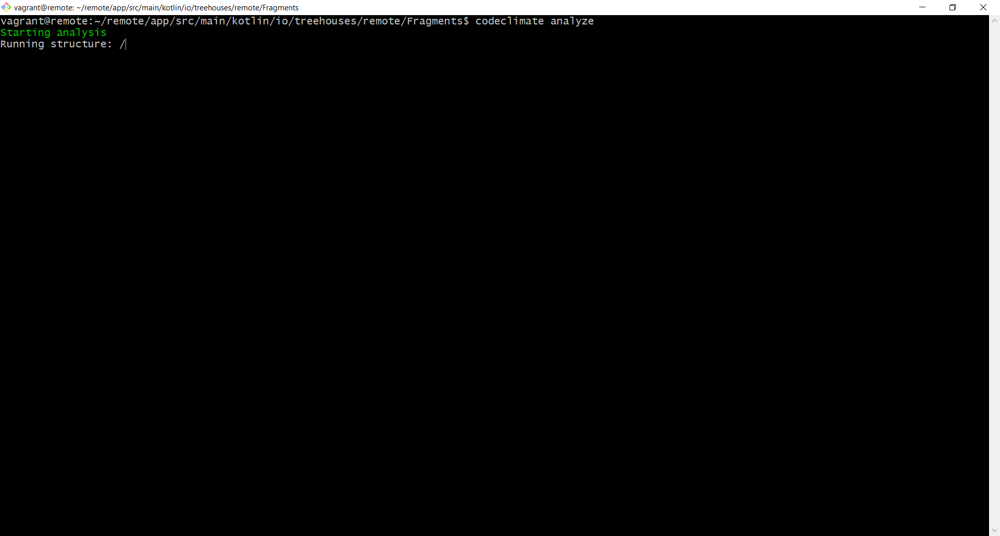

# Run Code Climate Locally

Created on 18 August 2020 • [sydneyaldo](https://github.com/sydneyaldo)

---
This blog is a guide to running Code Climate locally (without having to create pull requests)
Useful for code quality checking prior to upload

---

## 1. Make Sure Vagrant and VirtualBox are Installed

- [Vagrant download page](https://www.vagrantup.com/downloads.html)

- [VirtualBox download page](https://www.virtualbox.org/wiki/Downloads)


## 2. Navigate to the Project Folder



## 3. Make Sure that Vagrant is Set Up

Check for a file named Vagrantfile. If it does not exist, please check out [Vagrant Setup Guide](https://learn.hashicorp.com/collections/vagrant/getting-started)



## 4. Run Git Bash or Terminal



## 5. Start SSH in Vagrant

Create a machine using `vagrant up` command

Run `vagrant ssh`



**Note:** Text output may vary depending on the Vagrantfile content



- If errors exist, make sure Vagrant is set up properly

## 6. Change to the Directory of the Code to be Analyzed



## 7. Invoke Code Climate CLI Command

Run `codeclimate analyze` (if wrapper is installed)

- We can also run other Code Climate CLI commands by invoking `codeclimate <command>`
	Run `codeclimate help` for a list of available commands

- If Code Climate wrapper is not installed in */usr/local/bin*, consider running the CLI commands natively


 

#### Natively run the CLI command by running:

```
docker run \
  --interactive --tty --rm \
  --env CODECLIMATE_CODE="$PWD" \
  --volume "$PWD":/code \
  --volume /var/run/docker.sock:/var/run/docker.sock \
  --volume /tmp/cc:/tmp/cc \
  codeclimate/codeclimate analyze
 ```

Or: 

```
docker run \
  --interactive --tty --rm \
  --env CODECLIMATE_CODE="$PWD" \
  --volume "$PWD":/code \
  --volume /var/run/docker.sock:/var/run/docker.sock \
  --volume /tmp/cc:/tmp/cc \
  codeclimate/codeclimate analyze <path/to/directory>
 ```