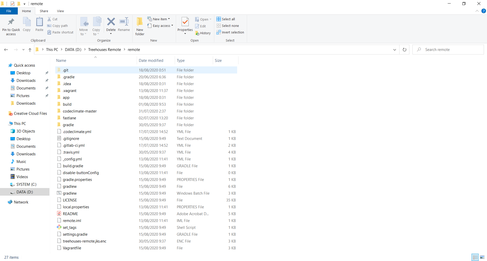
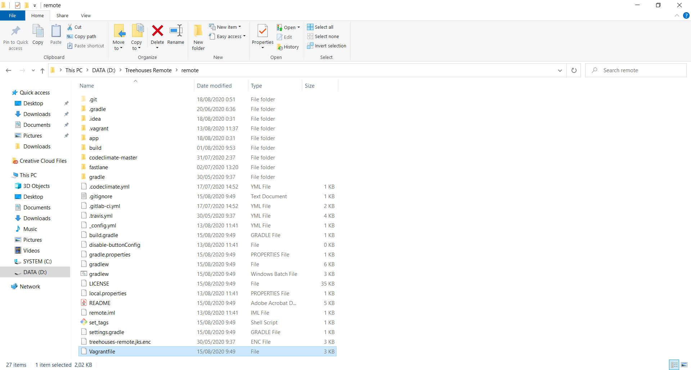
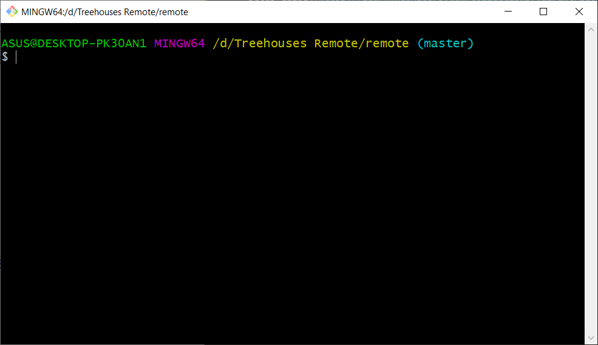
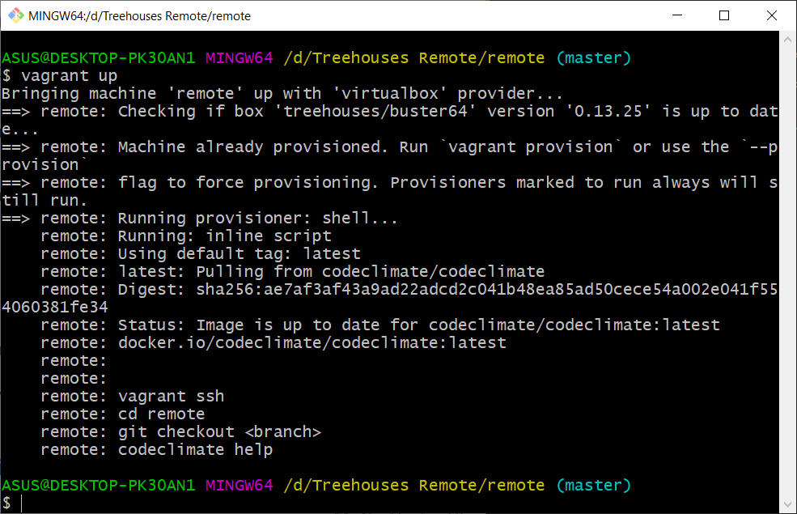
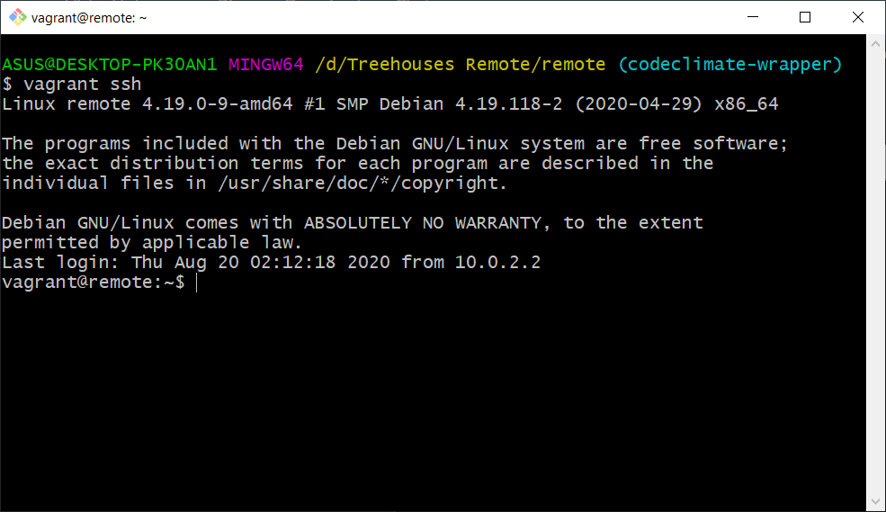
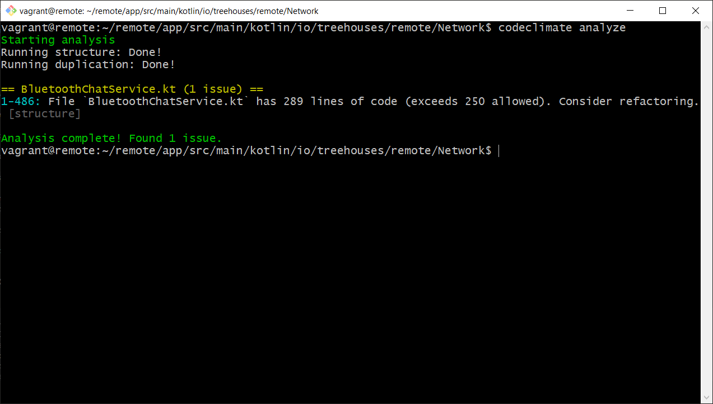

# Run Code Climate Locally

Created on 18 August 2020 • [sydneyaldo](https://github.com/sydneyaldo)

---
This blog is a guide to running Code Climate locally (without having to create pull requests)
Useful for code quality checking prior to upload

---

## 1. Make Sure Vagrant and VirtualBox are Installed

- [Vagrant download page](https://www.vagrantup.com/downloads.html)

- [VirtualBox download page](https://www.virtualbox.org/wiki/Downloads)


## 2. Navigate to the Project Folder



## 3. Make Sure that Vagrant is Set Up

Check for a file named Vagrantfile. If it does not exist, please check out [Vagrant Setup Guide](https://learn.hashicorp.com/collections/vagrant/getting-started)



## 4. Run Git Bash or Terminal



## 5. Start SSH in Vagrant

Create a machine using `vagrant up` command

Run `vagrant ssh`



**Note:** Output may vary on different machines when running `vagrant up`



- If errors exist, make sure Vagrant is set up properly

## 6. Change to the Directory of the Code to be Analyzed

```
vagrant@remote:~$ cd remote/app/src/main/kotlin/io/treehouses/remote/Network/
vagrant@remote:~/remote/app/src/main/kotlin/io/treehouses/remote/Network$
```

## 7. Invoke Code Climate CLI Command

Run `codeclimate analyze` (if wrapper is installed)

- We can also run other Code Climate CLI commands by invoking `codeclimate <command>`
	Run `codeclimate help` for a list of available commands

- If Code Climate wrapper is not installed in */usr/local/bin*, consider running the CLI commands natively (to check, navigate to */usr/local/bin* and see if Code Climate exists in the directory)



**Note:** Running structure may take a while, if the engine timed out please run the `codeclimate engines:install` (command and output shown below)

```
vagrant@remote:~$ codeclimate engines:install
Pulling docker images.
Using default tag: latest
latest: Pulling from codeclimate/codeclimate-structure
75cb2ebf3b3c: Pulling fs layer 
bf9f7b182d6c: Pulling fs layer 
...
d072530a3378: Pull complete 
e198cf3b1351: Pull complete 
Digest: sha256:63601288051ac8d71d910dc2cee871bf0d22c5bf7e4a3a66e313ef5047a9f2fe
Status: Downloaded newer image for codeclimate/codeclimate-structure:latest
Using default tag: latest
latest: Pulling from codeclimate/codeclimate-duplication
75cb2ebf3b3c: Already exists 
bf9f7b182d6c: Already exists 
...
cf818c6259f3: Pull complete 
e929626cf0b2: Pull complete 
Digest: sha256:d80a157b3093af6422b5e5ff16b9fc2883c66c435848caf6ac557dd06c83c491
Status: Downloaded newer image for codeclimate/codeclimate-duplication:latest
vagrant@remote:~$ 
```

## 8. Interesting 

Natively run the CLI command by running:

```
docker run \
  --interactive --tty --rm \
  --env CODECLIMATE_CODE="$PWD" \
  --volume "$PWD":/code \
  --volume /var/run/docker.sock:/var/run/docker.sock \
  --volume /tmp/cc:/tmp/cc \
  codeclimate/codeclimate analyze
 ```

Or: 

```
docker run \
  --interactive --tty --rm \
  --env CODECLIMATE_CODE="$PWD" \
  --volume "$PWD":/code \
  --volume /var/run/docker.sock:/var/run/docker.sock \
  --volume /tmp/cc:/tmp/cc \
  codeclimate/codeclimate analyze <path/to/directory>
 ```
