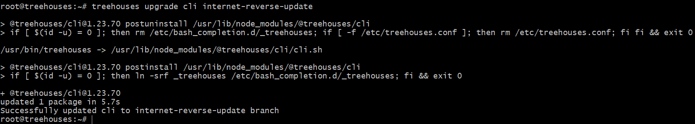
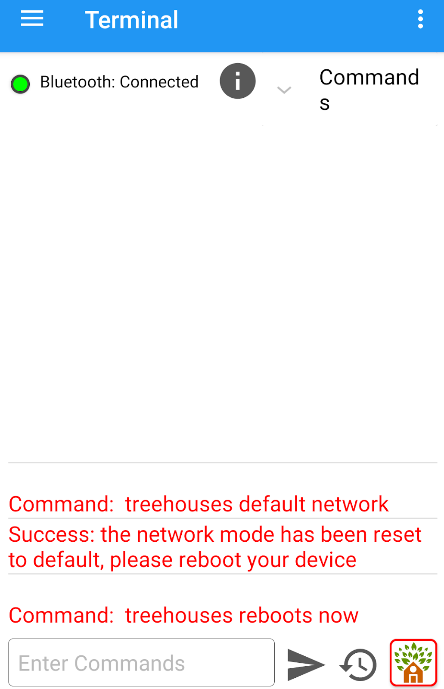

# Testing refactor of treehouses internet over bluetooth with phone

24, August 2020 • [sarahrams](https://github.com/sarahrams)

---

The most common way to access Raspberry Pi is by using ssh through internet like WiFi or Ethernet. However, if you don’t have internet connection, bluetooth becomes your best friend to access your raspberry pi.

**Example situation:**
The command **treehouses internet** allows to check the availability of internet. In this way, it normally outputs true if the rpi can reach internet, or false if it doesn't. 
What if we want to refactor the internet in such a way that when the output is false, it immediately exits and otherwise the command returns true?
This is when comes the necessity of testing over bluetooth and to check for when internet is not available. 

## Tools Required:
1. Raspberry Pi with a full working CLI
1. An Android device which has bluetooth module
1. Treehouses remote app (available on Play Store)

## Step1: Get RPi up and Connect to Terminal
The treehouses remote app is principally used to remote control the raspberry pi over bluetooth with a treehouses image as well as to control rpi over bluetooth remotely with terminal and a full working CLI. In the following lines, we will go through the steps for accomplishing a command test over bluetooth using an Android device:
1. Get your RPi running
1. On Raspberry Pi terminal, enter `treehouses upgrade cli <branchname>`. This is to upgrade the cli repo to the specified ‘branchname’ branch on github. In our case, we are testing internet.sh, which means we will upgrade cli to the branch containing the internet file refactored.

## Step2: Connect to Treehouses Remote and Set Network to Default
1. Go then to your phone within the treehouses remote app. Click `connect to RPI` to pair Raspberry Pi to android device. On the main menu, go to the terminal and run the command `treehouses default network`. This command is to set the network back to the initial configuration of when installed.
1. This previous action requires a device reboot to be functional. After rebooting, connect again to RPi over bluetooth.

1. If you enter `treehouses networkmode info` you will notice that the network has been set to default mode. This command shows the current status of the network mode or to test if the internet is on or off.
![]images/20200824-treehouses-networkmode.png

## Step3: Test your commands (`treehouses internet`)
1. Then, you can test your commands in internet.sh and make sure to test all other files using the new commands, if any.
In this case, we are firstly running `treehouses internet`.

1. As there are several commands in treehouses that need to check the internet before running, this means they should also be tested to assure they do not crash. If you go to the Github cli directory and enter `checkinternet` in search tab, you will get all the files that need to be tested: anime.sh, gpio.sh, inspire.sh, internet.sh, magazine.sh, upgrade.sh. We should also remember that `treehouses remote status` and `treehouses remote statuspage` will break if there is no internet. 
1. Once everything is working perfectly, you can create a pull request. In the meanwhile, logging back into your terminal and testing over ssh are blocked, which means you will need to burn a new image and set network configuration as preferred.

## Congrats! You just tested over bluetooth using your phone.
