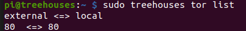
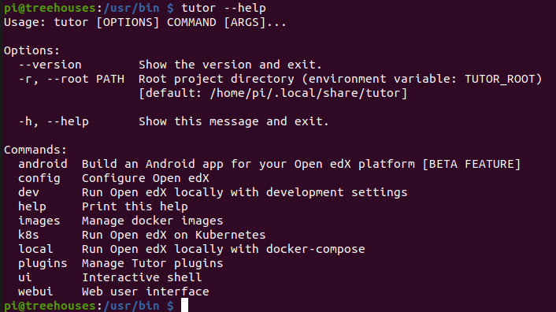

# How to install OpenEdx by tutor

Created on xx, Aug 2020 • [hiroTochigi](https://github.com/hiroTochigi)

---

This blog is about how to install OpenEdx by [Tutor(rpi)](https://github.com/ole-vi/tutor-rpi) on Tor network. Tutor(rpi) is forked from [Tutor](https://github.com/overhangio/tutor) and customized to run on Raspberry pi 4.

[Tutor](https://github.com/overhangio/tutor) is a docker-based [Open edX](https://openedx.org/) distribution, both for production and local development. The goal of Tutor is to make it easy to deploy, customize, upgrade and scale Open edX. Tutor is reliable, fast, extensible, and it is already used by dozens of Open edX platforms around the world.

---

### [Prerequisite](https://openedx.atlassian.net/wiki/spaces/OpenOPS/pages/146440579/Native+Open+edX+platform+Ubuntu+16.04+64+bit+Installation)
* Raspberry Pi 4 with 8GB RAM
* 32GB or more storage

---

## Setting up Environment in Raspberry Pi for OpenEdx

1. Enter Raspberry Pi via non-root
`pi` is a default user for treehouses image.
Tutor gives you a warning message if you run it as root.
Also, it might prevent OpenEdx from connecting to MariaDB in some point.
Strongly recommend to run Tutor as non-root.

1. Delete all Docker containers and Docker images
Treehouses starts Planet in default.
They might hinder Tutor from installing OpenEdx, so you should delete them.

1. Make Sure Tor is Configured 
Tutor asks hosting address to host OpenEdx.
In this tutorial, we host OpenEdx on Tor network with port 80.
Verify Tor is configured and port 80 is opened by the below command.
```
sudo treehouses tor list
```
You should get `80 <=> 80` on your screen. 
If you get `external <=> local` but not `80 <=> 80`, port 80 is not opened
Open port 80 by the below command.
```
sudo treehouses tor add 80 
```
When even you do not get `external <=> local`, Tor is not configured yet.
Execute the below command.
```
sudo treehouses tor add 80
sudo treehouses tor start
```
If you get message like below, Tor is properly configured.



**Note: ** If you boot up your image first time, you should reboot it again.
Without rebooting, your stoarage might not be enough to install OpenEdx.

---

## Install Tutor

1. Download Tutor Binary Data
You can download Tutor by a below command.
```
wget https://github.com/ole-vi/tutor/releases/download/v10.0.10-rpi/tutor
```
This command should download Tutor in your current directory.

1. Make Tutor  Executable
You can make Tutor executable by below command.
```
sudo chmod +x tutor
```
Witihout making executable, you cannot use Tutor.

1. Move Tutor in `usr/local/bin/`
You should move Tutor in `/usr/local/bin/` by a below command.
```
sudo mv tutor /usr/local/bin
```

1. Make Sure Tutor Installed Correctly
Type `tutor --help`.
You should get the below picture with a proper configuration.





**note: ** There are several directories named `bin`.
Tutor should be stored in `/usr/local/bin` because Tutor is a normal user programs not managed by the distribution package manager.
Please look at [this page](https://unix.stackexchange.com/questions/8656/usr-bin-vs-usr-local-bin-on-linux/8663) for more precise information.

---

## Start OpenEdx

1. Copy Your Onion Addfress
It is used for the configuration

1. Start Tutor
Type the below command.
```
tutor local quickstart
```

