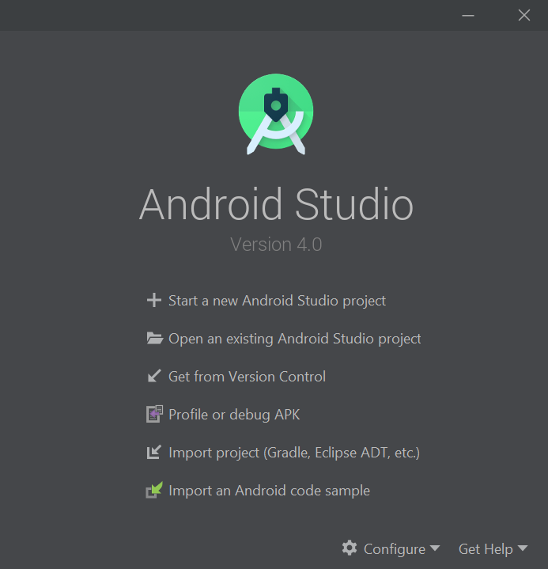
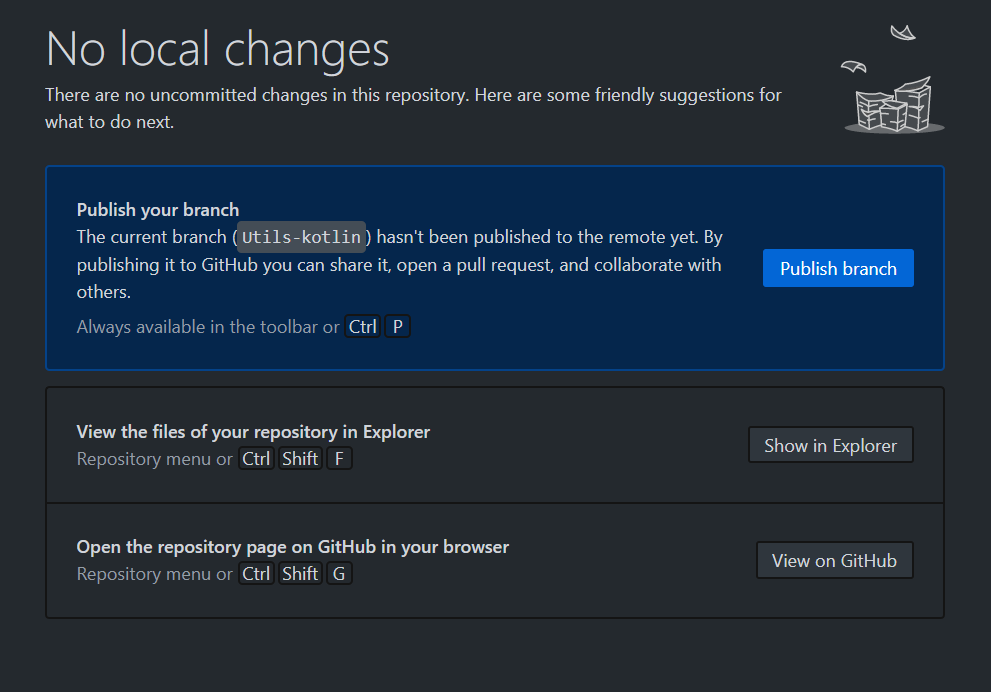
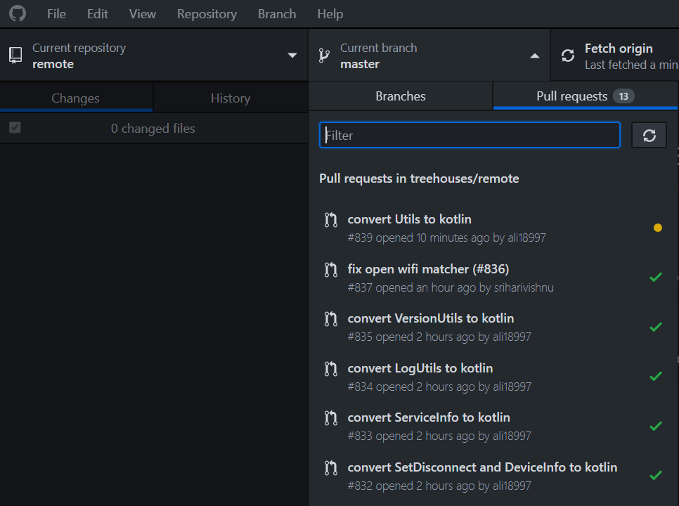

# How to install OpenEdx by tutor

Created on xx, Aug 2020 • [hiroTochigi](https://github.com/hiroTochigi)

---

This blog is about how to install OpenEdx by [Tutor(rpi)](https://github.com/ole-vi/tutor-rpi) on Tor network. Tutor(rpi) is forked from [Tutor](https://github.com/overhangio/tutor) and customized to run on Raspberry pi 4.

[Tutor](https://github.com/overhangio/tutor) is a docker-based [Open edX](https://openedx.org/) distribution, both for production and local development. The goal of Tutor is to make it easy to deploy, customize, upgrade and scale Open edX. Tutor is reliable, fast, extensible, and it is already used by dozens of Open edX platforms around the world.

---

### [Prerequisite](https://openedx.atlassian.net/wiki/spaces/OpenOPS/pages/146440579/Native+Open+edX+platform+Ubuntu+16.04+64+bit+Installation)
* Raspberry Pi 4 with 8GB RAM
* 32GB or more storage

---

## Setting up Environment in Raspberry Pi for OpenEdx

1. Delete all Docker containers and Docker images
The default treehouses starts Planet.
They might hinder Tutor from installing OpenEdx, so you should delete them.

1. Get Onion Address
Tutor asks hosting address to host OpenEdx.
Get your Onion Address by `treehouses tor`

Note. If you boot up your image first time, you should reboot it again.
Without rebooting, your stoarage might not be enough to install OpenEdx.

---

## 

1\. Open Android Studio
 

2\. Click **Import Project (Gradle, Eclipse ADT, etc.)**

3\. Navigate to where the GitHub Desktop stored the remote repository locally. By default its in the `GitHub\remote` directory inside your Documents folder. Select the remote folder with Android icon and click **OK**
 

 
---

## Making Changes and Pull Requests

1\. By Default you would be on the Master branch, so you should make a new branch to make your changes. Give it a name and click **New Branch**

2\. Click **Create branch**

3\. Your Android Studio project will automatically be switched to this new branch. Make the changes and when you come back they will automatically be detected by GitHub Desktop. Give your commit a description and click **Commit to "your branch name"**

4\. Click **Publish Branch**

5\. Click **Create Pull Request**

6\. It will open it on a browser where you can complete the Pull Request

---

## Testing Pull Requests of Others:
1. Select the Pull Request you want to test in GitHub Desktop. Click on it and wait for it to fetch that branch. Once it is done, Android Studio will automatically be configured to work on that branch and you can build/run the code to test the pull request.
 

---
