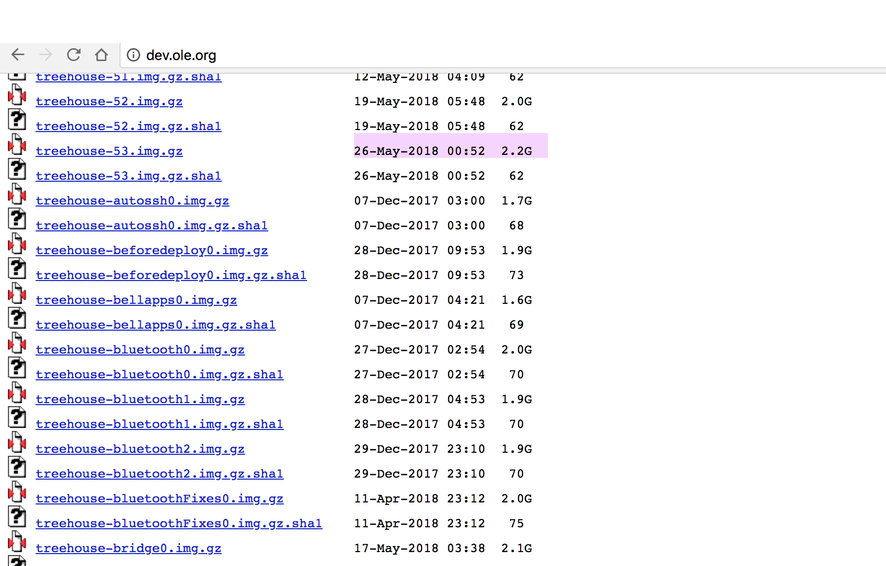
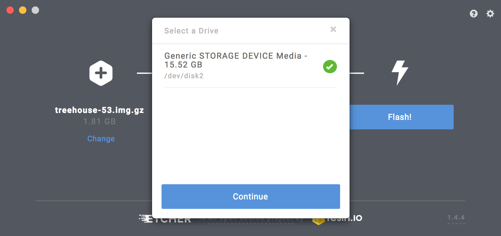
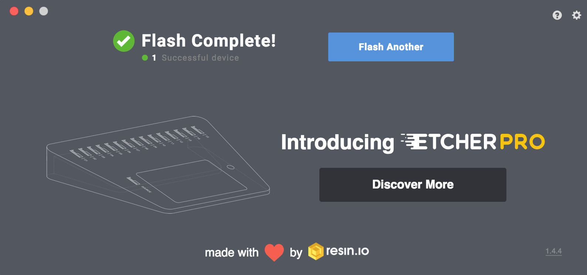

Do you want a Raspberry Pi image that runs perfectly out of the box with Docker and Educational Application? This is the getting started guide to running [treehouses](https://github.com/treehouses) Raspberry Pi Image on your Raspberry Pi.

This guide will demonstrate the process with Raspberry Pi 3B and it will be specific to macOS, but it should be applicable to other operating systems such as Linux distribution or Windows.

## Downloading Image

[DOWNLOAD LATEST IMAGE](http://dev.ole.org/latest.img.gz)

Click the link above to download the latest treehouses Raspberry Pi image. For more information and older releases, please visit to our [download](/download) page.

You can just click the `DOWNLOAD LATEST TREEHOUSES IMAGE` and you'll get the latest image (not always be stable) or you can browse for the specific version in the given link which will redirect you to [dev.ole.org](http://dev.ole.org).

Okay, suppose you want to download the version 53 of the image. In the [dev.ole.org](http://dev.ole.org) navigate to the desired image.

Latest Image

Version 53 Image

Then download it!

## Installing Etcher

In order to burn your image to Micro SD Card, you need an OS image flasher that copy and format the filesystem of the Micro SD. We recommend you to use [Etcher](https://etcher.io/) from Resin.io.

Download Etcher!

Then open the package and install it!

## Burning the Image

The next step is to burn your image with Etcher. You only need to open Etcher and do three steps:

* Choose your treehouses image
* Choose your target SD Card drive (don't forget to plug in your card first)
* Click flash!

## Booting with your Micro SD Card

The last step is to insert your Micro SD Card to your Raspberry Pi then plug in the power. After few seconds, you will see the desktop like this.

You'll be warned that the system has SSH enabled and you need to change the default password and username for security purpose.