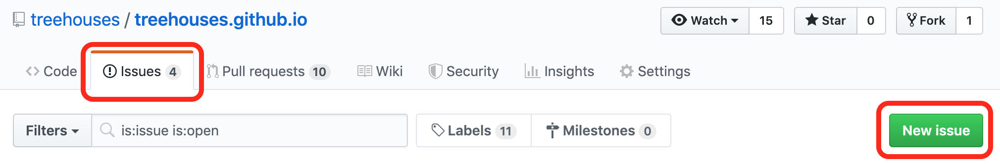

# GitHub Issues

## Objectives

* Learn about Issues, Commits, and Pull Requests
* Understand the collaborative git/GitHub work-flow that will be used throughout the internship
* Create an issue, and upon admin approval, create a branch to fix it
* After resolving the issue in the branch, make a pull request to the [upstream repository](https://github.com/treehouses/treehouses.github.io)
* Work with admins to make adjustments if necessary, and merge your branch into the upstream

## Introduction

On GitHub, each repository has a section where issues can be added, discussed, and fixed as a means of categorizing and addressing problems we find. Issues are often opened by our team to fix software bugs in our code.

NOTE: Issues are not just about adding to the wiki, but finding better ways to express instructions and removing information that may be redundant.

We encourage you to file as many issues as you can, no matter how big or small. If you notice something but are not sure how to solve, file it as an issue anyway to let others know about it so it can be fixed. Strive to provide as much value as possible with the issues you submit. By doing so, you will better support the community and improve this section for all.

## Create an Issue

First, you will need to open an issue within the right repository, in this case [treehouses.github.io](https://github.com/treehouses/treehouses.github.io), and explain the problem you have discovered, or improvement you want to implement. You will then research the possible solutions or ideas on how to address the issue before detailing your proposed solution.
Your Pull Request (PR) will then be approved and someone else will hopefully provide some helpful input, you can then move ahead with making the proposed changes.

Go to the "Issues" tab and click on "New issue" to create a new issue:

Give it a short title and a decriptive body and you can now submit your issue. If you are explaining a bug or how to replicate an issue, please be as explicit as possible and use pictures as necessary.

_**IMPORTANT NOTE:**_ Issues are _not required_ to be approved _before_ a Pull Request is submitted for the respective fix; however, we do suggest that you wait until someone from the System Team confirms/approves the change that your issue addresses BEFORE you begin work on the fix.

If a Systems Team member does not approve your issue prior to the creation of the Pull Request, your efforts may be in vain. Your Issue may not be approved, among many other reasons this may be because:

* Your issue is not a problem to begin with
* Your issue does not improve treehouses enough
* Your fix is not suitable

In this case your the Pull Request will not be merged and the Issue will not be counted towards your "First Steps" progress. Therefore, it is suggested that you wait for the OLE member(s) to approve your Issue submission.'

**Already available issues:** You can also help on issues which have already been created. Issues which are tagged as `first step intern` can be taken and worked on. Please make sure when you start working on these issues that you assign yourself to said issue or ask to be assigned. If someone else is already assigned to an issue, do not try to work on that issue.

_**SPECIAL NOTE:**_ Aspiring Virtual Interns have a tendency to speed through this process in order to check off their "First Steps" requirements. The purpose of these requirements is to fix an actual problem and improve the "First Steps" as a whole. Take time to review the "First Steps" materials to identify real issues and to research helpful solutions. It is also important to search current/open Issues to see if the problem has already been identified.

## Create a New Branch

**Every time you start to work on an issue, you need to create a branch to keep issues you are working on separated from each other.**
Before you create your branch, sync your repo using next commands:
`git fetch upstream`  
`git checkout master`
`git merge upstream/master`
`git push origin master`

To create a new branch, go to your github repo and create it using the same steps as you can see [here](https://help.github.com/en/articles/creating-and-deleting-branches-within-your-repository) (do not delete your branch)

Use `git checkout master` to switch to master branch, then use `git checkout -b <name_of_your_new_branch>` to create and switch to a new branch on your local repository. Make sure to remove the angled brackets (< & >) as they are just place holders. More documentation on checkout can be found [here.](https://git-scm.com/docs/git-checkout)

Now you can go and make the proposed changes to your local files. You can use any IDE or text editor you prefer. You can also use VIM or Nano to edit files from the terminal. [This guide on VIM](https://www.vim.org/docs.php ) and [this guide on Nano](https://www.nano-editor.org/docs.php) contain more information on their proper usage.

 _**NOTE:**_  Use `git branch` to see which branch you are in. Your `master` branch is the base working branch. It needs to remain untouched just in case you need to revert some changes back to a working version. Make sure you are on right branch using `git branch` to see what branch you are currently on, and `git checkout <branch-name>` to switch to the proper branch before making changes to your local files and committing.

If you're still confused, that's quite alright. [Forking Workflow](https://www.atlassian.com/git/tutorials/comparing-workflows/forking-workflow) can be quite challenging at first. See this diagram below. For better context, the new branch you just made is inside your "Forked GitHub IO".

### Preview Changes Locally

After making modifications to your local files and before making a commit, you should preview the changes locally. The following link, [how to preview changes](http://dynalon.github.io/mdwiki/#!faq.md), gives all the information about how to preview changes from your machine. There's also another option to preview using online environment. This [link](https://dillinger.io/) takes you to the online environment.

_**NOTE:**_ In case you have come up with the wrong edit and if you'd like to revert it back to the previous version of the file follow this [link](https://githowto.com/undoing_local_changes). This is applicable only before committing the change.

## Create a Commit and Push the Changes
Use the next commands to commit and push the changes:

1.  `git status` to see which files in the working directory have been modified.

2.  `git add .` to stage **ALL** of the modified files shown,
    or `git add <file1> <file2> <file3>...` to stage specific modified files.

3.  `git commit -m "<your_commit_message> (fixes #<issue_no>)"`
	(refer to the commit message guidelines below).

4.  `git push -u origin <name_of_your_new_branch>` to save your changes and push them to your GitHub (for any further commit on the same branch after the first one, you can just use `git push`).

### Commit Message Style Guide

Because the commits you will be making on this Markdown wiki are fairly basic, it is not necessary to enforce a wordy commit style. However, in the future, when you start to work on more complex projects, it is helpful to write your commit messages in a certain way. Here is an article on [how to write good commit messages](https://chris.beams.io/posts/git-commit/).

For edits to this Markdown wiki, we recommend that your commit messages only consist of the subject line (refer to the article for more on what the subject is). Rules 2-5 are the most important:

* Limit the subject line to 50 characters
* Capitalize the subject line
* Do not end the subject line with a period
* Use the imperative mood in the subject line

Here is an example of how you would write your commit message:
`$ git commit -m "Add commit message style guide and add raw.githack section (fixes #841)"`

_**NOTE:**_ In your commit message, if you add a keyword like "fixes" or "resolves" followed by "#" and the issue number, once your pull request is merged, the issue will automatically be closed. This is helpful because it helps declutter the issues section. See more [here](https://help.github.com/articles/closing-issues-using-keywords/).

### Raw.githack

Raw.githack is an important aspect of the pull request process. After you commit changes to your local branch and push them to your remote branch, you can view these changes by going to `https://raw.githack.com/{YourGitHubUsername}/{YourGitHubUsername}.github.io/{YourBranchName}/#!index.md` and viewing the page(s) you have changed. You may need to change the link slightly depending on where the file you want to view is located. If everything looks correct, you are ready to create a pull request.

#### Raw.githack Generator

You can also use the raw.githack url generator on <https://raw.githack.com>
1.  Select the branch you were working on from the drop-down on the top left
2.  Navigate to the page you changed in your fork of the GitHub repository  
3.  Copy the URL in your browser and paste it in the field on <https://raw.githack.com>
4.  Select the Development URL
5.  Add `#!` after the forward slash proceeding your branch name, this will show the markdown in presentation mode rather than as raw markdown.

Raw.githack makes it easy to see what the page will look like if your branch is merged, so don't forget to include a raw.githack link in your pull request.

## Create a Pull Request
If you login to your own fork of OLE on Github, GitHub will notice that you recently pushed a new branch. The fork can be found via `https://github.com/YourUsername/YourUsername.github.io`, replacing YourUsername with your own details. Press the green button that says Compare & pull request. In this new page, give the PR a title and description. Once you are done with filling out these forms, submit the pull request by clicking on the green create pull request button.

For everyone's convenience, we highly recommend that you follow a certain structure when submitting a pull request. We suggest to include the issue for which the pull request is resolving (for example, if your pull request fixes the issue number 320, then add `#320` to your pull request) to the title of your PR and also the raw.githack link into the description of the pull request. This saves a lot of time for the person reading your pull request as he/she does not need to search and match the issues with the corresponding PR and is able to instantly see the changes pushed via the raw.githack link.

Additionally, creating a checklist will help others understand what you have done and what needs to be done - it helps you coordinate with your team members with the issues you are facing in an organized manner. GitHub will render the task list in markdown, and it will look similar to something like the checklist shown below this paragraph.

[x] Check for issue number in pull request title
[x] Are there any unneeded files in the pull request?
[x] Did they make a branch for their patch?
[x] Does the pull request actually fix the issue?
[x] Check the pull request on raw.githack, does it display without any errors?
[x] Are there any merge conflicts?
[x] Make sure that people use their GitHub accounts when making commits through git

Some of these items are of course optional, but try to include as much useful information for others as possible in your checklists because nobody really wants to work on something that has already been completed by someone else.

_**NOTE:**_ While you are waiting on two OLE team members to approve your Pull Requests, it is OK to keep creating more Issues and Pull Requests in the meantime. They will all count towards your final Issue/PR total, and PR approval can take time, so do not let a lengthy approval/fix process keep you from moving on in your "First Steps".

## Delete the Branch

*  **Wait for the pull request merge!**
All that remains is posting your pull request in the chat and waiting until one of the OLE staff gets a chance to look at it. Be aware that a staff member may either submit a code review asking you to modify some of your changes, or accept the pull request and close the issue. You can see the process.

* **Delete the branch from your remote repository.**
After your pull request has been approved and merged by OLE staff, you might want to delete the branch that is associated with your pull request. It can keep your local and remote (yourUserName.github.io on GitHub) repository away from a mess of defunct branches. To delete the defunct branch in your remote repository, you can click the "Delete branch" button in your pull request (see the picture below).

* **Delete the branch from your local repository.**
To delete the defunct branch in your local repository, use the command `git branch -d <yourLocalBranchName>` (make sure you are not on the branch that you want to delete). Go [here](https://tecadmin.net/delete-git-remote-and-local-branch/) to find out more about how to delete a branch locally.

_**NOTE:**_ Remember to always sync your fork before starting to work on a new issue. To sync your fork you can follow the process in the [previous step](gitrepositories.md).

This is an exercise to help you familiarize with GitHub issues, committing, and creating pull requests. This is a common process in large open source projects as there is always room for improvement. So, we strongly encourage you to follow this process and continue to post issues and resolve them.

## Useful Links

[Mastering Issues](https://guides.github.com/features/issues/) - The official Git Guide on the basics of filing an issue.
[Helpful links and videos](faq.md#Helpful_Links)
[How to Contribute to Open Source](https://opensource.guide/how-to-contribute/)

---
#### Return to [First Steps](firststeps.md#Step_6_-_GitHub_Issues_Tutorial)
