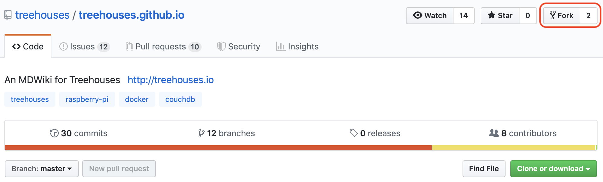

# GitHub and Markdown

## Objectives

* Learn about GitHub and Markdown
* Create your own Markdown profile page
* Understand the GitHub workflow (including forks, repositories, commits, and pull requests)

## Preparation

[GitHub](https://help.github.com/categories/writing-on-github/) – a web-based hosting service for version control using git, source code management system for treehouses.

[Markdown](https://en.wikipedia.org/wiki/Markdown) – a lightweight markup language with plain text formatting syntax.

[MDwiki](http://dynalon.github.io/mdwiki/#!quickstart.md) – a CMS/Wiki built in HTML5/Javascript and runs on the client. It uses Markdown as its input markup language. The website you are currently viewing is realized with MDwiki.

### Markdown
The following resources can be used (and bookmarked) to familiarize yourself with Markdown:

- [GitHub – Mastering Markdown](https://guides.github.com/features/mastering-markdown/) - The official GitHub Guide for Markdown syntax.

- [Git Cheat Sheet](https://github.github.com/training-kit/downloads/github-git-cheat-sheet.pdf) - A resource for commonly used git commands.

- [Markdown cheat sheet](https://github.com/adam-p/markdown-here/wiki/Markdown-Cheatsheet) - A bigger Markdown cheat sheets with examples

- [Markdown Tutorial](https://tylingsoft.github.io/tutorial.md/#whats-markdown) - An interactive tutorial to learn Markdown.

- [Markdown Interactive Tutorial](http://www.markdowntutorial.com/lesson/1/) - Another awesome interactive tutorial to experiment and learn more Markdown syntax.

**NOTE**:
• **If you have not used Markdown before, we recommend you to go through at least one of the tutorials/guides.**

## Start Here

Below is a summary of the steps that we will walk you through:

* [Login to GitHub with your username and password](#Login_to_GitHub_with_your_username_and_password)
* [Find and fork the correct repository](#Find_and_fork_the_correct_repository)
* [Go to Settings and rename your repository](#Go_to_Settings_and_rename_your_repository)
* [Check if your github.io works](#Check_if_you_github.io_works)
* [Create a new file as your personal MDwiki page and commit your changes](#Create_a_new_file_as_your_personal_MDwiki_page_and_commit_your_changes)
* [Open a pull request](#Open_a_pull_request)

### Login to GitHub with your username and password

Since you have already created an account on GitHub, we will assume that you understand the basic layout and functionality. If you don't, please explore and do some basic googling.

There is a lot to learn about GitHub, but to acclimatize you to it, we will walk you through a basic example of how to create your own &lt;username&gt;.github.io and allow you to edit and commit your changes.

**NOTE**: Existing GitHub users, please make sure to set your email address per local repository or make sure global settings are accurate. Follow [this](https://help.github.com/articles/setting-your-commit-email-address-in-git/) for more information.

### Find and fork the correct repository

Forking is essentially creating a copy of a repository on your own GitHub account, to avoid editing and, possibly, messing up with the main repository.

Now, go to [treehouses github.io repository](https://github.com/treehouses/treehouses.github.io) and click on the "Fork" button to fork the repository to your own GitHub account.

**NOTE**: It is very important to **distinguish between your personal GitHub account and treehouses's account**.
As we want to keep a 'clean' version of our code, you should first fork the repository. You should commit any changes you make to a branch on this version of the repository. These changes should be sent back to treehouses repository through pull requests. treehouses code will be updated when the pull requests are approved.

### Go to Settings and rename your repository

After you fork the repository, you will be on your repository: &lt;YourUserName&gt;/treehouses.github.io. Next, you should go to **Settings** at the top middle of the page and rename your repository to &lt;YourUserName&gt;.github.io. See example below.

**Note:** In case you have the **https://YourUserName.github.io** in use, please refer to the [FAQ](faq.md).

### Check to see if your github.io works

After renaming your forked repository, go to  https://YourUserName.github.io and make sure it works.

Don't worry if you see a **404** page not found error. When you access the link, it will take a while for the page to load and run. Make sure in **Settings > GitHub Pages**, the **source** is set to **_master branch_**.

### Create a new file as your personal MDwiki page and commit your changes

**Again, when you're editing on GitHub, it is important to make sure you are working on your own GitHub repository.** To that end, make sure there is your own username before the slash and the correct repository after the slash. For example: `EmilyLarkin/EmilyLarkin.github.io`.

First, before creating your file, we need to create a new branch

1. Click on the branch selector menu (make sure it says "Branch: **master**", if it's something else, click on it and switch to master branch first
1. Give your new branch a short and descriptive name (you can read more about branch naming [here](https://github.com/agis/git-style-guide#branches))
1. Click on "Create branch: your-new-branch-name". Then you should see "Branch: **your-new-branch-name**" on the branch selector menu

Next, we are going to create your page

1. Go to the `pages/vi/profiles` folder
1. Make sure you are still on the new branch you just created, look for "Branch: **new-branch-name**" on the branch selector menu
1. Click `Create new file` button
1. Name the file exactly the same as your GitHub username with file extension `.md`
  * It is important that you stick with your GitHub username so we could easily identify you

Then, in the new Markdown file, include the following information:

* your name, location/time zone, and OS (including version)
* a short description of yourself (so your fellow virtual interns know who you are)

You may use the "Preview" tab to have a primitive look of what your Markdown will look like. Please use at least 5 different types of Markdown elements so you can get an idea of how it works. Avoid using HTML as the purpose of Markdown is to make pages easy to write and read. Try to be as creative as possible. Some good examples of profiles are: [Profile 1](profiles/Loshma93.md) (links), [Profile 2](profiles/ketruong.md) (picture), [Profile 3](profiles/paulbert.md) (lists)

When you are finished, press 'commit changes' below.

If you need to edit your file again, click the pencil icon to edit.

Now, check what this looks like on your own page `https://raw.githack.com/YourUserName/YourUserName.github.io/YourBranchName/#!pages/vi/profiles/YourUserName.md`. The [raw.githack](https://raw.githack.com/) link allows reviewers to preview your changes. Please double check that everything looks good and is working as you hoped before moving on to next section.

**NOTE**:
• If you don't see any changes in your page after editing your file then you need to clear your browser's cache or open your page in your browser's **"incognito"** or **"privacy"** mode. You can also press Ctrl+Shift+R or Ctrl+F5 to reload the page with cache cleared.
• As MDwiki site is what we use for "production," please **always check** if everything renders as you expected using raw.githack link. There are [different flavors of Markdown](https://github.com/commonmark/CommonMark/wiki/Markdown-Flavors). Use GitHub's preview tab for reference only.
• The [raw.githack](https://raw.githack.com/) link is different from the raw link available on Github page.

### Open a pull request

Once you have your profile ready, it's time to create a pull request. Click on one of the "Pull request" button.

**There are a few things to watch out before clicking on the green "Create pull request" button**. Make sure you:

* give the pull request a short and descriptive title (e.g. create YourUserName.md)
* include the raw.githack link to your Markdown profile page in the pull request description
* scroll down the page and verify you used at least 5 **different** Markdown elements in your profile

Finally, click "Create pull request" button and post the link to your github.io and profile pull request in the [gitter chat](https://gitter.im/treehouses/Lobby):

> @/all I'm on step 3 - GitHub and Markdown, please look at `https://YourUserName.github.io` and review my profile pull request `LinkToYourPullRequest`

Remember, it can take a while for `https://YourUserName.github.io` to be up and running, so don't worry if you see a **404** when you access the link!

Someone from our team will review the changes and notify you on gitter. Often there will be some feedback from the reviewer for you to address. If that is the case, go to your pull request first then select "files changed" --> next select "..." on the top right --> select "Edit File" --> make the required changes --> scroll down and select "commit" on the pull request when done. Any changes you make to your branch will be automatically updated in the pull request. Once you get 3 approving reviews, we will merge your Markdown profile with the main repository.

After the pull request is merged, you'll be able to see your personal page at `treehouses.github.io/#!pages/vi/profiles/<YourUserName>.md`. Let us know in the [gitter.im chat](https://gitter.im/treehouses/Lobby) after you complete this step.

**NOTE**: Try to add and experiment with as many markdown elements as you can and make your page attractive. A list of sample profile pages can be found [**here**](https://github.com/treehouses/treehouses.github.io/tree/master/pages/vi/profiles). Be creative.

## Useful Links

[GitHub – Mastering Markdown](https://guides.github.com/features/mastering-markdown/) - The official GitHub Guide for Markdown syntax.

[MDWiki – Quick Start](http://dynalon.github.io/mdwiki/#!quickstart.md) - The official MDwiki quick start guide on Markdown syntax.

[GitHub - Writing and Formatting](https://help.github.com/categories/writing-on-github/) - A GitHub help page on how to format and write, along with working with saved replies.

[GitHub - How to fork a repo](https://help.github.com/articles/fork-a-repo/) - A more in-depth explanation about how and why we fork repositories.

[Other helpful links and videos](faq.md#Helpful_Links)

---
#### Return to [First Steps](firststeps.md#Step_3_-_Markdown_and_Fork_Tutorial)
