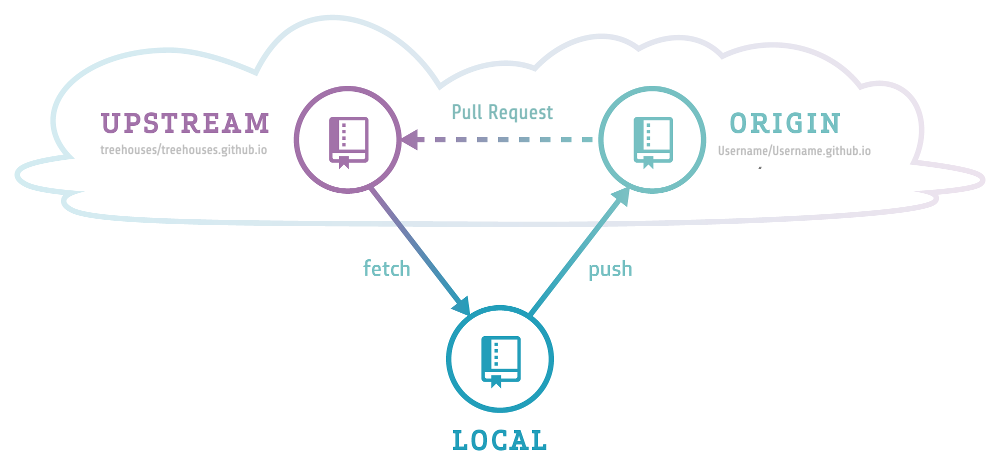

# Git Repositories

## Objectives

* Understanding Git repositories and levels
* Learning how to use Git from the command line
* Configuring and syncing your repository

## Introduction

On GitHub, our software code is organized in repositories, each of which represents different projects or components of projects we're working on. For example, you have been working on one of our repositories, called **treehouses.github.io**. We would strongly suggest you to look (**look, don't touch**) at our different repositories on [GitHub](https://github.com/treehouses/). These repositories act as a categorizing system for us to organize our code.

You previously forked a repository from treehouses to work on, which means that that a version of the treehouses repository was available on your own GitHub account. You were then able to modify your fork, then send an update to the upstream repository in the form of a pull request. 


## Start here

This is just a summary of the steps that you will need to perform. Keep on reading for a detailed explanation of each step.


* [Clone Your GitHub Repository username.github.io](#Clone_Your_GitHub_Repository_username.github.io)
* [Clone with HTTPS or Clone with SSH?](#Clone_with_HTTPS_or_SSH)
* [Explanation About Repositories and Syncing Process](#Repositories_and_the_Syncing_Process)
* [Configure a Remote Repository for Your Fork](#Configure_a_Remote_Repository_for_Your_Fork)
* [Sync Your Fork](#Sync_Your_Fork)

**NOTE**: You will see some common names used in git (*which you can change*), such as `master`: the name of the main branch, `upstream`: the location where you forked the repository from, and `origin`: the location you cloned repository from. Both `upstream and origin` are considered **remote**. Keep in mind also, a repository may contain many branches.


### Clone Your GitHub Repository username.github.io

Now, we will be using GitHub repositories on a command line, which means that there is a separate step to get your GitHub repository on your OS. To be clear, you will be using both the command line and the GitHub user interface, meaning that you **need to constantly check to make sure that your version is not behind to avoid merge conflicts**. Therefore, open your username.github.io repository on the GitHub user interface and copy the link provided by clicking the "Clone or download" button.

Then, turn to your command prompt and type `git clone <repository_url>` into the command line. For example `git clone https://github.com/EmilyLarkin/EmilyLarkin.github.io.git`. Be sure to use the correct URL to clone your repository (you will obviously type your own username).  If you `cd` into your `username.github.io` you can see different files which you will be working on during your internship.

### Clone with HTTPS or SSH

Both HTTPS(Hypertext Transfer Protocol Secure) and SSH(Secure Shell) URLs identify the same remote repositories but use different protocols to access the codebase. Both HTTPS and SSH to do the same thing, the differences between the two can be examined [here](https://help.github.com/articles/which-remote-url-should-i-use/).


### Repositories and the Syncing Process

The previous step created a clone of your repository on your Operating System.

There are now three different Github repository levels: 
1. [treehouses.github.io](https://github.com/treehouses/treehouses.github.io)
2. Your username.github.io on GitHub
3. Your username.github.io on your OS. 

These three levels need to be constantly synced and kept up to date with one another as we will all be contributing to the same upstream repository (treehouses.github.io). 

Maintaining projects across multiple Git repositories with multiple team members requires strict adherance to process to avoid conflict. 
1. Keep your changes small if possible, do not modify more than 100 lines of code at a time if possible
2. Keep your fork updated regularly, this will avoid you doing work on an old version of the repository, which could mean your work may not be accepted
  
There are various ways to sync the repository on your OS and the one on GitHub (username.github.io) with the upstream repository treehouses.github.io.


First, the [GitHub help section](https://help.github.com/en) and the [Git website](https://git-scm.com) are incredibly helpful in answering your basic questions. 
For example, [this link](https://help.github.com/articles/syncing-a-fork/) explains how to sync a fork with the correct upstream repo, because as you renamed your repository, it does not automatically assume that `treehouses.github.io` is the source. Instead, it assumes that `username.github.io` is the source. This means that when you do `git diff` and `git status`, it only looks at your username.github.io. You will therefore need to use `git fetch upstream`, `git checkout master`, and `git merge upstream/master` to correctly sync to treehouses.github.io as we will see below.


### Configure a Remote Repository for Your Fork

To be able to fetch updates from the upstream repository, you need to first configure the upstream repository by following these steps:

1. Open your command prompt/terminal and find the correct directory, `cd username.github.io.`

2. List the current configured remote repository for your fork with `git remote -v`. This is what it should look like:
```
$ git remote -v
origin  https://github.com/username/username.github.io.git (fetch)
origin  https://github.com/username/username.github.io.git (push)
```

3. Specify a new remote upstream repository that will be synced with the fork by using `git remote add upstream <repository>`. Our remote upstream repository will be https://github.com/treehouses/treehouses.github.io.git. Do not forget the `.git` at the end.
```
$ git remote add upstream https://github.com/treehouses/treehouses.github.io.git
```

4. Verify if upstream is configured correctly with `git remote -v`.
```
$ git remote -v
origin  https://github.com/username/username.github.io.git (fetch)
origin  https://github.com/username/username.github.io.git (push)
upstream  https://github.com/treehouses/treehouses.github.io (fetch)
upstream  https://github.com/treehouses/treehouses.github.io (push)
```

### Sync Your Fork

Then, use the command `git fetch upstream` to fetch branches from the upstream repository (in this case, it is treehouses.github.io). Next, check your fork's master branch with `git checkout master`. You should see some variation of this response:

```
EmilyLarkin.github.io $ git fetch upstream
remote: Counting objects: 1, done.
remote: Total 1 (delta 0), reused 1 (delta 0), pack-reused 0
Unpacking objects: 100% (1/1), done.
From https://github.com/treehouses/treehouses.github.io
   6940637..5934ec2  master     -> upstream/master
EmilyLarkin.github.io $ git checkout master
Already on 'master'
Your branch is up-to-date with 'origin/master'.
```
**NOTE**: If there are any errors after `git fetch upstream`, please check for typos from previous step. If so, use `git remote rm upstream` and add the repo in upstream again

Then, use `git merge upstream/master` to merge the open-learning-exchange upstream/master with your local repository. It should look something like this:

```
EmilyLarkin.github.io $ git merge upstream/master
Updating 1388180..5934ec2
Fast-forward
```

If you get something like this,

```
Please enter a commit message to explain
why this merge is necessary, especially
if it merges an updated upstream into a
topic branch. Lines starting with '#'
will be ignored, and an empty message
aborts the commit.
~
~
```
it means that you are in the Vim text editor. Simply type ```:wq``` which stands for **w**rite and **q**uit. However, if you want to insert something you can type "i" and Vim goes into edit mode. To exit edit mode just hit "escape".

Now, your repository has been synced to the upstream/master. However, a discrepancy may still exist between your local (and now your origin/master) versus your username.github.io on GitHub. You will now use `git diff` and `git status` to check how your local repository compares to your username.github.io repository. Depending on whether you have more or less commits than your username.github.io, you will either use `git pull` to receive any changes or `git push` to push updates to your repository. Most likely, as you just synced with the master, you will use `git push` to push updates to your username.github.io repo.
``` bash
$ git push origin master
```
If you have uncommitted changes (from mixing interface and terminal use of GitHub repositories), then these commands will be aborted until you fix the discrepancy.

Remember, you should repeatedly use the commands `git diff` and `git status` to respectively see the difference between your username.github.io and your local repository and then see the status of your repository and the changes you have made. Once again, you need to sync your repository with the correct master first, otherwise you will not see the correct `git diff` and `git status`. `git diff` and `git status` only look between your local and username.github.io repos, not your upstream repo.

Below is an example of **git diff** command showing difference in the file of local and remote repository.

``` bash
$ git diff
diff --git a/<file name>.md b/<file name>.md
index bf400c0..fc7380b 100644
--- a/<file name>.md
+++ b/<file name>.md
@@ -1,5 +1 @@
 What is this?
```
**What does `diff --git a/<file name>.md b/<file name>.md` mean?**

**Answer:** Our diff compares two items with each other: item A and item B. In most cases, A and B will be the same file, but in different versions. To make clear what is actually compared, a diff output always starts by declaring which files are represented by "A" and "B".

**What does `--- a/<file name>.md` and `+++ b/<file name>.md` mean?**

**Answer:** Further down in the output, the actual changes will be marked as coming from A or B. In order to tell them apart, A and B are each assigned a symbol: for version A, this is a minus ("-") sign and for version B, a plus ("+") sign is used.

This process needs to be repeated whenever you begin to work, to make sure that you are always up to date. If there are discrepancies, it will mess up the code and you could potentially lose your saved changes, because it was not updated properly. We will provide more information on editing and saving changes in the next tutorial.

## Summary of Steps
Generally, this is what the structure of your workflow will look like: 



Use the following commands in your command line, but refer back to the descriptions above if there are any errors or further questions about why you are using them:

#### Clone your GitHub repository username.github.io
1. Open your command prompt/terminal and find the correct directory
2. Copy the HTTPS or SSH link from your repository on the GitHub site
3. On the command line, type `git clone *paste your HTTPS or SSH link here*`

#### Understand that there are three levels of a Github repository:
- the upstream ([treehouses.github.io](https://github.com/treehouses/treehouses.github.io))
- Your username.github.io on GitHub
- Your username.github.io on your OS.

These need to be synced and checked constantly.
The **upstream repository** is the one we are contributing to.

#### Configure the upstream repository to your fork
1. `cd username.github.io.`
2. `git remote -v` see above to make sure you are pushing and fetching to your own repository on GitHub as the origin
3. `git remote add upstream https://github.com/treehouses/treehouses.github.io.git`
4. `git remote -v` origins should remain the same, but you should also be fetching and pushing to OLE as the upstream now

#### Sync Your Fork
1. `git fetch upstream` -  to fetch branches from the upstream repository ([more info](https://git-scm.com/docs/git-fetch))
2. `git checkout master` - to checkout the `master` branch ([more info](https://git-scm.com/docs/git-checkout))
3. `git show-branch` - to see branches and the changes made in them ([more info](https://git-scm.com/docs/git-show-branch))
4. `git merge upstream/master` - You repository should now be synced to upstream/master ([more info](https://git-scm.com/docs/git-merge))

#### Make sure your repository is up to date
1. `git diff` - for comparing different versions of the same file ([more info](https://git-scm.com/docs/git-diff))
2. `git status` - to view the changes made in the branch, whether the branch is up-to-date with master ([more info](https://git-scm.com/docs/git-status))
3. `git pull` - to sync the local repository with the remote repository ([more info](https://git-scm.com/docs/git-pull))
4. `git push` - to push the updates that you made to the local repositories to the GitHub repositories ([more info](https://git-scm.com/docs/git-push))

**NOTE**: Developers should always sync their fork and make sure their repositories are up to date with GitHub every time they begin to work. This way we as a team can minimize data loss, and can save you some time.

#### If you find yourself needing to rebase your forked repository, the following two links should help:
- [Rebase](https://git-scm.com/docs/git-rebase)
- [Branching Rebasing](https://git-scm.com/book/en/v2/Git-Branching-Rebasing)

**NOTE**: While rebasing and merging are similar, there is a difference between them. Merging takes all changes in one branch and merges onto another branch in one commit. Rebasing moves the branch's starting point to another place. For example, if you rebased your branch to the master branch, then your branch now incorporates all the changes made in the master, and every time master is changed, your branch is changed as well. In contrast, merging is a one-time change.

For more info on differences of merging vs. rebasing (and when to use which one), [check this out](https://www.atlassian.com/git/tutorials/merging-vs-rebasing)

If you would like to understand how syncing with the fork works, here is a useful [video](https://www.youtube.com/watch?v=-zvHQXnBO6c)

[](https://www.youtube.com/watch?v=-zvHQXnBO6c)


## Useful links

[Configure a remote for fork](https://help.github.com/articles/configuring-a-remote-for-a-fork/) - You can sync changes made in the original repository with a fork.
[Sync fork](https://help.github.com/articles/syncing-a-fork/) - Sync a fork of a repository to keep it up-to-date with the upstream repository.
[GitHub tutorial](http://product.hubspot.com/blog/git-and-github-tutorial-for-beginners) - An Introduction to Git and Github for beginners from Hubspot.
[GitHub's Git Tutorial](https://try.github.io/) - An interactive tutorial to learn GitHub in the browser.
[Git-it Workshop](http://jlord.us/git-it/) - Runs in your terminal to work and provides a hands-on approach to learn Git and GitHub repositories.
[Git help](https://git-scm.com/) - An encyclopedia of useful git workflows and terminology explanations.
[Git GUIs](https://git-scm.com/downloads/guis) - A list of Git Graphical User Interfaces and what platforms they work for.
[Other helpful links and videos](faq.md#Helpful_Links)


---
#### Return to [First Steps](firststeps.md#Step_5_-_Keeping_Fork_Updated)
