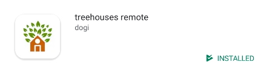

# Virtual Intern Orientation

## Welcome to the Treehouses Intern Team!

Congratulations! You have completed the first steps and have been selected to join the Open Learning Exchange's Systems Engineering team. 
Please remember that we expect interns to contribute at least 16 hours a week for a minimum duration of 3 months, in which time you will be working on the Treehouses repositories to solve issues and devellop tools for the Open Learning Exchange. 

If you do not think that this is a commitment that you can currently honour, we would be happy to have you later when circumstances will allow you to fully participate.

## Get to Know the Team

The first thing is to meet the team, starting with CTO [dogi](https://github.com/dogi), then the [current intern team  members](team.md). After having the initial meeting with dogi, you can join <http://talk.ole.org> during Google Hangouts session to meet with current interns, get to know each other, and ask them what they have been working on.

## Familiarize Yourself with Current Projects and Issues

Typically, interns choose what project they want to work on based on their experience. If you get tired of a certain project, there is an opportunity to switch. Take a look at our current projects below, if any particular ones interest you, there is a very good chance that you can work on them.

### Active System Teams Projects

#### [Remote](https://github.com/treehouses/remote/)
 * The Remote repository contain the android application developed by the systems team that **allows Android devices to connect to the Raspberry Pi** via Bluetooth.
   * The application can be found via the Google App Store by searching “treehouses remote”
   
   
  
  
  
#### [Treehouses](https://github.com/treehouses/treehouses.github.io/)
* Treehouses is the name of our markdown wiki which you have been using throughout the 10 steps.

#### [builder](https://github.com/treehouses/builder)
 * Builder is the ongoing repository that contains script  latest Raspbian image by installing packages, purging packages and executing custom commands, and then finally creates a bootable .img file that can be burned to the microSD card.
 
#### [Cli](https://github.com/treehouses/cli)
* Cli is  Command-Line Interface for the treehouses system image, it allows different commands to be entered in the Raspberry Pi terminal

#### [control](https://github.com/treehouses/control)
* Bluetooth service for treehouses image which interacts with treehouses/remote android app

#### [RPi-CouchDB](https://github.com/treehouses/rpi-couchdb)
* CouchDB is a document database meaning that it. This means a NOSQL database that uses JSON for documents, an HTTP API, & JavaScript/declarative indexing. 
 * The OLE Systems team aims to use CouchDB to ensure that the programs we develop operate reliably on different computing environments.


#### [Docker](https://hub.docker.com/r/treehouses/) <!--replace link to rbts-docker.md once PR #1384 is finished-->
* Docker is a powerful and widely-used software option for creating, deploying, and running applications in containers. 
  * Used by OLE for educational applications such as `planet`
  
  
 #### Active Planet Teams Projects 
 The Planet team is a second group of Virtual Interns that work on develloping the edicational applications for that are hoasted on the Raspberry Pi's
 
* [`planet`](rbts-angular.md)
  * A Progressive Web App using Angular & CouchDB with the BeLL Apps functionality.
  
* [Takeout](rbts-takeout.md)
  * Takeout is an Android port of the `planet` apps.


## A Few Things to Know...

Once you officially become a virtual intern, you will receive email invites to become GitHub organization members of [open-learning-exchange](https://github.com/open-learning-exchange), [ole-vi](https://github.com/ole-vi), and [treehouses](https://github.com/treehouses).

**Now you should work on OLE's repositories instead of your own forked repositories, the workflow will be [Feature Branch Workflow](https://www.atlassian.com/git/tutorials/comparing-workflows/feature-branch-workflow)**. Note that this will give you the ability to make bigger mistakes - so make sure you always double check what branch you are working on. Remember to commit often and create pull request early, so other virtual interns could look at your code and make sure you are on the right track at an early stage.

You will now have the ability to review, close, and merge pull requests and issues.

Once you have accepted your invitation, mark yourself as a public member in the [list of OLE contributors.](https://github.com/orgs/open-learning-exchange/people)

### Reviewing Pull Requests and Issues

One of your responsibilities as an intern is to review and help prospective interns with their issues / pull request on open learning exchange. You can start a review by going to the files changed tab on a pull request. You can read more about [Review on GitHub](https://help.github.com/articles/about-pull-request-reviews/). 

Since we are a very diverse community with people coming from different background and culture, it might be hard to find the right language to use in reviewing other's code. Please make sure to read [**a guide for reviewing code and having your code reviewed**](https://github.com/thoughtbot/guides/tree/master/code-review#code-review) for some useful tips.

You should check if the following conditions are met:

* [x] issue number is included in pull request title and description
* [x] there are no unnecessary files/lines change in pull request
* [x] there's a branch for the patch
* [x] the pull request actually fixes the issue
* [x] changes are rendered correctly on rawgit preview
* [x] no merge conflicts
* [x] commits are associated with GitHub account

Every time you comment on an issue or review a pull request, message those involved on the [Gitter chat](https://gitter.im/open-learning-exchange/chat) with a link to the issue / pull request. Also, if you find any issue that must be addressed with a pull request, do not forget to use the `Request changes` option when creating your review.

### Merging a Pull Request

The pull request can be merged if at least two other people have approved the pull request and there are no more changes requested by another intern. One exception is when virtual interns are adding themselves to the team, we want the new intern to merge their pull request during their interview.

When you are ready to merge the pull request:

* Select "Squash Merge"
* **Remove all of the commit messages in the extended description, and make sure the commit title is clear and short.** 
* Include “(fixes #IssueNumber)” in the title so it will automatically close the issue.
  * If you forget to add a keyword, go to the issue and manually close it and link to the original pull request.
  * An example of good commit title is: "update vi-configuration.md (fix #1530) (#1557)", where "1530" is the issue number and "1557" is pull request number.
  * Read more about [closing Issues using keywords](https://help.github.com/articles/closing-issues-using-keywords/).

Every time you merge a pull request, message the author on [Gitter chat](https://gitter.im/open-learning-exchange/chat), make sure you include a link to the pull request and commit id.

### Standup Message

Every time you work on OLE projects and issues, you should post the "[stand-up](https://en.wikipedia.org/wiki/Stand-up_meeting)" message in [our Gitter standup room](https://gitter.im/open-learning-exchange/standup) before you start working. Use the following format:

```
What did I achieve yesterday?
- Mention what you were able to achieve

What is my aim for today?
- List what you are working on - consider linking to the issues

What obstacles are in the way of our progress?
- List any problems
```

This is especially helpful if you are not able to attend our Google Hangouts sessions.

## Form a Working Routine and Schedule

### Recommended Daily Routine

While you are free to work in your own style, we recommend you follow this basic daily routine:

* Check Gitter interns room and your Gitter private messages.
* Join the [OLE Google Hangouts session](http://talk.ole.org) if you are able to, so you can follow what everyone is working on and get help fast.
* Write a message in [Gitter standup room](https://gitter.im/open-learning-exchange/standup) with the format mentioned above.
* Review any issues or pull requests that have been added or changed on [open-learning-exchange.github.io](https://github.com/open-learning-exchange/open-learning-exchange.github.io) since last time you reviewed.
* Work on your issues and write in intern chat any time you run into problems.
* Make pull requests as early as possible so you can get feedback as you work.
* Try to close issues using some of the following keywords and variations of them in the headings: `close`, `fix` and `resolve`. [Closing Issues using keywords](https://help.github.com/articles/closing-issues-using-keywords/)

### Weekly Schedule

All of our Google Hangouts sessions can be joined at <http://talk.ole.org>. Currently, we have a few scheduled sessions each week:

* Happy Hacking Hangout
* angular asia (h)acking (h)angout
* Systems Hacking Hangout
* Mobile Hacking Backup Hangout
* Raspberry Pi Hangout
* Angular Hacking Hangout
* Secret Hacking Hangout


Every Monday at the "[Happy hacking hangout](http://talk.ole.org)" session, we work on problems together and catch up on what people have been doing all week. It is also advisable to schedule a day out of the week to meet with a team leader, especially if you can’t make it to the meeting. Use the calendar to set up meetings and other events with interns.

Please subscribe to our calendar:

* In [Google Calendar](https://calendar.google.com/), paste `ole.org_u2koassrool56icb7fqko9abac@group.calendar.google.com` into "*Add a friend's calendar*" and **hit `Enter` (do not click the + sign)**.
* Use [this iCalendar file](https://calendar.google.com/calendar/ical/ole.org_u2koassrool56icb7fqko9abac%40group.calendar.google.com/public/basic.ics) to access our calendar from other applications.


## Communicate, Communicate, Communicate!

It’s not good to go silent on Gitter or any other forms of communication. If you are ever unsure of what to work on, or cannot work for any other reason, please talk to us in the Gitter chat. It's better that we know why you aren’t able to do anything than to imagine reasons ourselves. Also make sure you are `away` in the [OLE google hangout](http://talk.ole.org/). Remember, the more you put into this internship the more you will get out of it. It may take a while to get used to the fact that you will need a good amount of self-discipline and initiative to get anything done in a remote internship, but we are here to help, so take advantage of it!

Also, if you find any issue that must be addressed with a pull request, do not forget to use the `Request changes` option when creating your review.
