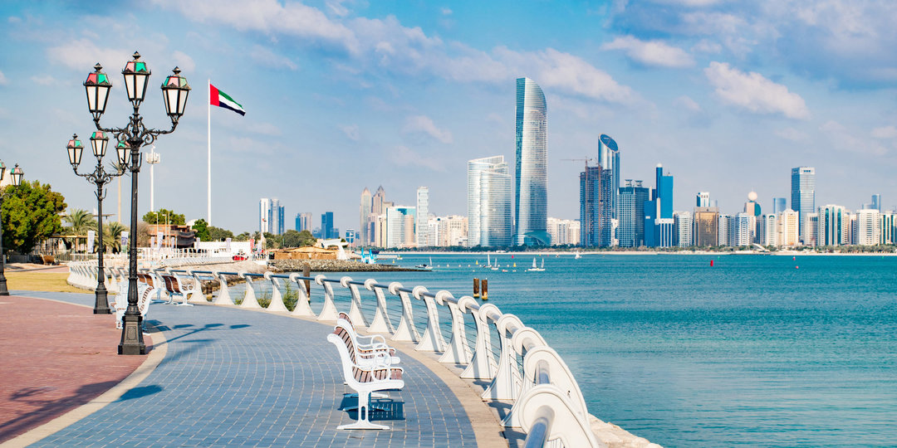

# Neethu Mohan
  * * *
## About me
I am originally from India and currently living in Abudhabi, UAE. I have a master degree in Wireless Networks and Applications and a bachelor degree in Electrical and Electronics Engineering. I was working as a server Engineer. I am certified in both RHCSA and RHCE. I am good in Python and bash scripting. I am also familiar with C and C++.

**Location** :  Abudhabi, UAE

**Timezone** : (GMT+4)

## Operating Systems

OS | Version
---| --------
Ubuntu | 18.10
Windows | 10
RHEL |7

## Contacts

[Linkedin](https://www.linkedin.com/in/neethumohan/)

