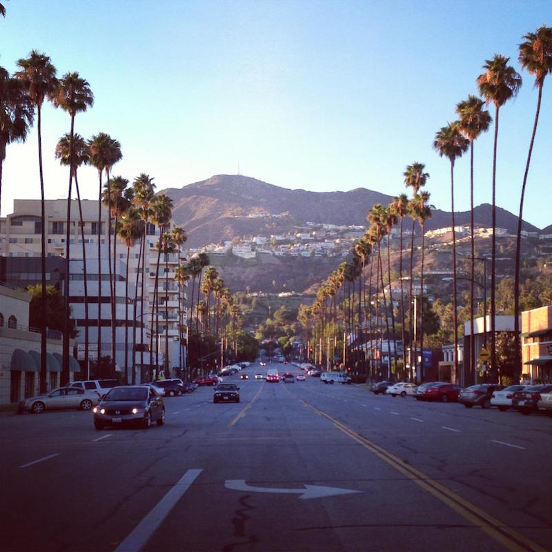

# Hello Everyone
> My Name is Tarik Rajper, and I am a fourth year Computer Science student graduating in May 2020. I am in Los Angeles, California,
> Timezone is PST(Pacific Standard Time) and use both a Windows 10 OS along with a Linux OS on a virtual machine. I will be graduating
> with a Bachelors Degree, and I currently do research in Image Retrieval with focus on Machine Learning and parallel processing.
> I currently attend Cal Poly Pomona.

1. Here is a Link to My [Github](https://github.com/trajper)
2. Here is a Link to My [LinkedIn](https://www.linkedin.com/in/tarik-rajper-0ab611161/)

## Hobbies
* Going to the Gym
* Writing Mobile Apps
* Working with Cars
* Playing Video Games

### Hometown: Glendale, CA

