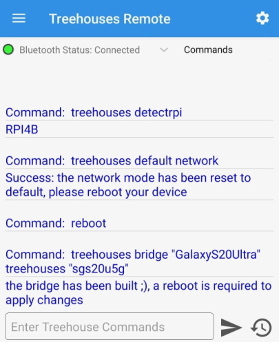

# Using the Treehouses Remote App

## Objectives

- Download Treehouses Remote
- Connect to the Treehouses custom OS on Raspberry Pi via Bluetooth

## Installation

On your Android device, find and download the [treehouses remote](https://play.google.com/store/apps/details?id=io.treehouses.remote) app from the Google Play Store.

## Connecting to the Raspberry Pi via Bluetooth and Interact with it in Terminal

1. Open the Bluetooth settings on your Android device.
2. Scan and pair with the Raspberry Pi (look for `treehouses-xxxx`). If you run into issues, check out [FAQ TQ3](http://localhost:8000/#!pages/vi/faq.md#TQ3:_What_should_I_do_if_I_encounter_issues_pairing_with_my_Raspberry_Pi_via_Bluetooth?).
3. Open the **treehouses remote** app.
   - The app may request access to your device's location. You can decline this permission, but consider granting it to have your approximate location appear in the Community Map feature of the app.
4. Tap **"Connect to RPI"** and select your Raspberry Pi (look for `treehouses-<4-digit-number>`, e.g., `treehouses-8930`).
5. **🎉 Congrats, you have just connected your Raspberry Pi!** tap the menu button on the top left to view the features for interacting with your Raspberry Pi.
   - Go to **Terminal**: This section of the app allows you to use the command line interface (CLI) to interact with the Raspberry Pi.
6. In the Terminal window, type `treehouses detectrpi` and tap **Send**.
   - Alternatively, select **Commands** at the top to use the pre-defined commands.
7. Type `treehouses default network` to return the network back to the original configuration, then reboot the system with the command `reboot`. Return to the home screen and reconnect to your Pi after about a minute.
8. Back in the terminal, type `treehouses bridge <your-home-wifi-ssid> treehouses [your-home-wifi-pwd]` to create an open hotspot named `treehouses`, bridged from your home Wi-Fi network.
   - If your home Wi-Fi network has no password, leave `[your-home-wifi-pwd]` empty or use `""`.
   - To set a password for the hotspot, append your desired password to the end of the original command.
   - To further understand the parameters for `treehouses bridge`, type `treehouses help bridge`.

    

9. Reboot the system again.
10. Lastly, navigate to Settings by clicking the top right icon and scroll down to enable the **Share Data** option as shown below:

  

**Tip:** The Raspberry Pi typically finishes rebooting in less than a minute, though the time may vary depending on factors such as the read/write speed of the microSD card and the specific Treehouses image being loaded.

**Tip:** You can observe the Raspberry Pi reboot by watching the steady red LED (labeled "PWR" on the circuit board). During a reboot, the red light briefly turns off and then comes back on. Immediately after booting, the green LED (labeled "ACT") will flash rapidly as the microSD card reads the initialization steps. Once the image has fully loaded, the green LED will blink at a slower, steady rate.

**Tip:** You will need to unpair and re-pair the Raspberry Pi in your phone's Bluetooth settings each time you insert a newly flashed image onto the device.

**Tip:** If you are experiencing frequent Bluetooth disconnects, restart your Android device and try again.

---

#### Next Section: [Finding your Pi](find-pi.md)
