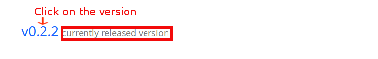

# FAQ

## General Internship Questions

- **Q1:** [What will I be working on during this internship?](#Q1:_What_will_I_be_working_on_during_this_internship?)
- **Q2:** [What kind of software will we be using for this internship?](#Q2:_What_kind_of_software_will_we_be_using_for_this_internship?)
- **Q3:** [Where can I find more information about this internship?](#Q3:_Where_can_I_find_more_information_about_this_internship?)
- **Q4:** [What are the hours of the internship?](#Q4:_What_are_the_hours_of_the_internship?)
- **Q5:** [Is this a paid internship?](#Q5:_Is_this_a_paid_internship?)
- **Q6:** [What happens after the initial steps?](#Q6:_What_happens_after_the_initial_steps?)
- **Q7:** [If I'm an international student, how soon can I get my paperwork required by my visa?](#Q7:_If_I'm_an_international_student,_how_soon_can_I_get_my_paperwork_required_by_my_visa?)
- **Q8:** [How many pull requests and issues in total do I need to make to finish the steps?](#Q8:_How_many_pull_requests_and_issues_in_total_do_I_need_to_make_to_finish_the_steps?)
- **Q9:** [How long do I have to complete these steps?](#Q9:_How_long_do_I_have_to_complete_these_steps?)

## Technical Questions

- **Q10:** [What is the purpose of Nations and Communities, and how do they work together?](#Q10:_What_is_the_purpose_of_Nations_and_Communities,_and_how_do_they_work_together?)
- **Q11:** [How can I enable virtualization on my computer in order to turn Vagrant on?](#Q11:_How_can_I_enable_virtualization_on_my_computer_in_order_to_turn_Vagrant_on?)
- **Q12:** [Why is the "Submit" button not showing up when I try to submit my survey?](#Q12:_Why_is_the_"Submit"_button_not_showing_up_when_I_try_to_submit_my_survey?)
- **Q13:** [Why does Firefox say “Unable to connect” when I try to load my Community?](#Q13:_Why_does_Firefox_say_“Unable_to_connect”_when_I_try_to_load_my_Community?)
- **Q14:** [When I first run BeLL with the "vagrant up" command, why does the download fail?](#Q14:_When_I_first_run_BeLL_with_the_"vagrant_up"_command,_why_does_the_download_fail?)
- **Q15:** [I named my repo incorrectly by not naming it &lt;username&gt;.github.io, can I rename it or do I need to delete it?](#Q15:_I_named_my_repo_incorrectly_by_not_naming_it_&lt;username&gt;.github.io,_can_I_rename_it_or_do_I_need_to_delete_it?)
- **Q16:** [What do I do if I already have a github.io with my username?](#Q16:_What_do_I_do_if_I_already_have_a_github.io_with_my_username?)
- **Q17:** [What do I do if I am on Unix/Mac/Linux and accidentally give root permissions, corrupting the installation of the Vagrant VM?](#Q17:_What_do_I_do_if_I_am_on_Unix/Mac/Linux_and_accidentally_give_root_permissions,_corrupting_the_installation_of_the_Vagrant_VM?)
- **Q18:** [What if I accidentally resign my manager account, or delete my ole--vagrant-vi folder, how do I recreate my manager profile?](#Q18:_What_if_I_accidentally_resign_my_manager_account,_or_delete_my_ole--vagrant-vi_folder,_how_do_I_recreate_my_manager_profile?)
- **Q19:** [What do I do if I get the error message "A Virtual Box machine with the name 'vi' already exists"?](#Q19:_What_do_I_do_if_I_get_error_message_"A_Virtual_Box_machine_with_the_name_'vi'_already_exists"?)
- **Q20:** [How can I run two communities on the same machine?](#Q20:_How_can_I_run_two_communities_on_the_same_machine?)
- **Q21:** [How do I destroy the Virtual Machine and start over?](#Q21:_How_do_I_destroy_the_Virtual_Machine_and_start_over?)
- **Q22:** [What do I do if I cannot create a dummy account?](#Q22:_What_do_I_do_if_I_cannot_create_a_dummy_account?)

### General Internship Questions

#### Q1: What will I be working on during this internship?

+ OLE virtual interns will be helping develop OLE’s Planet Learning system (Planet) and its related software, systems, and services. Planet is a virtual library that is deployed internationally to children in countries that typically do not have access to educational resources.

#### Q2: What kind of software will we be using for this internship?

+ As a part of this internship, you will be working with software and languages including Git, GitHub, Gitter, Markdown, Vagrant, VirtualBox, Command Line/Terminal, Command Line/Terminal Scripts, Vim, CouchDB, Docker, HTML5, JavaScript, Node.js, and Angular.

#### Q3: Where can I find more information about this internship?

+ More information about the internship can be found at the Virtual Software Engineer Intern listing [here](https://www.indeed.com/cmp/Open-Learning-Exchange,-Inc./jobs).

#### Q4: What are the hours of the internship?

+ This is an intensive internship that requires 16 hours of work each week. Work with your fellow interns and keep us updated in the [Gitter chat](https://gitter.im/open-learning-exchange/chat).
+ The reason we have a 16 hour minimal commitment per week is that things are moving forward quickly and it might be hard for virtual interns to catch up with changes. Basically, we would have a few hours of Google Hangout sessions per week where everyone shares their screen, discusses problems, and works on issues together. Then the rest of the time is for catching up with the changes and working on issues assigned.

#### Q5: Is this a paid internship?

+ This position is unpaid, but it will provide a diverse range of experiences in the workplace. We can provide a certificate of completion, upon request. Also, academic credit can be provided through your institution (if applicable).

#### Q6: What happens after the initial steps?

+ The initial steps are meant to introduce potential interns to the OLE BeLL/Planet, planet software and the process that we use to develop features and improve upon the BeLL/Planet. To be more clear: the initial 10 steps are a vetting process to determine whether or not people are fit for the internship, so consider it an interview for the internship. Once you have completed the 10 steps and are approved, you have officially joined the OLE interns team! We’ll add you to the interns Gitter chatroom and assign you to a team. You and your team will be working on an assignment, and we’ll switch up the assignments each week.

#### Q7: If I'm an international student, how soon can I get my paperwork required by my visa?

+ Since the first 10 steps are a vetting process, your internship technically doesn't start until you finish them. Think of the first 10 steps as a continued application process; you are not working on or adding to our organizational software, but rather showing that you have enough technical background to work with us. After you finish the first 10 steps, let us know if you need us to sign some paperwork, give you organizational information, or provide you with an offer letter for your visa compliance and we'd be more than happy to help.

#### Q8: How many pull requests and issues in total do I need to make to finish the steps?

+ To finish the initial steps, you need to make a **minimum** of 4 issues and 5 pull requests so you can get familiar with GitHub and to show us that you can write proper issues/PRs.

#### Q9: How long do I have to complete these steps?

+ There is no official deadline, so work on your own time. However, please note that most people who continued into the internship program completed the steps within 7-8 days.


### Technical Questions

#### Q10: What is the purpose of Nations and Communities, and how do they work together?

+ We use the nation/community infrastructure because we often deploy our software in places without internet. Nations are the services sitting in the cloud (which are connected to the internet). Communities, which run locally on Raspberry Pis and/or laptops, are run on an *intranet* but are most of the time not connected to the *internet*. Because nations are connected to the internet, they allow a connection process between us (with internet) and users on communities (without internet). To sync with a nation, however, a community needs to be connected to the internet so that information can be sent in both directions.

#### Q11: How can I enable virtualization on my computer in order to turn Vagrant on?

+ First of all, you have to access the BIOS. To do that, you need to reboot your computer and press the appropriate key while it’s booting. It is usually the "F2", "Esc" or "Delete" key. Once you have entered the BIOS setup menu, you have to search for an option called "Intel VT-x", "Intel Virtualization Technology" or something similar. Enable this option, save and reset. Now the "vagrant up" command should work.

#### Q12: Why is the "Submit" button not showing up when I try to submit my survey?

+ Please make sure you’re using Firefox, as our BeLL software is only guaranteed to work in Firefox. To get the “Submit” button to show up, try logging out of the BeLL and logging back in, then go back to the survey. If that doesn’t work, log out of the BeLL, shut down the vagrant machine (`vagrant halt` in the directory where the Vagrantfile is located), `vagrant up` again, log in, and check the survey again. If you’ve tried these steps and it still doesn’t work, let us know in the [Gitter chat](http://gitter.im/open-learning-exchange/chat).

#### Q13: Why does Firefox say “Unable to connect” when I try to load my Community?

+ Because a Community is run locally on your machine, you need to `vagrant up` in the directory where the Vagrantfile is located. You can then see if your Community is running by going to `127.0.0.1:5985` in Firefox. Go to `127.0.0.1:5985/_utils` to see the CouchDB behind the BeLL, and `127.0.0.1:5985/apps/_design/bell/MyApp/index.html` to navigate the actual BeLL user interface.

#### Q14: When I first run BeLL with the "vagrant up" command, why does the download fail?

+ You should first check if Vagrant Cloud is up and running by looking at [HashiCorp's status page](https://status.hashicorp.com):

  

  If Vagrant Cloud is operational, then maybe your download is being interrupted, you can try to download and set up the big Vagrant box file manually:

  1. Go to this [Vagrant Cloud Box page](https://app.vagrantup.com/ole/boxes/jessie64).

  2. Click on the last version's (the uppermost) version number.

    

  3. Add `/providers/virtualbox.box` to the page link you have been redirected to and click 'Enter' to start the download via your browser, or copy the link and paste it in your preferred downloader, preferably one that has pause/resume functionality.

  4. After you download the box, run the following commands while in your `ole--vagrant-vi` directory. Also, include the correct path to the box you just downloaded:

        ``` bash
        vagrant box add ole/jessie64 /path/to/vagrant-box.box
        vagrant init ole/jessie64
        vagrant up
        ```
  You now have a working community BeLL on your OS.

#### Q15: I named my repo incorrectly by not naming it &lt;username&gt;.github.io, can I rename it or do I need to delete it?

+ Yes it is possible to rename it but we highly recommend you to delete and start over so that you have a clean forked repository. Navigate to the misnamed repo and click the settings tab or enter `https://github.com/YOUR-USERNAME/YOUR-MISNAMED-REPOSITORY/settings` in your browsers URL bar. Next, scroll down to the Danger Zone section of the settings and click '*Delete this repository*'. Read the warnings and then type in the name of the repo to confirm.

#### Q16: What do I do if I already have a github.io with my username?

+ You have a few options:
  1. If you are still using it and you don't want to overwrite it, you can go to the forked repository settings rename the repository to YourUsername-ole.github.io and then deploy it to GitHub Pages by selecting "master branch" in the repository settings under GitHub Pages. By doing that, you can access the forked OLE repository with this link `YourUsername.github.io/YourUsername-ole.github.io/`.
  
  2. If you are not using the repo anymore you can delete it and then follow the [First Steps](vi-first-steps.md).

  3. If you are still using it and you don't want to remember another login, you can [create an organization]( https://help.github.com/articles/creating-a-new-organization-from-scratch/) and name the forked repo &lt;orgname&gt;.github.io.

#### Q17: What do I do if I am on Unix/Mac/Linux and accidentally give root permissions, corrupting the installation of the Vagrant VM?

+ Please follow the guide at [Q21](#Q21:_How_do_I_destroy_the_Virtual_Machine_and_start_over?) to destroy the original virtual machine and start over.

#### Q18: What if I accidentally resign my manager account, or delete my ole--vagrant-vi folder, how do I recreate my manager profile?

+ Please follow the guide at [Q21](#Q21:_How_do_I_destroy_the_Virtual_Machine_and_start_over?) to destroy the original virtual machine and start over.

#### Q19: What do I do if I get the error message "A Virtual Box machine with the name 'vi' already exists"?

+ There are 2 potential solutions:

  1. Use `VBoxManage list vms` to find out the name and ID of the virtual machines. Copy the ID of the desired VM into the contents of `ole--vagrant-vi/.vagrant/machines/default/virtualbox/id`. Save the change and run `vagrant up` again. For more information, check out [Vagrant Issues #6623](https://github.com/hashicorp/vagrant/issues/6623).

  2. Delete the "vi" VM in VirtualBox or command line, then run `vagrant up` to start over again.

#### Q20: How can I run two communities on the same machine?

+ Running two communities on the same machine is possible as long as their configurations (VirtualBox name, port forwarding, etc.) does not collide with each other.

  1. If you want to run multiple VMs together, you need to change the vagrant file as instructed in [multi-machine](https://www.vagrantup.com/docs/multi-machine/).

  2. If you will not run those two communities at the same time:
    - clone `ole--vagrant-vi` again and name the folder `ole--vagrant-vi-1`:

      ```
      git clone https://github.com/dogi/ole--vagrant-vi.git ole--vagrant-vi-1
      cd ole--vagrant-vi-1
      ```

     - change line 24 of the `vagrant` file

      ```
      vb.name = "a_different_name"
      ```

#### Q21: How do I destroy the Virtual Machine and start over?

+ In `git bash`:

  ```
  # remove existing VM and Vagrantfile
  vagrant global-status
  vagrant destroy [virtual_machine_name]
  rm -rf ole--vagrant-vi

  # clone again to start over
  git clone https://github.com/dogi/ole--vagrant-vi.git
  cd ole--vagrant-vi
  vagrant up
  ```

#### Q22: What do I do if I cannot create a dummy account?

+ Note: Before trying the steps below, make sure your planet is up to date.
  
  ```
  cd planet
  git pull
  ```
  Then, 
  ```
  vagrant halt prod 
  vagrant up prod.
  ```

  If it still does not work please follow the steps below. Assuming you are already in the planet directory,
   ```
  vagrant ssh prod
  cd /vagrant
  sudo rm -rf node_modules/*
  sudo npm install --unsafe-perm
  ```
 
  If this too does not work. 
  ```
  cd planet 
  vagrant destroy prod
  ```
  Please follow the instructions [here](http://open-learning-exchange.github.io/#!pages/vi/vi-planet-installation-vagrant.md) to reinstall planet. (**Note**: After planet reinstallation, you will need to register as admin a second time as you did in step [Planet Configurations](http://open-learning-exchange.github.io/#!./pages/vi/vi-configurations-vagrant.md). However, you cannot use the same "Name" in Set up Configuration step because that "Name" already exists. You may instead use YourName01 or add any other number you like at the end of your original "Name". This should allow you to register as the admin and log in your community planet. Also, the 3 resources you uploaded to Library, the Virtual Intern course you added to myCourses, and all your progress in the Virtual Intern course will be gone.)


## 'First Steps' Software Summary

>_The aim of the ‘First Steps’ is to introduce prospective interns to the software that they will be using, and make sure they are familiar with each. While each step goes into detail on the specific program(s) at hand, it can be easy at times to lose sight of the bigger picture. To that end, below is a brief synopsis of the primary tools you will be using/learning about in the first steps, and how they work together to empower our collaborative development environment._

We start off by learning about BeLL, or the 'Basic e-Learning Library.' BeLL is the learning tool that OLE uses to provide the educational materials and resources to its students. It is a lightweight digital Library that can be accessed through Local networks (’Communities’)  and synced through the Internet (‘Nations’). To do so, we need to install a few software packages, Vagrant and VirtualBox primary among them. We use Vagrant (a development environment builder), in conjunction with VirtualBox (virtual machine software) to initialize a BeLL environment on the local system. Using this virtual environment we access the BeLL interface locally and create our own communities/nations.

The other two tools we focus on are GitHub and Markdown. Similar to how we use Vagrant and VirtualBox to standardize the development environment for each developer, we use Git/GitHub in order to centralize the development process and enable greater collaboration and teamwork. Git is a revision control system that allows many users to simultaneously edit and develop the same projects, and GitHub is a website/hosting service that utilizes the git system and hosts the git repositories we work on. Markdown, on the other hand, is a style of formatting text native to GitHub and thus used in the Virtual Intern program. Markdown simplifies formatting and emphasizes readability, helping coders focus on content, and not get bogged down in syntax.

To sum up, the primary software/tools we cover in the 'First Steps' are BeLL, Vagrant, VirtualBox, Git/GitHub and Markdown. Though not immediately apparent, the tools we use are all unified by a common purpose. Each bit of software we use is chosen in an effort to promote collaboration. The use of Vagrant and VirtualBox mandates that each instance of BeLL is the same, making sure that all developers utilize the same system. Markdown simplifies the development process, as each piece of code must comply with its syntax, increasing clarity for all users. Finally, GitHub serves as the last piece in the puzzle, as it takes advantage of the standardized development environment that Vagrant/VirtualBox provides, as well as the streamlined syntax of Markdown to allow for easy collaboration.

It can often be challenging to see the 'Big Picture', and it’s easy to lose sight of it when focused on individual tasks. With that said, hopefully this synopsis has shed light on the importance of the process, and shown that each step is not an isolated assignment, but rather part of a greater task.

## Helpful Links

#### *GitHub and Markdown*


* General
    - [GitHub and Markdown Short Tutorials](https://guides.github.com/)
    - [GitHub Help](https://help.github.com/en/categories/github-pages-basics)
    - [Git Cheat Sheet (PDF)](https://education.github.com/git-cheat-sheet-education.pdf)

* First Steps
    - [GitHub's Git Tutorial](https://try.github.io/)
    - [Git-it Workshop](http://jlord.us/git-it/)
    - [Codecademy's Learn Git Course](https://www.codecademy.com/learn/learn-git)

* Intermediate
    - [Git Immersion](http://gitimmersion.com/)

* Reference/Advanced
    - [Git Pro (Book)](https://git-scm.com/book/en/v2)
    - [GitHub Tips](https://github.com/git-tips/tips/blob/master/README.md)
    - [Oh, Shit, Git](http://ohshitgit.com/)

* Git Workflow
    - [Git Workflow - High Level](https://www.atlassian.com/git/tutorials/comparing-workflows)
    - [Git Workflow - High Level, Short](https://git-scm.com/book/en/v2/Git-Branching-Branching-Workflows)
    - [Feature Branch Workflow](https://www.atlassian.com/git/tutorials/comparing-workflows/feature-branch-workflow)

* Markdown
    - [Markdown Syntax](https://daringfireball.net/projects/markdown/syntax)
    - [Markdown Cheat Sheet (PDF)](https://enterprise.github.com/downloads/en/markdown-cheatsheet.pdf)
    - [Markdown Editor](https://jbt.github.io/markdown-editor/)

#### *Vi/Vim*
- [Vi Cheat Sheet (PDF)](https://www.shell-tips.com/sheets/vi_help_sheet.pdf)

#### *VirtualBox*

- [VirtualBox First Steps (Manual)](https://www.virtualbox.org/manual/ch01.html)

#### *Vagrant*

- [Vagrant Documentation](https://www.vagrantup.com/docs/getting-started/)
- [Vagrant Tutorial](https://scotch.io/tutorials/get-vagrant-up-and-running-in-no-time)

## Helpful Videos

- [GitHub & Git Foundations (Playlist)](https://www.youtube.com/watch?list=PLg7s6cbtAD15G8lNyoaYDuKZSKyJrgwB-&v=FyfwLX4HAxM)
- [Shorter Git/GitHub Tutorial (Playlist)](https://www.youtube.com/watch?v=vR-y_2zWrIE&list=PLWKjhJtqVAbkFiqHnNaxpOPhh9tSWMXIF)
- [Mastering Markdown (Playlist)](https://www.youtube.com/watch?v=Je5w18nn-e8&list=PLu8EoSxDXHP7v7K5nZSMo9XWidbJ_Bns3)
- [How to Manually Fix Git Merge Conflicts](https://www.youtube.com/watch?v=g8BRcB9NLp4) - Please note that this video will explain how to fix a merge conflict from the point of view of the repo owner who is trying to merge a pull request. However, it is helpful also when you have to fix a merge conflict on your own local and forked repos.
- [How to Use VirtualBox](https://www.youtube.com/watch?v=Dbblu_HVROk)
- [Vagrant Tutorial](https://www.youtube.com/watch?v=PmOMc4zfCSw)
