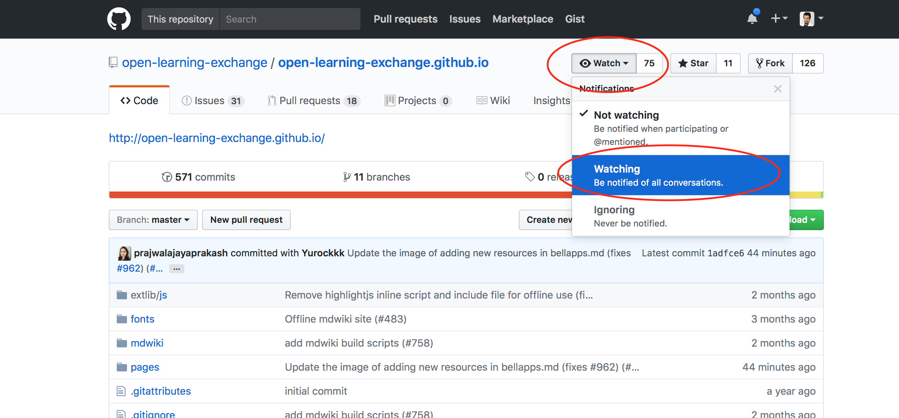
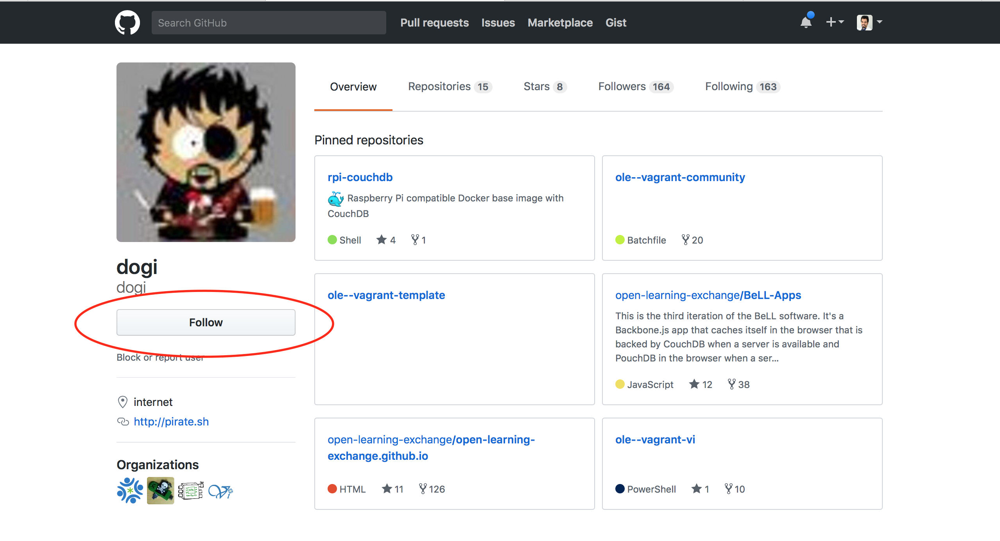

# First Steps

# The Big Picture

Welcome to the first steps for becoming an OLE Virtual Intern! We treat these first steps as a vetting process to prove that you can follow simple instructions before you can progress to working on harder projects in bigger teams. Consider them to be the interview for the internship.

If you are selected for the internship after completing the steps, you will be officially invited to join the OLE interns team! We’ll add you to the Virtual Interns Gitter chatroom and assign you to a specific team to work on developing and improving OLE’s software. Our current projects could be found [here](#!./pages/robots/rbts-intern-orientation.md#Familiarize_Yourself_with_Current_Projects_and_Issues).

Once accepted, you and your team will work on an assignment, and we’ll switch up the assignments each week. As part of this internship, you will have the opportunity to work with software and languages including **[Git](https://git-scm.com/)**, **[GitHub](https://github.com/)**, **[Markdown](https://daringfireball.net/projects/markdown/syntax)**, **[Vagrant](https://www.vagrantup.com/)**, **[VirtualBox](https://www.virtualbox.org/)**, **[Command Line/Terminal](https://en.wikipedia.org/wiki/Command-line_interface)**, **[Command Line/Terminal Scripts](https://www.codecademy.com/articles/command-line-commands)**, **[Vim](https://www.vim.org/)**, **[CouchDB](http://couchdb.apache.org/)**, **[Docker](https://www.docker.com/)**, **[HTML5](https://developer.mozilla.org/en-US/docs/Web/Guide/HTML/HTML5)**, **[JavaScript](https://en.wikipedia.org/wiki/JavaScript)**, **[Node.js](https://nodejs.org/en/)**, and **[Angular](https://angular.io/)**.

**NOTE**: This is an unpaid but intensive internship that requires 16 hours of work each week. More information about the internship can be found in our [FAQ](vi-faq.md#General_Internship_Questions). If you have further questions, don’t hesitate to ask other members in the Gitter [chat](vi-chat.md)!

# The Steps

Social coding is a huge part of any open source and collaborative project, and the Open Learning Exchange (OLE) is no different. In the following series of steps, you will learn about Markdown, Vagrant, Docker, Git, GitHub, GitHub issues, GitHub pull requests, etc. You will also be introduced to OLE’s digital library that hosts the learning materials – [Planet](https://github.com/open-learning-exchange/planet).

Because these steps are simple, we expect high-quality work, which may take a longer time. We want to see that you are capable of using or learning how to use these tools (writing good GitHub issues, creating pull requests, navigating the Planet, using Vagrant and Docker, etc.). These steps may seem easy, but we want you to impress us with good GitHub etiquette and quality Markdown. The bare minimum would be to just passively follow the steps; you should do further reading about the tools/languages we use so you can further your understanding and relieve confusion if you're unclear about how something works. **Treat these steps as learning opportunities!** The GitHub and Markdown skills you practice here are very important for both this internship and a future software development career.

The MDwiki has plenty of resources to help you complete the steps. There is a list of useful links at the end of each step. We also created a [FAQ page](vi-faq.md) where you can find the answers to some commonly asked questions. This page has even more [useful links and video tutorials](https://open-learning-exchange.github.io/#!./pages/vi/vi-faq.md#Helpful_Links) that will help you become familiar with the tools/languages we use. For anything that is not on the FAQ page, Google and Stack Exchange are your friends :)

**We also want you to keep us updated a relatively good amount in the Gitter chat as you complete these steps. We will ask you to send us messages, links, and screenshots along the First Steps, and we will use this to track your progress, so please do not forget to do so.** Check our [Gitter chat](vi-chat.md) page for more information about how to best communicate in Gitter.

A very large part of these steps is finding problems with these steps and this MDwiki, so take note of any issues that you run into or suggestions for improvement while doing these steps. Think of it as improving these steps and this MDwiki for future interns.

There is no official deadline to complete these steps, but most candidates who are approved for the internship program finished the steps within 7-8 days. Good luck!

## Step 0 - Introductory Steps

1. Send us your resume again along with a short description of yourself and what you would like to be called to [vi+resume@ole.org](mailto:vi+resume@ole.org).

2. Create a [GitHub account](https://github.com/) then watch <a href="https://github.com/open-learning-exchange/open-learning-exchange.github.io" target="_blank">Open Learning Exchange's github.io repo</a> and Follow [Leonard](https://github.com/leomaxi), [Dogi](https://github.com/dogi), [Laxman](https://github.com/lmmrssa), [Paul](https://github.com/paulbert), [Mappuji](https://github.com/empeje), [Ignacio](https://github.com/i5o), [Arpita](https://github.com/singharpita) and [Roshan](https://github.com/rrijal53) on GitHub. In GitHub, we "[Watch](https://help.github.com/en/articles/watching-and-unwatching-repositories)" organization repositories and ["Follow"](https://help.github.com/en/articles/following-people) individuals. Look for the "Watch" button at the top right of the page when you are in a repository.  Also, follow each other to see what others in the group are doing. (Click on the image to enlarge.)

  
  

3. We use Crowdin to translate our user interface into many different languages. If you know another language besides English, we would greatly appreciate if you would help translate. To do so, go to [this Crowdin link](https://crowdin.com/project/ole-planet/invite) to create a Crowdin account. A good goal is to get 10% of the words in your chosen language translated. If you have time, it would be even better to translate more of the words. After finishing [Step 4 - Planet Tutorial](vi-first-steps.md#Step_4_-_Planet_Tutorial), check out this [link](https://crowdin.com/page/tour#tab_translators) to learn how you can start contributing on Crowdin.   

**NOTE**: See the [Planet User Manual](#!./pages/techgenius/tg-planet-user-manual.md) for an overview of functionality and an explanation of various terms. Your contributions will not only help us out but also give you a better understanding of what Planet does.

## Step 1 - Planet and Vagrant

There are 3 sections in this step:

1. [Planet Installation with vagrant](#!./pages/vi/vi-planet-installation-vagrant.md)
  The **Planet** is a virtual library that is deployed internationally to individuals in countries that typically do not have access to educational resources. In this section, you will learn about how to set up your own Community Planet using vagrant.

1. [Planet Configurations](vi-configurations-vagrant.md)
  In this section, you will learn about how to configure your Community Planet.

1. [Vagrant Tutorial](vi-vagrant.md)
  **Vagrant** is an open-source software product for building and maintaining portable virtual software development environments. In this section, you will learn about how to interact with Vagrant through the command-line interface.

## Step 2 - Planet and Docker

Follow the instructions on the [Docker Tutorial page](vi-docker-tutorial.md). **Docker** is a computer program that performs operating-system-level virtualization also known as containerization. In this section, you will learn the basics of interacting with Docker and Docker Compose through the command-line interface and basic commands for maintaining your Planet installation.

## Step 3 - Markdown and Fork Tutorial

Follow the instructions on the [GitHub and Markdown page](vi-github-and-markdown.md). Make sure that you've linked to your github.io and pull request link on the [Gitter chat](https://gitter.im/open-learning-exchange/chat) (https://YourUserName.github.io and `LinkToYourPullRequest`). Also include Raw.githack link in your pull request(https://raw.githack.com/YourUserName/YourUserName.github.io/YourBranchName/#!pages/vi/profiles/YourUserName.md).

**NOTE**: Raw.githack link above is case sensitive to your username.

* Once you complete Step 3 you will have:
    * 1 Pull request made

## Step 4 - Planet Tutorial

This step includes the [Planet Tutorial](vi-planetapps.md), which explains the features of the application.

## Step 5 - Keeping Fork Updated

Follow the directions at [Git Repositories](vi-github-and-repositories.md) to keep your username.github.io and your local repository up to date.

## Step 6 - GitHub Issues Tutorial

Follow the tutorial under the [GitHub Issues tab](vi-github-issues.md) to create at least one issue. Post a link in [Gitter](https://gitter.im/open-learning-exchange/chat) whenever you create an issue or when you comment on someone else's issue. You are encouraged to post as many issues as you can for improving the page as well as for personal practice. No issue is too big or too small to be filed and it is OK if you are not sure how to fix it yourself. If you know how to solve an issue, be sure to provide a detailed account of your research and show how to fix it. It is ok to file an issue about minor typos and very small changes, but do not make this the case for all of the issues that you file. You can also work on issues that you didn't create.

Make sure you have created at least one issue, resolved it, commented on an issue you didn't create and have a pull request with the fix merged. You may continue making Issues, Pull requests and Comments, or move on to the next step, while you are waiting for your pull request to be merged. The approval process for your Step 6 fix may take time, but it is OK to continue working.

- Once you complete Step 6 you will have:
   * 2 pull requests made (one at step 3 and one at step 6)
   * 1 comment added (on an issue you didn't create)
   * 1 issue created

Please note that creating and working on Issues are not exactly bound by the "Step" you are in. Feel free to move on to other steps, and make more Issues and Pull Requests while you wait on OLE approval for your merge(s). 

## Step 7 - Nation Planet

Follow the directions under the [Nation Planet tab](vi-nation.md).

## Step 8 - Create Issues and Pull Requests

Create three more issues, add comments to three other issues, and resolve three issues by making the necessary changes in your repo with three separate pull requests. You should resolve three issues created by yourself, and make sure you mention in the issue you are working on, that you are in fact working on it. **Besides, you should make sure someone from the OLE team confirms to make the change that your issue has brought up before you start working on the issue.** You will follow the same steps as in [GitHub Issues](vi-github-issues.md), continuing to improve this Markdown Wiki so that it is educational, yet easy to understand for future interns.

Just as your learning with this Wiki was made possible by the efforts of previous interns, now we turn to you to continue that tradition and help future interns take their First Steps. Through this step, you should try to further improve our Markdown Wiki, with better explanations, formatting fixes, and more! You must have made your pull requests and have them each approved by at least two other OLE team members/interns in order for it to be merged to the upstream repository. Just as before, announce your Pull Request on the Gitter chat so other members can review it. You may need to make some additional corrections. Learn by teaching - or editing our teaching tool, in this case!

**NOTE**: When you are fixing an issue, mention the issue number you are fixing in the title of your pull request and make a new branch for every new issue from the master branch.

- Once you complete Step 8, you should have:
   * 5 merged pull requests (one at step 3, one at step 6 and three at step 8)
   * 4 comments made on *issues you didn't create* (one at step 6 and three at step 8)
   * 4 issues created (one at step 6 and three at step 8)

**NOTE**: You can track your progress with the number of pull requests and issues [here](vi-track-progress.md).

## Step 9 - Be part of the team

Once you have finished step 8, sync your community with the nation (as you did in Step 7 - [Nation Planet tab](vi-nation.md)).

Next thing is to add yourself to the virtual intern list found in [vi-team.md](vi-team.md) and create a pull request. Message us ("@/all" and "@dogi") in the Gitter chat room so that we can set up a meeting and add you to the team as soon as possible.

Make sure to read through the [intern orientation document](#!./pages/robots/rbts-intern-orientation.md) before the meeting.
