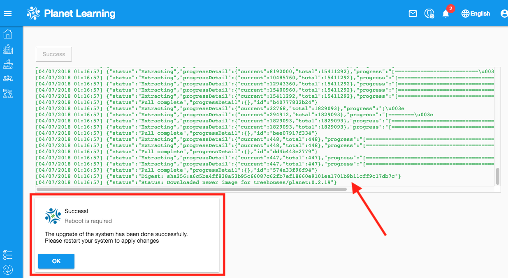

# Nation Planet

## Objectives

* Learn to sync your Community with the Nation
* Use the Nation interface to check whether your Community successfully joined the Nation
* Update your Community Planet to the latest version

## Introduction

In [Step 1 - Planet Installation - Configuration](vi-configurations-vagrant.md), you registered your community Planet with the nation. Now, you will learn how to keep your community Planet in sync with the nation.

There should be constant communication between the nation and the communities. While it is not necessary for remote communities in the field, it is ideal for our goals of "improving the software and testing the increasing forms of communication and feedback between the nation and the communities". This communication takes the form of a syncing process from the community side, where you select material to send to the nation.

Make sure vagrant is running and then click [here](http://localhost:3100) to access your Community Planet. 
It is recommended that you use Firefox since Planet is only guaranteed to run properly on Firefox.

**NOTE**: Before you can sync your community with the nation, you will need to create an additional dummy user on your community. Therefore, create one by clicking on "Become a Member" under the SIGN-IN button. Then fill out the details and press the "Become a Member" button. (Tip: When creating the dummy user, don't put a password that you actually use). Next, log back in to your admin account and double-check that your dummy account is listed under Members on the Manager page. Now that your community has a user, you can sync with the nation. If you can not create a dummy user, please see Q22 on the [FAQ page](vi-faq.md).


## Sync With the Nation

In [Step 4](vi-planetapps.md#Different_Kinds_of_Updates_to_Your_Community), we listed 3 kinds of updates that you might receive on the community side: updates, publications, and surveys. Another important type of update is the reverse: syncing with the nation. This sends data about your community to the nation.

You can click on "Manager" icon as you can see on the picture below.


Next, click on "Manage Sync".


Then, you will end on page showing all sync process. Click on **Run Sync** button.


You will be prompted to provide Administrator password. Once you confirm password, sync process will start.

You have now sent all activities on your community to the nation. To explain further, the nation receives a number of data points: number of resources opened, number of logins, number of members, resource ratings, technical feedback, and resource requests. We don't get specific information on individual users, but rather usage and feedback as whole.

## Check Sync Status

On the nation side ([planet.vi.ole.org](http://planet.vi.ole.org)), you can log in with the username `vi` and the password `iv` and check that the sync worked.


Click on "Manager" once again.


Then, click on "Reports" to access reports from various communities on the nation.


You should see a list of communities. Click on your community to view report.


Finally you see report of your community. It will have some graphical and some tabular statistics of your community data you synced.


## Update your community

On your [local community](http://localhost:3100) login as Administrator. Then go to Manager Page. You should see option to Upgrade.
If you do not see **Upgrade** button please check **Nation version** and **Local version**. If both of those are same your planet is already upto-date. In case you see any other message below Version, then send a message on chat channel along with screenshot.


Click on **Upgrade** button and you will see upgrade page. Click **Start Upgrade** button.


You should see log of upgrade process along with progress bar. Once upgrade is complete you will see the message saying upgrade was successful.



NOTE: If you see error message during upgrade please try again.

You will have to restart your community to reflect upgrade.
Run following commands on terminal/command prompt to restart your virtual machine. Please make sure you are on the folder path where your planet exists.

```
vagrant halt prod
vagrant up prod
```

## Useful Links

[Helpful links and videos](vi-faq.md#Helpful_Links)

## Next Section _(Step 8)_ **→**

In the next section, you will create and resolve more issues with GitHub.

#### Return to [First Steps](vi-first-steps.md#Step_7_-_Nation_Planet)
