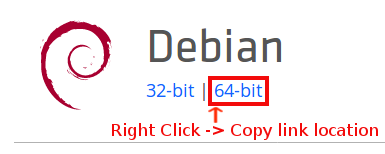

# Planet Installation

## Objectives

- Set up an environment for Planet
- Install Community Planet

## Introduction

The Planet is a virtual library that is deployed internationally to individuals in countries that typically do not have access to educational resources.

Please follow the directions of your OS below to install your community Planet and its dependencies on our system.

## Prerequisites

#### Staying Organized

We recommend you designate a new directory for your work at OLE. This puts all of your OLE related repositories in one place and enables you to be organized and efficient.

To do this, you could make a new folder directly through your OS GUI. Or you could open `Terminal`(macOS or Ubuntu), `cmd`(Windows) and use the following commands: (Note the commands should be identical on all three operating systems)

```bash
cd Desktop
mkdir OLE
```

#### Virtualization

Before installing Vagrant on any platform, it is necessary to check if VT-x/AMD-V instruction set is enabled on your processor by checking the BIOS. This is a requirement for installing Vagrant on any platform since Vagrant is a type of virtualization software that utilizes VirtualBox. 

Most recent CPUs have this feature enabled already, but if you are unsure whether VT-x/AMD-V is enabled on your device please see the following on [Windows](https://techiesdigest.com/how-to-check-if-virtualization-is-enabled/) | [Ubuntu](https://www.cyberciti.biz/faq/linux-xen-vmware-kvm-intel-vt-amd-v-support/) | [Mac](https://apple.stackexchange.com/questions/224870/how-to-check-vt-x-status-on-macbook-pro/224879) 

If later you are having trouble running Vagrant, it may be that VT-x/AMD-V is not enabled on your system. 
Here are instructions to enable virtualization on [Windows](https://www.howtogeek.com/213795/how-to-enable-intel-vt-x-in-your-computers-bios-or-uefi-firmware/) | [Ubuntu](http://askubuntu.com/questions/256792/how-do-i-enable-hardware-virtualization-technology-vt-x-for-use-in-virtualbox) | [macOS](http://kb.parallels.com/en/5653)

---

## Windows

#### Dependencies

You need to install the following programs on your computer:

- **Git**
[Git](https://git-scm.com) is an open source version control system that we use for communication and management for our software. More specifically, we use gitter.im for communication and github.com for software management. [Download](https://git-scm.com/download/win)

- **VirtualBox**
[Virtualbox](https://www.virtualbox.org) allows you to install a software virtualization package as an application on your OS. [Download](https://www.virtualbox.org/wiki/Downloads)

- **Vagrant**  
[Vagrant](https://www.vagrantup.com) is an open source tool for building development environments. [Download](https://www.vagrantup.com/downloads.html)

---

## macOS or Ubuntu

### Preparation

Open your `Terminal`

### For macOS

We assume that [brew](http://brew.sh/) is already installed:

```bash
brew install git
brew cask install vagrant
brew cask install virtualbox
```
If VirtualBox installation fails, go to `System Preferences > Security & Privacy` and click `Allow`. You may need to eject VirtualBox from `Finder > Devices` and retry multiple times. More information in [this thread](https://apple.stackexchange.com/questions/301303/virtualbox-5-1-28-fails-to-install-on-macos-10-13-due-to-kext-security).

### For Ubuntu

```bash
sudo apt-get update
sudo apt-get -y install git virtualbox
```
Next, go to [Vagrant download page](https://www.vagrantup.com/downloads.html) in Firefox Web browser and Right click on the `64-Bit` version of `Debian` and select "Copy Link Location" from the pop-up menu.
Refer to this image:



Now replace `https://yourcopiedlink.com/vagrant.deb` in the following commands by the link which you just copied.
```bash
wget -O vagrant.deb https://yourcopiedlink.com/vagrant.deb
sudo dpkg -i vagrant.deb
sudo apt-get install -f
```
If you encounter the error:
   > dpkg: error processing archive vagrant.deb (--install): package architecture (amd64) does not match system (i386)
   > Errors were encountered while processing: vagrant.deb

To solve this problem: Copy link location of Debian 32-bit instead and run commands again.
 
---

## Install a Community Planet  

Make sure you `cd` to the designated OLE directory you created earlier.

```bash
git clone https://github.com/open-learning-exchange/planet.git
cd planet
vagrant up prod
```

You now have a working [community Planet](http://localhost:3100) on your OS.
It is advisable to use Firefox to access your community Planet. If you don't have Firefox already, you may want to [download](https://www.mozilla.org/en-US/firefox/new/) it. If you are using Firefox and community planet is not working properly, please update your Firefox to the latest version and then try again.

---

## Troubleshooting

1. On macOS, when you run `vagrant up prod`, you may experience an error such as the following: "vi: Box 'ole/jessie64' could not be found. Attempting to find and install...". A simple solution is to use this command `sudo rm /opt/vagrant/embedded/bin/curl`, This will remove the old version of curl in Vagrant and `vagrant up` should now work as usual. For more information, visit [this Stack Overflow question](http://stackoverflow.com/questions/23874260/error-when-trying-vagrant-up)

2. On Windows, when you run `vagrant up prod` from command prompt, you might get the following error :
"The executable `curl` Vagrant is trying to run was not found in the `%PATH%` variable. This is an error. Please verify this software is installed and on the path." A simple solution is to add Cygwin bin folder to path variable or use Git Bash rather than command prompt to run `vagrant up prod`. For more information, visit [this GitHub issue](https://github.com/hashicorp/vagrant/issues/6788)

  On Windows 7 the Planet installation might stop if the version of PowerShell is lower than 3, please upgrade the PowerShell by downloading & installing [Windows Management Framework 3](https://www.microsoft.com/en-us/download/details.aspx?id=34595). Please, read the installation instructions to know which version to download.
  Your computer will restart and then the installation will resume.

3. On Ubuntu, you might get this error when you run `vagrant up prod`:

   > Stderr: VBoxManage: error: The virtual machine 'ud381_default_1463617458900_49294' has terminated unexpectedly during startup with exit code 1 (0x1) VBoxManage: error: Details: code NS_ERROR_FAILURE (0x80004005), component MachineWrap, interface IMachine

   This is caused when VirtualBox gets a minor version Update. (i.e. 5.0.x -> 5.1.x or 5.1.x -> 5.2.x). There are some old unused modules, which are not compatible with the newer version. They remain installed, which causes the above problem and prevents VirtualBox from starting. A system restart also does not solve the problem.

   To solve it first remove the unused packages using `sudo apt-get autoremove`. Then reconfigure VirtualBox to install updated modules using `sudo /sbin/vboxconfig`

4. If you see the following error:
   > The provider 'virtualbox' that was requested to back the machine 'prod' is reporting that it isn't usable on this system. The reason is shown below:
   > VirtualBox is complaining that the installation is incomplete. Please run `VBoxManage --version` to see the error message which should contain instructions on how to fix this error.

   The problem is the requirement that all kernel modules must be signed by a key trusted by the UEFI system, otherwise loading will fail. Ubuntu does not sign the third party vbox* kernel modules, but rather gives the user the option to disable Secure Boot upon installation of the virtualbox package, so disabling the secure boot on BIOS would solve this problem. If you do not want to disable Secure Boot in some reasons, you can look at [this page](https://era86.github.io/2018/01/24/vagrant-virtualbox-secureboot-in-ubuntu-1604.html) to make and assign the trusted key(MOK). 

5. If you see "no_db_found" when trying to access <http://localhost:3100>:
At this early stage, the simple solution would be using `vagrant destroy prod` to delete the current machine, then use `vagrant up prod` to rebuild it.

6. If the command `vagrant up prod` is not working, try to install [Virtual Box version 5.1](https://www.virtualbox.org/wiki/Download_Old_Builds_5_1).

7. On Windows, if you are unable to run the PowerShell command at the beginning of Step 1 and get the error `powershell is not recognized as an internal or external command`. Try to add the following path variable to your system variables under Advanced Settings: `%SYSTEMROOT%\System32\WindowsPowerShell\v1.0\;`

## Next Section (Step 1.2) **→**

Now  you have installed your community Planet, head over to [Planet Configurations](#!./pages/vi/vi-configurations-vagrant.md) to register your community with the nation.

#### Return to [First Steps](vi-first-steps.md#Step_1_-_Planet_and_Vagrant)


