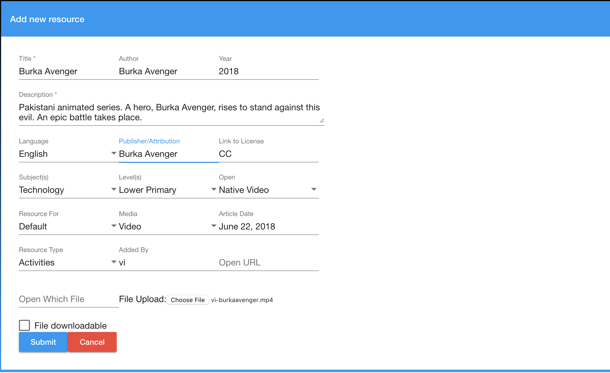

# Planet Tutorial

## Objectives

- Understand how `planet` interface is structured
- Understand basic functions of community `planet`
- Add resources to your Community in order to get accustomed to the `planet` interface

## Preparation

Please run `docker ps -a` or go to <http://127.0.0.1> to see if your community `planet` is currently running.
If not, please go to `planet/docker` directory and run `docker-compose -f planet.yml -p planet start`.

## Planet

Functionality wise, `planet` is similar to BeLL-Apps. We suggest you to play around a bit, try to explore and feel comfortable with `planet`.

## Upload Resources

You uploaded resources to BeLL-Apps in the previous section, we will now add those resources to `planet`.

On the left navigation, click on `Library`, then click on the yellow "+" sign in the Library interface.

Fill out the information:

- As we are just doing this as a practice, accuracy of information/source of content is not very important.
- It is important to choose the correct resource format from the `Open` drop-down (e.g., PDF, MP3, or Native Video(MP4)).
- Make sure to have something in all of the drop-down menus and text boxes.

Next, click on `Submit`. You have now uploaded the resource. You should be able to find the resource in Library, make sure that you can open it. Repeat the same process for all three resources.

## Useful Links

[Helpful links and videos](vi-faq.md#Helpful_Links)

#### Return to [First Steps](vi-first-steps.md#Step_4_-_BeLL-Apps_and_Planet_Tutorial)
